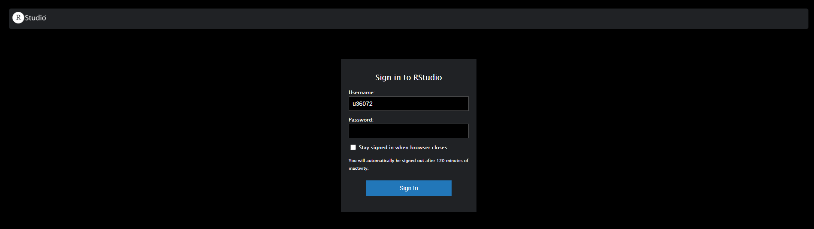
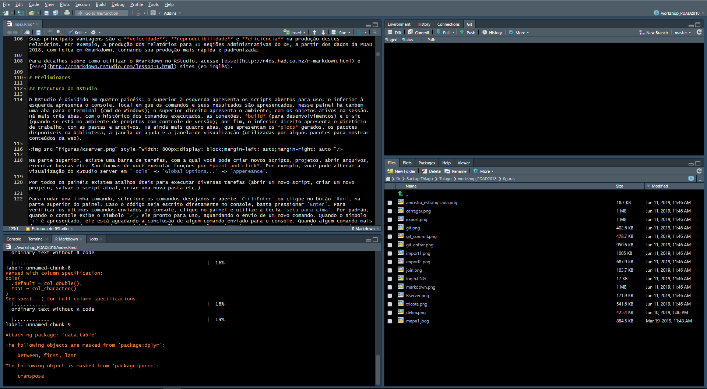
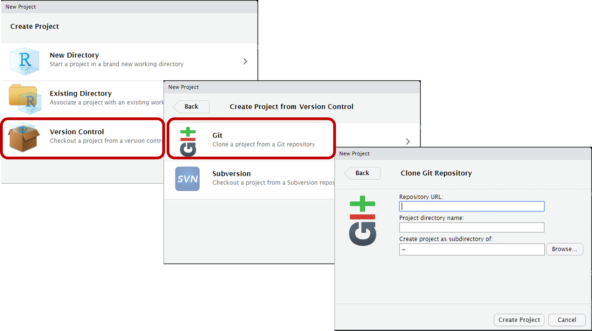
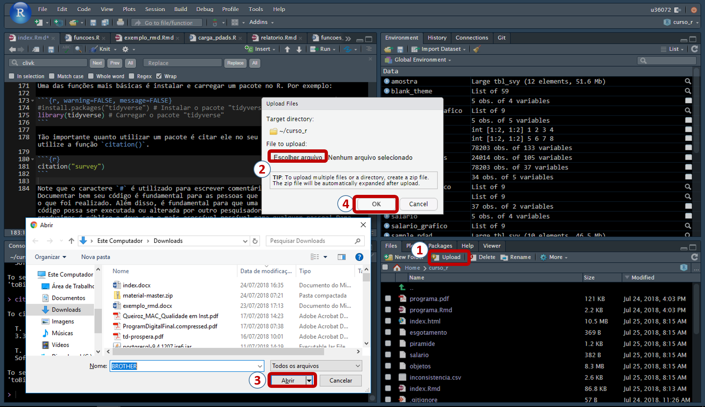
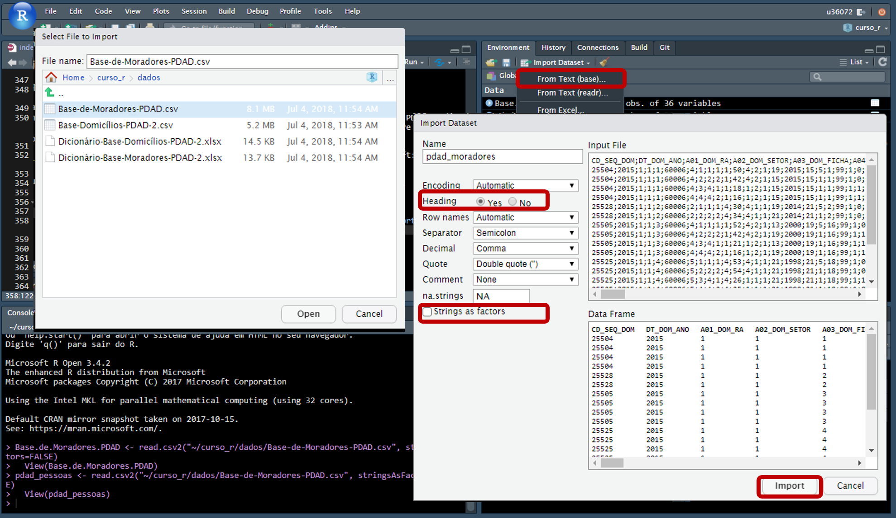
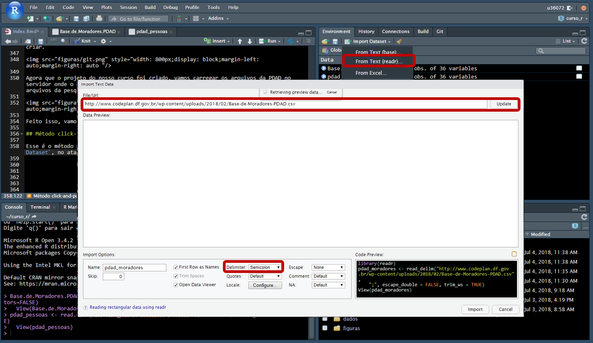
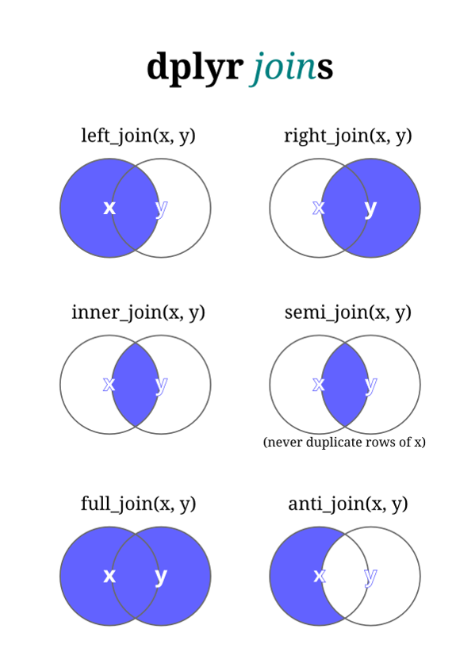
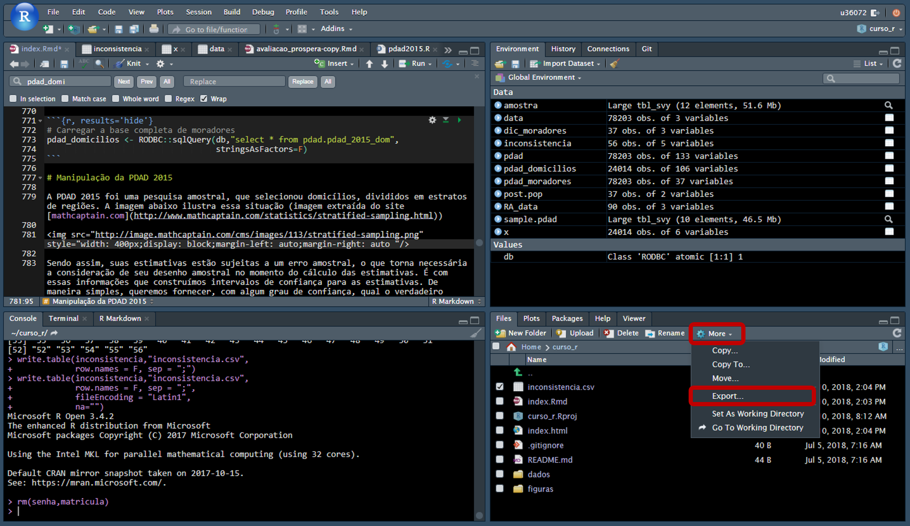

--- 
title: "Curso R"
author: "Thiago Mendes Rosa"
date: "`r Sys.Date()`"
output:
  html_document:
    #df_print: paged
    theme: flatly
    highlighting: tango
    number_sections: yes
    toc: yes
    toc_float: yes
description: Minicurso de R aplicado a manipulação de microdados da Codeplan
#documentclass: book
fontsize: 14pt
#github-repo: curso-r/ragmatic-book
link-citations: yes
#bibliography: book.bib
#site: bookdown::bookdown_site
biblio-style: apalike
---

```{r, echo=F}
# Definir opções dos chunks
knitr::opts_chunk$set(echo = TRUE, warning = FALSE, message = FALSE,
                      results = "hide")


setwd("~/curso_r")
```

# Agenda

Este minicurso de R será focado no `tidyverse` (universo "arrumado"), que conta um um conjunto de pacotes que auxiliam os pesquisadores a manipularem suas bases de dados, preparando-as para que análises possam ser realizadas. Ajustar a base de dados, geralmente, é a etapa que mais consome tempo do pesquisador. Portanto, ter uma ferramenta que torne essa tarefa mais eficiente é fundamental.

Informações mais aprofundadas sobre o `tidyverse` estão disponíveis livro [R for data science](http://r4ds.had.co.nz/). Esse curso foi baseado no curso [R pragmático](https://curso-r.github.io/ragmatic-book/), que pode ser consultado e realizado sempre que necessário. O livro [R para cientistas sociai](http://www.uesc.br/editora/livrosdigitais_20140513/r_cientistas.pdf) é uma outra boa fonte de informações.

**Público-alvo**

- Estagiários da Codeplan.
- Pesquisadores da Codeplan.
- Pessoas com desejo de adquirir novos conhecimentos.

**Requisitos básicos:**

- Noções de lógica de programação.
- Noções básicas de estatística.
- Noções básicas de inglês (para facilitar pesquisas e entendimento das funções).

**Conteúdo:**

- Introdução ao R;
- Carga da Pesquisa Distrital por Amostra de Domicílios;
- Introdução ao `tidyverse`;
- Operador `pipe`, manipulação de textos com o `stringr`e datas `lubridate`;
- Transformação de dados com `dplyr` e `tidyr`, visualização de dados com `ggplot2`;
- Utilização do pacote `survey` para pesquisas amostrais;
- Elaboração de relatórios com `knitr` e `rmarkdown`.

# Introdução

## Por que usar o R e não outros softwares?

- O R é um sistema para estatísticva computacional e gráfica;

- Um dos focos do R é análise de dados e a interatividade. Isso faz com que o R seja uma linguagem intuitiva e flexível.

- Código aberto: sem pirataria!

- Constantemente atualizado;

- Comunidade ativa e cada vez mais ampla (estatística, economia, pscicologia, biologia etc.);

- O R possui a possibilidade de adotar diversos pacotes. Estes pacotes são coleções de funções e/ou bases de dados desenvolvidos pela comunidade que utiliza a ferramenta. Os pacotes ficam disponíveis no [CRAN](https://cran.r-project.org/), que é o *Comprehensive R Archive Network*, que nada mais é do que uma coleção de sites da linguagem R e seus documentos relacionados.

## RStudio

O RStudio é um ambiente integrado de desenvolvimento para a linguagem R. Ele ajuda a organizar os trabalhos desenvolvidos, dividindo os conteúdos em janelas. Ele, por exemplo, tem recursos que facilitam a escrita dos códigos (com atalhos de teclado e o recurso de auto completar). Além disso, possibilita que algumas funções sejam utilizadas via *click and point*. Acesse  [essa página](https://csgillespie.github.io/efficientR/set-up.html#rstudio) para maiores informações.

Um recurso muito importante do RStudio, amplamente utilizado na Codeplan, é a possibilidade de criar projetos. Nossos projetos são todos com controle de versão, realizados atravez do [github](https://github.com/). Caso você não tenha conta, aproveite essa oportunidade para criar uma.

## Rsutdio Server

A Codeplan conta com o RStudio server, o que significa que você pode acessar e trabalhar de qualquer máquina conectada à rede do GDF diretamente do navegador. Clique [aqui](http://rserver.codeplan.df.gov.br/) para acessar o servidor.

Uma vantagem de utilizar o Rserver é sua alta capacidade de processamente, quando comparado com as máquinas locais, contando atualmente com 32GB de memória RAM e um processador de 32 núcleos.

Além disso, os pacotes instalados para a realização de um projeto ficam disponíveis para todos os demais usuários da empresa, sendo periodicamente atualizados pelo administrador do servidor. Isso facilita a reprodutibilidade dos códigos escritos por outros usuários, auxiliando também na continuidade de pesquisas e projetos.

## Banco de dados da Codeplan

A Codeplan conta com um banco de dados com as principais pesquisas da empresa já organizadas e prontas para uso, além de outras fontes de dados secundárias bastante utilizadas em pesquisas (e.g. IBGE). A vantagem de se utilizar um banco de dados centralizado é que todos os pesquisadores usem a mesma fonte de informação para a produção de relatórios, garantindo consistência aos produtos gerados.

Além disso, as bases utilizadas em um trabalho ficam à disposição dos demais pesquisadores da empresa, evitando o trafego de informações localmente. Quanto mais usuários estiverem utilizando a mesma fonte de dados, mais fácil fica para validar as informações e proceder eventuais correções, beneficiando todos os usuários. 

Atualmente, o banco conta com as seguintes bases de dados:

- Pesquisa Distrital por Amostra de Domicílios;
- Pesquisa Metropolitana por Amostra de Domicílios;
- Pesquisa Nacional por Amostra de Domicílios;
- Relação Anual de Informações Sociais;
- Censo escolar;
- Prova Brasil;
- Enem;
- IPCA;
- Pesquisas 156;
- Base de MEIs;
- Cadastros de endereços.

Algumas bases de dados são de acesso público, enquanto outras são de acesso restrito. Todos os usuários, por padrão, possuem permissão de leitura das bases públicas. Para as bases restritras, é necessário preencher um termo de responsabilidade de uso, informando o projeto, o período de uso e os produtos a serem gerados com as informações. Esse termo deve ser aprovado pelo gestor da informação, antes que o acesso gera liberado pelo administrador do banco de dados. Esse processo visa a resguardar a confidencialidade dos dados.

As informações podem ser facilmente carregadas pelo R (ou qualquer outro pacote estatístico), por conexão ODBC -- acrônimo para Open Database Connectivity. O Rserver já está configurado para fazer esta conexão, enquanto as máquinas locais podem ser facilmente configuradas seguindo **esses passos (incluir informação)**. As bases são acessadas com o pacote `RODBC`, através de consultas SQL (Structured Query Language), que nada mais é que uma linguagem estruturada para realizar consultas em bancos de dados.

## GitHub

O GitHub é uma plataforma online de compartilhamento e armazenamento de códigos. Os projetos do GitHub são baseados no `git`, uma ferramenta de versionamento de software.

A Codeplan utiliza o GitHub para gerenciar e versionar seus projetos, de modo a mantê-los organizados e atualizados, sem o risco de perder informações acidentalmente ou por alguma falha técnica. Outra vantagem é a característica colaborativa da plataforma, permitindo o acesso aos códigos de qualquer lugar por outros pesquisadores. Se o repositório for público, qualquer pessoa pode contribuir com os projetos, proporcionando ganhos a todos os futuros usuários.

## RMarkdown

O Markdown é um sistema para tornar a escrita e a leitura de textos mais simples. Ele adiciona as formatações correspondentes a estrutura na qual você deseja apresentar seu texto. Tudo isso é feito de maneira simplificada, através de símbolos de teclado.

No R, o RMarkdown, é um tipo de documento especial que contém tanto textos, no formato markdown, quanto códigos, em R. Os códigos em R podem ser inseridos diretamente no texto ou separados em estruturas específicas (*chunks*). Os códigos são executados sempre que o documento é processado para algum formato específico, que pode ser HTML (como esse documento que você está lendo), em PDF (formato `Latex`) ou mesmo microsoft Word. Apresentações de slides também podem ser facilmente realizadas com o Rmarkdow, nos formatos HTML ou Latex.

Alguns relatórios e apresentações da Codeplan são produzidos em RMarkdown As apresentações da pesquisa [156](https://codeplanprojetos.github.io/156_adasa_2018/) e os relatórios da PDAD 2018 estão sendo produzidos com esta ferramenta.

Suas principais vantagens são a **velocidade**, **reprodutibilidade** e ***eficiência** na produção destes relatórios. Por exemplo, a produção de relatórios para 31 Regiões Administrativas do DF a partir dos dados da PDAD 2018 fica muito mais rápida e padronizada.

Para detalhes sobre como utilizar o RMarkdown, acesse [esse](http://r4ds.had.co.nz/r-markdown.html) e [esse](http://rmarkdown.rstudio.com/lesson-1.html) sites (em inglês).

# Preliminares

## Estrutura do RStudio Server

O primeiro passo é efetuarmos o login no RStudio server da Codeplan. Para isso, acesse o site do [servidor](http://rserver.codeplan.df.gov.br/).



Entre com suas credenciais e faça o login.

O RStudio server estará dividido em quatro painéis: o superior à esquerda apresenta os scripts abertos para uso; o inferior a esquerda apresenta o console, local em que os comandos e seus resultados são apresentados. Nesse painel há também uma aba para o terminal do Linux; o superior direito apresenta o ambiente, com os objetos ativos na sessão. Há mais quatro abas, com o histórico dos comandos executados, as conexões, build (para desenvolvimentos) e o Git; por fim, o inferior direito apresenta o diretório de trabalho, com as pastas e arquivos. Há ainda mais quatro abas, que apresentam os plots gerados, os pacotes disponíveis na biblioteca, a janela de ajuda e a janela de visualização (utilizadas por alguns pacotes para mostrar conteúdos da web).



Na parte superior, existe uma barra de tarefas, com a qual você pode criar novos scripts, projetos, abrir arquivos, executar buscas etc. São formas de você executar funções por click-and-point. Por exemplo, você pode alterar a visualização do RStudio server em `Tools` -> `Global Options...` -> `Appereance`.

Por todos os painéis existem atalhos úteis para executar diversas tarefas (abrir um novo script, criar um novo projeto, salvar o projeto salvo, criar uma nova pasta etc.).

## Pacotes
Uma das funções mais básicas é instalar e carregar um pacote no R. Por exemplo:

```{r, warning=FALSE, message=FALSE}
#install.packages("tidyverse") # Instalar o pacote "tidyverse"
library(tidyverse) # Carregar o pacote "tidyverse"
```

Note que o caracter $"#"$ é utilizado para escrever comentários na codificação. Documentar bem seu código é fundamental para as pessoas que trabalham com você entendam o que foi realizado. Além disso, é fundamental para que uma tarefa que dependa desse código possa ser executada ou alterada por outro pesquisador. Lembre-se que tudo o que produzimos é público e deve ser o mais acessível possível para qualquer pessoa!

## Operadores básicos

Dentro do R, alguns operadores básicos são constantemente utilizados. Os mais comuns são:

```{r, echo=F,results='asis'}
pander::pander(
data.frame(Operadores=c("+","-","*","/","^ ou **", "%%","%/%"),
           Descrição=c("Adição","Subtração","Multiplicação",
                       "Divisão","Exponenciação","Resto da divisão","Divisão inteira")),
caption="Operadores aritiméticos")
```

```{r, echo=F,results='asis'}
pander::pander(
data.frame(Operadores=c("<","<=",">",">=","==","!=","!X","X|Y","X&Y"),
           Descrição=c("Menor","Menor ou igual","Maior","Maior ou igual",
                       "Exatamente igual a","Não é igual a","Não X",
                       "X ou Y","X e Y")),
caption="Operadores lógicos")
```

```{r, echo=F,results='asis'}
pander::pander(
data.frame(Operadores=c("x <- valor","x <<- valor",
                        "valor -> x","valor ->> x",
                        "x = valor"),
           Descrição=c("Atribuir 'valor' a 'x'","Atribuir 'valor' a 'x'",
                       "Atribuir 'valor' a 'x'","Atribuir 'valor' a 'x'",
                       "Atribuir 'valor' a 'x'")),
caption="Operadores de atribuição de valor")
```

Agora vamos realizar algumas operações matemáticas básicas com o R.

```{r warning=FALSE, message=FALSE}
1 + 2 # Adição
```

```{r warning=F,message=F}
3 - 1 # Subtração
```

```{r warning=FALSE, message=FALSE}
2 * 2 # Multiplicação
```

```{r warning=FALSE, message=FALSE}
1 / 4 # Divisão
```

O R realiza operações matemáticas básicas diretamente no console, como adição, subtração, multiplicação e divisão. Ele também realiza testes lógicos.

```{r, warning=F,message=F}
2+2==4 # 2 + 2 é igual a 4?
```

```{r, warning=F,message=F}
2+2==5 # 2 + 2 é igual a 5? 
```

```{r, warning=F,message=F}
2+2&1+3==4 # 2 + 2 e 1 + 3 são iguais a 4?
```

```{r, warning=F,message=F}
2+2|1+4==5 # 2 + 2 ou 1 + 4 são iguais a 5?
```

## Tipos de dados

O R cria seus objetos em diversos classes e tipos. Para as classes, elas podem ser: lógica, inteiro, numérico, complexo ou caracter. Vamos olhar alguns exemplos:

```{r}
x <- 1L # Inteiro
class(x)
x <- 1 # numérico
class(x) 
x <- 8i # complexo
class(x)
x <- TRUE # lógico
class(x)
x <- "hello" # character
class(x)
```

Sobre os tipos, que dizem respeito à estrutura de como as informações são organizadas, temos, entre outros: vetor, lista, matriz, data frame, fator e tabela. Vejamos primeiramente o vetor, o mais simples deles.

```{r}
x <- c(1,2,3) # Vetor numérico
typeof(x) # Checar o método de armazenagem
class(x) # Checar a classe
length(x) # Checar o tamanho
str(x) # Checar a estrutura
```

Agora vamos ver uma matriz.

```{r}
x <- matrix(ncol = 2,nrow = 2) # Criar uma matriz  2 x 2
dim(x) # Checar as dimensões da matriz
x <- c(1,7,9,6) # Atribuir valores à matriz
x <- 1:3 # Contruir um vetor x
y <- 10:12 # Construir um vetor z
z <- cbind(x,y) # Montar uma matriz a partir destes vetores (por colunas)
z <- rbind(x,y) # Montar uma matriz a partir destes vetores (por linhas)
```

A lista é um tipo de objeto que pode armazenar diferentes classes em um mesmo local.

```{r}
lista <- list(1,"galo",2i,2.61, TRUE,matrix(1:4)) # Criar uma lista
lista # Checar a lista criada
lista[[2]] # Acessar o segundo elemento da lista
lista <- list(a=1,b="galo",c=2i,d=2.61,e= TRUE,f=matrix(1:4)) # Criar uma lista, com nomes dos elementos
```

Os fatores são particularmente importantes para a apresentação dos dados e para regressões. Eles servem para tratar vetores categóricos ou enumeráveis. Vamos ver um exemplo. A função `table()` é utilizada para fazer uma tabulação simples dos valores inseridos no argumento.

```{r}
x <- factor(c("sim","sim","sim","não","sim","não"),levels = c("não","sim"),ordered = T) # Construir um fator, com opção para mander a ordem data
table(x) # Tabular os dados
``` 

A estrutura dos data frames, foco deste curso, será tratada em detalhes mais adiante, quando começarmos a manipular a PDAD 2015.

Para finalizar, temos alguns números especiais no R: `Inf`, `-Inf`, `NA` e `NaN`. Os dois primeiros se referem ao infinito em ambas as direções, enquanto os dois últimos são os valores ausentes. Enquanto o `NaN` se refere a valores "não númericos", funcionando como nulo, os valores ausentes propriamente ditos são da forma `NA`, podendo assumir diferentes classes.

```{r}
1/Inf # Divisão de 1 por infinito
-1/0 # Infinito - divisão de 1 por zero (conceito de limite)
1/0-1/0 # Infinito menos infinito - Indefinido (não numérico)
x <- NA # Missing value (valor ausente)
```

## Utilizar chamada de funções

As funções no R são chamadas seguidas dos símbolos `()`. Algumas delas estão sempre disponíveis no R (como as "base functions"), enquanto outras estão apenas quando os pacotes são carregados. Vamos ver as funções de soma `sum()` e de multiplicação `prod()`.

```{r, warning=FALSE, message=FALSE}
sum(1,2) # Adição
prod(2,2) # Multiplicação
```

Algumas funções podem ser chamadas diretamente de seus pacotes, sem que seja necessário carregar o respectivo pacote. Para isso, escreva o nome do pacote instalado, seguido do símbolo `::`.

```{r, warning=FALSE, message=FALSE,results='hide'}
psych::describe(c(1,2)) # Utilizando a função describe, do pacote "psych", sem carregá-lo
```

Apesar de ser necessário digitar mais caracteres para obter o resultado, chamar funções desta maneira apresenta duas vantages. A primeira é que fica claro, em cada passo, qual o pacote está sendo utilizado para executar determinada tarefa. Em segundo lugar, caso exista algum outro pacote com uma função de mesmo nome, não haverá o risco de utilizarmos a função errada para o problema que estamos tratando.

## Criar uma função

Você pode criar suas próprias funções do R. Por exemplo, ao invés de utilizar a função de soma `sum`, nós podemos criar nossa própria função de soma.

```{r, warning=FALSE, message=FALSE, results='hide'}
# Função para somar dois valores
somar <- 
  function(x,y){
  z = x + y
  
  return(z)
  
  }

#Aplicar a função
somar(2,4)
```

No caso acima, nos determinamos que a função deve ser dois argumentos, `x` e `y`, os quais serão somados e atribuídos a variável `z`, que, por sua vez, será apresentada com a função `return()`.

# Operador Pipe

Com o R, nós podemos "aninhar" várias funções ao mesmo tempo. Por exemplo, se alguém quiser somar um vetor de números, tirar a raiz quadrada e arrendondar o resultado, podemos fazer tudo isso em uma única linha de comando.

```{r}
x <- c(1:10) # Criar o vetor numérico

round(sqrt(sum(x))) # Calcular a raíz quadrada da soma do vetor x, arredondando o resultado
```

Todavia, aninhar várias funções ao mesmo tempo, em algumas situações, pode deixar o código confuso. Vejamos um exemplo de função hipotética para preparação de um bolo.^[Exemplo extraído de: https://curso-r.github.io/ragmatic-book/principios.html#pipe.]

```{r}
# esfrie(asse(coloque(bata(acrescente(recipiente(rep("farinha", 2), "água", "fermento", "leite", "óleo"), "farinha", até = "macio"), duração = "3min"), lugar = "forma", tipo = "grande", untada = T), duração = "50min"), "geladeira", "20min")
```

Dentro de um mesmo código, é possível indentar as linhas, sempre após um novo argumento da função que precisa ser separado por vígula.

```{r}
# esfrie(asse(coloque(bata(acrescente(recipiente(rep("farinha", 2), 
#                                                "água", "fermento", 
#                                                "leite", "óleo"), 
#                                     "farinha", até = "macio"), 
#                          duração = "3min"),
#                     lugar = "forma", tipo = "grande", untada = T), 
#             duração = "50min"), "geladeira", "20min")
```

Mesmo assim, ainda resta alguma dificuldade para ler e entender o código de uma maneira mais clara e fluída. Essa é uma das vatagens de utilizar o operador pipe `%>%`. Ele realiza o seguinte comando, de maneira bastante intuitiva: "use o resultado do lado esquedo como argumento da função do lado direito". Para utlizá-lo, é necessário carregar algum pacote que leve o operador. Ao carregar o `tidyverse`, por exemplo, você já estará apto a utilizar o pipe.

Vamos testar o operador pipe para calcular novamente a raiz quadrada da soma de um vetor.

```{r}
x <- c(1:10)

x %>% sum %>% sqrt %>% round
```

Observe que a escrita fica muito mais intuitiva. Para o caso do bolo:

```{r}
# recipiente(rep("farinha", 2), "água", "fermento", "leite", "óleo") %>%
#   acrescente("farinha", até = "macio") %>%
#   bata(duração = "3min") %>%
#   coloque(lugar = "forma", tipo = "grande", untada = T) %>%
#   asse(duração = "50min") %>%
#   esfrie("geladeira", "20min")
```

A utilização do pipe será muito importante para a manipulação das bases de dados, uma vez que, geralmente, são necessárias várias sequências de funções até que elas fiquem no formato desejado para análise.

## Onde encontrar ajuda

Há várias maneiras de encontrar ajuda sobre um pacote específico. Por exemplo, você pode acessar os detalhes da função `psych::describe` posicionado o cursor próximo a função e pressionando a tecla `F1`.

Uma outra maneira é colocar ua=ma interrogação $?$ antes da função para a qual se quer ajuda. Uma terceira opção é utilizar a função `help`.

```{r warning=FALSE, message=FALSE}
?psych::describe
help("describe")
help(describe)
?psych
help("psych")
help(psych)
```

Para uma pesquisa mais ampla, que irá escanear todos os documentos do pacote instalado na sua biblioteca, você pode utilizar o símbolo $??$ antes da função ou utilizar diretamente a função `help.search`

```{r, warning=FALSE, message=FALSE}
??psych
help.search("psych")
```

Por fim, outra forma de realizar pesquisas, utilizando a internet é com a função `RSiteSearch`.

```{r warning=FALSE, message=FALSE}
RSiteSearch("psych") # Pesquisar um termo
RSiteSearch("{linear model}") # Pesquisar uma expressão
```

O site [stackoverflow](https://stackoverflow.com/questions/tagged/r) é outra excelente fonte de informação. É muito possível que a dúvida ou o problema que você está encontrando em alguma programação já foi enfrentado por outro usuário. Assim, basta pesquisar sobre sua dúvida neste site (geralmente, feitas e respondidas em inglês).

Por fim, uma boa e velha máquina de buscas é fundamental. Quase todas as repostas você encontrará com sua utilização.

# Carga da PDAD 2015

Vamos iniciar a atividade de manipulação de base de dados carregando a Pesquisa Distrital por Amostra de Domicílios 2015. A PDAD é uma pesquisa amostral conduzida pela Codeplan a cada dois anos, com representatividade para as 31 Regiões Administrativas, tendo por objetivo traçar as principais características dos domicílios e pessoas destas localidades.

Vamos carregar a PDAD 2015 de quatro maneiras diferentes. A PDAD 2015 está disponível, no formato `.csv` no site da Codeplan, neste [endereço](http://www.codeplan.df.gov.br/pdad-2015/). São quatro arquivos: dois deles contendo os microdados, referentes aos domicílios e aos moradores, juntamente de seus respectivos dicionários.

As bases de dados com microdados usualmente são separadas em tantos arquivos quanto necessário, seguidos sempre de uma documentação que detalha os aspectos técnicos, fornecendo informações para sua manipulação.

Vamos criar um projeto para fazermos nossas análises. Acesse sua conta no [github](https://github.com/) e crie um novo repositório. Depois disso, vamos criar um novo projeto no RStudio server. Para isso, clique em `File`, `New project`, `Version Control`,`Git`. No campo `Repository URL`, cole a url do projeto que você acabou de criar. 



Agora que o projeto do nosso curso foi criado, vamos carregar os arquivos da PDAD no servidor onde o Rstudio está instalado. Crie uma pasta chamada `dados` e salve os arquivos da pesquisa dentro dela.



Feito isso, vamos agora carregar os dados no R de várias maneiras diferentes.

## Método click-and-point

Para isso, clique em `Import Dataset`, no atalho do painel `Ambiente`. O RStudio server vem configurado com duas opções para você importar os dados. Vamos ver a primeira delas: `From Text(base)`.



Nesta primeira opção, você seleciona o arquivo `.csv` salvo no passo alterior e o R já apresenta a estrutura dos dados a ser carregada. Marque a opção "yes" em `Heading` e desmarque a opção `String as factors`. Caso deseje, altere o nome do arquivo e clique em importar.

Note que, no painel console, o código necessário para carregar a base foi inserido automaticamente. Teste novamente, copiando essa linha de comando e rodando no console.

```{r}
pdad_moradores <- read.csv2("~/curso_r/dados/Base-de-Moradores-PDAD.csv", stringsAsFactors=FALSE)
```

Vamos agora testar o segundo método. Novamente, clique em `Import Dataset`, no atalho do painel `Ambiente`, mas agoa na opção `From Text(readr)`. Agora, ao invés de informar o arquivo que você baixou, basta informar o link onde ele está hospedado. No nosso caso, é o mesmo endereço em que baixamos os dados da [PDAD 2015](http://www.codeplan.df.gov.br/pdad-2015/). Vamos testar com a [base de moradores](http://www.codeplan.df.gov.br/wp-content/uploads/2018/02/Base-de-Moradores-PDAD.csv).



Assim que você inserir o link para a pesquisa, clique em `Update` para visualizar uma prévia dos dados. Mude o delimitador dos dados para `Semicolon` e clique em importar. Repare, novamente, que o comando necessário para carregar os dados aparece no console. Desta vez, a função utilizada para ler o conjunto de dados foi `read_delim`. Mais uma vez, copie e rode essa linha de comando diretamente no console, para ver como carregar a base sem o auxílio do painel.

```{r}
pdad_moradores <- read_delim("http://www.codeplan.df.gov.br/wp-content/uploads/2018/02/Base-de-Moradores-PDAD.csv",";", escape_double = FALSE, trim_ws = TRUE)
```

Você poderia carregar os dados, de ambas as maneiras, diretamente pela linha de comando, de outras formas. Um outro pacote, bastante últil e veloz para o carregamendo de dados, é o `data.table`. Vamos treinar o carregamento dos dados pela linha de comando com ele. Para isso, vamos antes limpar o ambiente, excluindo os objetos carregados anteriormente, com a função `rm()`. 

```{r}
rm(pdad_moradores) # Remove apenas o objeto "pdad_moradores"
rm(list=ls()) # Remove todos os objetos do ambiente
```

Note que você pode excluir todos os objetos do ambiente, listando-os com a função `ls()`. Vamos também definir o diretório padrão em que estamos trabalhando. O RStudio server, por padrão, utilizará a pasta do seu usuário no servidor. Para consultar o diretório ativo no momento, utilize a função `getwd()`.

```{r}
getwd() # Consultar diretório de trabalho ativo
```

Vamos alterar para a pasta `curso_r`, criada juntamente com o nosso projeto.

```{r}
setwd("/u02/u36072/curso_r") # Alterar o diretório de trabaho
setwd("~/curso_r") # Alterar o diretório de trabaho (maneira alternativa)
```

Repare que existem duas maneiras de definir o diretório padrão. Caso ele seja um subdiretório do qual você já está trabalhando atualmente, basta entrar com o caracter `~` antes do caminho desejado. Este recurso é um atalho para o endereço do diretório atualmente ativo no R. Você também pode indicar o caminho completo, conforme exemplo acima. Atente-se paa o fato de que o padrão dos caminhos é a barra invertida `/`. Apesar deste ser o padrão Linux, que é o ambiente utilizado no servidor, ele também deve ser seguido nas demais plataformas, como o Windows.

## Método por linha de comando

Agora vamos carregar novamente a base de moradores da PDAD, desta vez apenas utilizando a linha de comando. 

````{r}
# Carregar o pacote
library(data.table)
# Carregar a base de um arquivo local
pdad_moradores <- data.table::fread("dados/Base-de-Moradores-PDAD.csv",
                                    dec = ",",encoding = "Latin-1")
# Carregar a base de um link da internet.
pdad_moradores <- data.table::fread("http://www.codeplan.df.gov.br/wp-content/uploads/2018/02/Base-de-Moradores-PDAD.csv",dec = ",",encoding = "Latin-1")
```

Com a função `fread()` é possível carregar a base de ambas as maneiras vistas anteriormente. Note que a função `fread()` detectou o delimitador automaticamente. Informamos apenas que o separador decimal da nossa base é a vírgula, com a opção `dec=","` e que o enconding do arquivo é `enconding=Latin-1`. Essa última opção é importante quando estamos transitando arquivos salvos em diferentes plataformas, principalmente entre Windows e Linux, que possuem formas distintas de tratar caracteres especiais. Agora que você já aprendeu a carregar a base de moradores, pratique carregando também a base de domicílios.

## Carga pelo banco de dados

A última maneira, que deverá ser sempre sua *primeira* opção, é carregar a base diretamente do banco de dados da Codeplan. Para isso, vamos precisar do pacote `RODBC`, que fará a nossa conexão com o banco de dados. Isso é feito através da função `odbcConnect()`.

```{r, results='hide'}
source("/u02/u36072/banco.R")
```


```{r}
# Carregar pacote
library(RODBC)

# Abrir conexão com o banco de dados
db <- RODBC::odbcConnect("db_codeplan", uid=matricula, pwd=senha, 
                         believeNRows=FALSE)
```

Pronto! Já estamos conectados ao banco de dados. Para consultar as tabelas disponíveis, utilizamos a função `sqlTables()`. O argumento desta função é o objeto com a conexão que fizemos para o banco de dados.

```{r}
# Verificar as tabelas disponíveis no banco de dados
tabelas <- RODBC::sqlTables(db)
```

No objeto `tabelas`, podemos observar todas as tabelas que temos permissão de acesso. Para consultar as tabelas, você pode clicar no objeto carregado ou utilizar a função `View()`, utilizando o nome do objeto como argumento. Para consultar a classe do objeto carregado, utilize a função `class()`, enquanto, para ver os nomes da colunas, utilize as função `names()`. A função `head()` apresenta as primeiras linhas do data.frame, enquanto a função `tails()` apresenta as últimas. Os tipos das colunas podem ser consultados com a função `glimpse()`, do pacote `dplyr`. Finalmente, podemos consultar a quantidade de linhas e a quantidade de colunas carregadas com as funções `nrow()` e `ncol()`, respectivamente.

```{r}
#View(tabelas) # Visualizar o objeto tabelas
class(tabelas) # Verificar a classe do objeto
names(tabelas) # Verificar o nome das colunas carregadas
head(tabelas) # Verificar as primeiras linhas da tabela
tail(tabelas) # Verificar as últimas linhas da tabela
str(tabelas) # Verificar as classes das colunas
dplyr::glimpse(tabelas) # Outra opção para checar as classes
nrow(tabelas) # Consultar o número de linhas
ncol(tabelas) # Consultar o número de colunas
```

A coluna `TABLE_CAT` informa o banco de origem, `TABLE_SCHEM` informa o esquema da tabela, `TABLE_NAME` o nome da tabela, `TABLE_TYPE` o tipo e `REMARKS` as observações, se houver alguma.

O objeto do tipo `data.frame`, formato do objeto *tabelas*, será aquele com o qual mais iremos trabalhar. Esse objeto é como se fosse uma matriz, em que as linhas representam as observações e as colunas as variáveis. Como em uma matriz, você pode acessar as linhas e as colunas com o operador `[,]` logo após o nome do objeto. À esqueda, indica-se a posição da linha, enquanto, à direita, indica-se a coluna. Você pode utilizar a posição númerica ou o nome da coluna. Repare que a função `names()` indica, além dos nomes, a posição das colunas. Elas ficam entre colchetes, apresentadas em ordem crescente. Outra maneira para acessar uma variável específica é utilizando o caracter `$` logo após o nome da tabela. Por exemplo, para consultar apenas a coluna com os esquemas, utilize um dos comandos abaixo. 

```{r}
tabelas$TABLE_SCHEM # Consultar apenas a coluna "TABLE_SCHEM"
tabelas[,2] # Outra maneira de consultar a coluna "TABLE_SCHEM"
tabelas[,"TABLE_SCHEM"] # Mais uma maneira de consultar a coluna "TABLE_SCHEM"
tabelas[1:2,1:2] # Selecionar apenas as duas primeiras linhas e colunas
tabelas[1:2,]$TABLE_SCHEM # Selecionar apenas as duas primeiras linhas da coluna "TABLE_SCHEM"
tabelas[c(1,7,10:12),c(1,3)] # Selecionar linhar e colunas distintas
```
 
Para fazer uma tabulação simples, de modo a verificar o número de tabelas em cada esquema, utilize a função `table()`.

```{r}
table(tabelas$TABLE_SCHEM) # Tabular a coluna
table(tabelas[,2]) # Tabular a coluna
table(tabelas[,"TABLE_SCHEM"]) # Tabular a coluna
```

Agora vamos aprender a filtrar os dados. Como o nosso foco é na PDAD, focaremos apenas nas tabelas deste esquema. Em outras palavras, queremos olhar apenas as **linhas** do esquema "pdad". Isso pode ser feito da seguinte maneira.

```{r}
tabelas[tabelas$TABLE_SCHEM=="pdad",3]
tabelas[tabelas[,2]=='pdad',]$TABLE_NAME
```

Dentro da posição para indicar a linha a ser selecionada, informamos que queremos apenas as linhas em que a coluna `TABLE_SCHEM` é exatamente igual à "pdad". Note que, como se trata de um campo caractér, nós devemos colocar a condição do filtro entre aspas (duplas ou simples).

Com isso, já conseguimos identificar quais são as tabelas que temos interesse em analisar. Vamos refazer todos esses passos, agora de uma maneira muito mais simples e rápida, com o pacote `dplyr`, utilizando os pipes.

```{r}
# Carregar o pacote dplyr
library(dplyr)

# Consultar as tabelas disponíveis
RODBC::sqlTables(db) %>%
  # Filtrar apenas linhas do esquema PDAD
  dplyr::filter(TABLE_SCHEM=="pdad") %>%
  # Selecionar apenas a coluna com as tabelas
  dplyr::select(TABLE_NAME)
```

Com as funções `filter` e `select`, conseguimos filtrar e selecionar colunas facilmente, de uma maneira rápida e elegante.

Agora que temos o nome das tabelas da pdad, vamos consultar quais são as colunas existentes, por exemplo, naquela referente às pessoas, do ano de 2015. Para isso, vamos utilizar a função `sqlColumns`, informando a tabela específica no formato [nome do esquema].[nome da tabela].

```{r}
colunas <- RODBC::sqlColumns(db,"pdad.pdad_2015_mor")
```

Os nomes das variáveis disponíveis estarão na coluna `COLUMN_NAME`. O objeto carregado possui diversas informações, como o tipo e o tamanho da coluna. Como, neste momento, vamos trabalhar apenas com os nomes das colunas, vamos utilizar o que já aprendemos para visualizar somente esta informação.

```{r}
RODBC::sqlColumns(db,"pdad.pdad_2015_mor") %>%
  dplyr::select(COLUMN_NAME)
```

Feito isso, já estamos pronto para carregar a base de moradores da PDAD no R. Para isso, vamos utilizar a função `sqlQuery`. Dentro dessa função, enviamos uma consulta SQL ao banco de dados, da mesma maneira que fazemos em qualquer outro programa de acesso a BD. A única diferença é que o pacote `RODBC` estará intermediando a comunicação, apresentando os dados quando pertinente. Por exemplo, caso tenhamos permissão para tal, podemos criar, excluir ou alterar tabelas diretamente do R.

Vamos, então, carregar a base de pessoas. A estrutura para realizar uma consuta é bastante simples: dizemos a ação que queremos realizar que, no caso da consulta, é feita com a palavra `select`; informamos as variáveis a serem carregadas, separando-as por vírgulas; dizemos de onde queremos obter esses dados, com a palavra `from`; e informamos o local do em que a tabela está armazenada no banco de dados, na estrutura "esquema.tabela", `pdad.pdad_2015_mor`.

Como consultamos os nomes das tabelas anteriormente, vamos carregar somente as informações sobre a Região Administrativa e o número de moradores no domicílio, para realizarmos um pequeno exercício.

```{r}
# Carregar a base de moradores da PDAD 2015
pdad_moradores <- RODBC::sqlQuery(db,"select A01_DOM_RA,A05_DOM_MORADORES from pdad.pdad_2015_mor")
```

Vamos usar o que aprendemos para verificar, de maneira rápida, quantas pessoas foram entrevistadas em cada RA.

```{r}
# Tabluar a amostra por RA
table(pdad_moradores$A01_DOM_RA)
```

Note que os dados são apresentados com suas codificações. Precisaremos do dicionário de variáveis para entendermos a correspondências entre os códigos e as RAs. Antes de começarmos a realizar estes tratamentos, vamos carregar toda a base da PDAD. Para isso, basta utilizar o caracter `*` na consulta sql.

```{r}
# Carregar a base completa de moradores
pdad_moradores <- RODBC::sqlQuery(db,"select * from pdad.pdad_2015_mor",
                                  stringsAsFactors=F)
```

Para termos o dicionário de dados da base de moradores prontamente acessível dentro do R, vamos carregado utilizando a função `readxl::read_excel()`.

```{r}
list.files("dados")
dic_moradores <- readxl::read_excel("dados/Dicionário-Base-Moradores-PDAD-2.xlsx")
```

Agora que temos as descrições das variáveis, disponível na coluna `RÓTULO DA VARIÁVEL`, vamos adicionar esses rótulos à base da pdad, com ajuda do pacote `Hmisc`. Esse passo, apesar de dispensável, pode nos ajudar no entendimento do significado das variáveis de maneira rápida, evitanto consultas ao dicionário.

```{r}
# Carregar o pacote
library(Hmisc)
# Criar um objeto com os rótulos
var.labels <- dic_moradores$`RÓTULO DA VARIÁVEL`
# Nomear esses rótulos com o nome das variáveis do nosso banco de dados  
names(var.labels) <- names(pdad_moradores)
# Adicionar os rótulos ao nosso banco de dados
pdad_moradores <- Hmisc::upData(pdad_moradores, labels = var.labels)
# Verificar o resultado
Hmisc::describe(pdad_moradores)
```

Vamos agora ver como criar uma nova variável, no formato fator, atribuindo label aos valores. Faremos isso com as Regiões Administrativas de residência dos respondentes. Isso pode ser feito, dentro do pacote `dplyr`, com as funções `mutate` ou `transmute`. A primeira cria uma nova variável no banco de dados, mantendo todas as demais, enquanto a segunda mantém somente as variáveis que estão sendo criadas dentro da função.

```{r}
# Construir uma variável em formato de fator
RA <- pdad_moradores %>%
  dplyr::transmute(RA=factor(A01_DOM_RA,
                            levels=1:31,
                            labels=c('Brasília/Plano Piloto',      
                                     'Gama',
                                     'Taguatinga',
                                     'Brazlândia',
                                     'Sobradinho',
                                     'Planaltina',
                                     'Paranoá',
                                     'Núcleo Bandeirante',
                                     'Ceilândia',
                                     'Guará',
                                     'Cruzeiro',
                                     'Samambaia',
                                     'Santa Maria',
                                     'São Sebastião',
                                     'Recanto das Emas',
                                     'Lago Sul',
                                     'Riacho Fundo',
                                     'Lago Norte',
                                     'Candangolândia',
                                     'Águas Claras',
                                     'Riacho Fundo II',
                                     'Sudoeste/Octogonal',
                                     'Varjão',
                                     'Park Way',
                                     'SCIA-Estrutural',
                                     'Sobradinho II',
                                     'Jardim Botânico',
                                     'Itapoã',
                                     'SIA',
                                     'Vicente Pires',
                                     'Fercal')))
# Tabular os resultados
table(RA$RA)
```

A função fator possui três argumentos principais: o vetor a ser fatorizado, os níveis existentes, i.e., o conjunto de valores únicos existente no vetor, e os rótulos que cada um dos níveis deve receber.

Poderíamos ter feito isso utilizando diretamente o dicionário de variáveis, ajustando as informações diretamente pelo R.

```{r}
# Filtrar somente as informações da coluna RA
ra <- dic_moradores[dic_moradores$`NOME DA VARIÁVEL`=="A01_DOM_RA",
                    ]$VALORES

# Separar o vetor de string, baseado no argumento "\n"
ra <- base::strsplit(ra, "\n")

# Transformar a lista de caracteres em data.frame
ra <- plyr::ldply(ra, data.frame, stringsAsFactors=F)

# Renomear a coluna de RA
colnames(ra) <- "RA"

# Realizar os tratamentos finais
ra <- ra %>%
  # Separar as colunas, baseado no espaço em branco ""
  tidyr::separate(col = RA, into = c("cod", "RA"), 
                  sep = " ",
                  extra="merge") %>%
  # Retirar o caracter "'" do campo RA e deixar somente a primeira letra maiúscula
  dplyr::mutate(RA= stringr::str_to_title(gsub("[']","",RA))) %>%
  # Criar uma coluna, unindo os valores com um sinal de "="
  tidyr::unite(col = "Arg",c("cod","RA"),sep="=",remove=F) %>%
  dplyr::mutate(RA=gsub("\r","",RA))


# Recodificar os nomes
ra_codificada <- pdad_moradores %>%
  dplyr::transmute(ra=factor(A01_DOM_RA,
                             levels = ra$cod,
                             labels = ra$RA)) %>%
  dplyr::select(ra)

# Tabular os resultados
table(ra_codificada$ra)
```

Apesar de parecer mais complexo, isso evita que tenhamos de copiar, colar ou escrever manualmente o nome de todas as 31 Regiões Administrativas. Se o número de categorias fosse mais elevado, certamente esses passos seriam fundamentais para dar agilidade à tarefa a ser realizada.

Agora que já conseguimos identificar qual foi a amostra em cada uma das Regiões Administrativas, vamos fazer uma gráfico simples, para verificarmos onde obtivemos as maiores amostras. Para isso, vamos usar a o pacote `ggplot`.

O `ggplot` trabalha com data.frames, e não somente com vetores individuais, como é o caso da função `plot`, disponível no pacote `graphics` do R. Uma vantagem do ``ggplot` é que você pode adicionar camadas a um gráfico existente de maneira simples e rápida, com o operador `+`. A função `aes()` é utilizada para especificar quais serão os eixos do gráfico, usualmente x e y. Para um tutorial mais completo, acesse [esse site](http://r-statistics.co/Complete-Ggplot2-Tutorial-Part1-With-R-Code.html).


```{r}
RA %>%
  # Criar a área de plotagem, com o eixo X
ggplot(aes(x=RA)) +
  # Inserir a geometrica do tipo "Barra", com a opção de contagem (gerada automaticamente no eixo y)
  geom_bar(stat = "count") +
  # Inverter os eixos
  coord_flip()
``` 

Agora vamos organizar essas informações de uma outra maneira, resumindo o total da amostra por Região Administrativas, refazendo o gráfico, para colocá-lo em ordem descrecente de localidade amostrada. Para isso, vamos utilizar o pacore `forcats`.

```{r}
grafico_amostra <-
# Contar quantas pessoas foram amostradas em cada RA
RA %>%
  # Contar quantas observações temos em cada RA
  dplyr::count(RA) %>%
  # Plotar o gráfico, ajustando as categorias de acordo com o total amostrado
  ggplot(aes(x=forcats::fct_reorder(RA,n),y=n)) +
  geom_bar(stat = "identity") +
  # Inverter os eixos
  coord_flip() +
  # Rotular os eixos
  labs(y="Amostra",
       x="Região Administrativa")
```

Agora, apresentação da informação ficou um pouco mais clara. Com o pacote `ggplot`, é possível alterar praticamente todos os aspectos de um gráfico. Existem alguns pacotes que carregam temas pré-configurados para serem utilizados com o `ggplot`. Vamos testar o pacote `ggthemr`. Basta rodar a função de mesmo nome e todos os gráficos subsequentes serão gerados com o novo tema.

```{r}
ggthemr::ggthemr()
```

Posteriormente vamos aprender a realizar outras configurações nos gráficos gerados com o `ggplot`.

Agora que já aprendemos a carregar e manipular as bases de dados, tente carregar a base de domicílios, diretamente do banco de dados.

```{r, results='hide'}
# Carregar a base completa de moradores
pdad_domicilios <- RODBC::sqlQuery(db,"select * from pdad.pdad_2015_dom",
                                   stringsAsFactors=F)
```

# Manipulação da PDAD 2015

A PDAD 2015 foi uma pesquisa amostral, que selecionou domicílios, divididos em estratos de regiões. A imagem abaixo ilustra essa situação (imagem extraída do site  [mathcaptain.com](http://www.mathcaptain.com/statistics/stratified-sampling.html))   


Sendo assim, suas estimativas estão sujeitas a um erro amostral, o que torna necessária a consideração de seu desenho amostral no momento do cálculo das estimativas. É com essas informações que construímos intervalos de confiança para as estimativas. De maneira simples, queremos fornecer, com algum grau de confiança, qual o verdadeiro valor populacional dada a amostra coletada.

Nesta aula iremos aprender a declarar o plano amostral da PDAD 2015 no R, utilizando o pacote `survey`. Vamos utilizar também o pacote `srvyr`, que roda o pacote `survey` sob a lógica do pacote `dplyr`.

## Declarar o plano amostral da PDAD 2015

Antes de declararmos o plano amostral da PDAD 2015, vamos trabalhar com a união das bases de moradores e domicílios. Muitas vezes precisamos cruzar as características de moradia com aquelas pessoais. Por exemplo, se quisermos saber os anos de estudo médio dos responsáveis por domicílios sem esgotamento sanitário adequado, precisamos utilizar as duas bases de dados simultaneamente.

Para realizar este trabalho, vamos utiliar a função `left_join()` do pacote `dplyr`. A junção de bases pode ser feita sob várias perspectivas. Veja a figura abaixo (extraída [desse site](https://twitter.com/yutannihilation/status/551572539697143808)).



Conforme apresentado no diagrama de Venn, temos junções à esquerda, à direita, intersecções e complementares de conjuntos. De maneira simples, a nossa intenção é relacionar conjuntos baseado em uma característica comum entre eles -- a chave de ligação. No caso da PDAD, o código que identifica cada domicílios é dado pela coluna `CD_SEQ_DOM`. Essa é uma chave única na base de domicílios, sendo repetida conforme o número de moradores na base de pessoas.

```{r}
# Consultar o índice das colunas de mesmo nome entre as bases
x <-
which((names(pdad_domicilios) %in% names(pdad_moradores)))

# Verificar quais são as colunas
names(pdad_domicilios)[x]

# Fazer o join das bases
pdad <- pdad_moradores %>%
  # Entrar com a função para left join
  dplyr::left_join(
    # Informar a base que iremos unir, filtrando para colunas repetidas
    pdad_domicilios %>%
      dplyr::select(-c(A01_DOM_RA,A02_DOM_SETOR,A04_DOM_SETOR_CENSITARIO,
                       A05_DOM_MORADORES,NFATOR_RA,PESO_PRE,POPULACAO_AJUSTADA,
                       ESTRATO)))
```

Consulte o número de linhas e colunas da base criada. Repare que o número de linhas permaneceu o mesmo da base posicionada à esquerda, i.e., base de moradores. Como não havia nenhuma repetição na base de domicílios, o resultado já era esperado. Experimente rodar o código novamente, agora substituindo a função `left_join` por `right_join` e perceba que o resultado é exatamente o mesmo. Esse é um cuidado que se deve fazer quando o desejo é ligar duas bases. Caso as chaves de ligação tivessem múltiplos casos, a função iria realizar as combinações pertinentes, o que, geralmente, causa um aumento exponencial no tamanho da base.

Note que a função retornou um aviso no console, com a seguinte mensagem: `Joining, by = "CD_SEQ_DOM"`. Por padrão, a função de `left_join()` como argumento as colunas de menos nome. Caso as chaves de ligação tivessem nomes distintos em cada base, podemos informar na função da seguinte maneira.

```{r}
# Fazer o join das bases
pdad <- pdad_moradores %>%
  # Entrar com a função para left join
  dplyr::left_join(
    # Informar a base que iremos unir, filtrando para colunas repetidas
    pdad_domicilios %>%
      # Filtrar as colunas repetidas
      dplyr::select(-c(A01_DOM_RA,A02_DOM_SETOR,A04_DOM_SETOR_CENSITARIO,
                       A05_DOM_MORADORES,NFATOR_RA,PESO_PRE,POPULACAO_AJUSTADA,
                       ESTRATO)),
by=c("CD_SEQ_DOM"="CD_SEQ_DOM"))
```

O resultado é exatamente o mesmo, mas o aviso de junção é inibido, uma vez que informamos a condição desejada. Se houvesse mais de uma condição, basta adicioná-las à direita (e.g. `by=c("CD_SEQ_DOM"="CD_SEQ_DOM","A01_DOM_RA"="A01_DOM_RA")`). Como exercício, rode novamente o `left_join()` de duas maneiras: sem filtrar as colunas repetidas; e fornecendo apenas duas condições de igualdade, também sem filtar colunas repetidas. Compare os resultados obtidos e note que todas as condições repetidas foram utilizadas no primeiro caso, enquanto no segundo caso novas colunas foram adicionadas à base.

Vamos agora declarar o plano amostral da PDAD 2015. Para isso, vamos precisar de algumas informações básicas: 

+ A probabilidade de um domicílio ter sido sortado em um determinado estrato `PESO_PRE`;
+ O estrato em que isso ocorreu `ESTRATO`;
+ A população total do estrato, ajustada para a data de referência da pesquisa; `POPULACAO_AJUSTADA`, para a pós-estratificação;
+ O código único de identificação da unidade de amostragem `CD_SEQ_DOM`.

O primeiro passo é criarmos o desenho inicial da pesquisa.

```{r}
library(survey)
library(srvyr)

# Declarar o desenho incial
sample.pdad <-  
  # Declarar a base a ser utilizada
  pdad %>%
  srvyr::as_survey_design(
    id = CD_SEQ_DOM, # Identificador único da unidade amostrada
    strata = ESTRATO, # Identificação do estrato
    weights = PESO_PRE, # Probabilidade de ser sorteado
    nest=TRUE # Parâmetro de tratamento para dos IDs dos estratos
  )

# Criar um objeto para pós estrato
post.pop <- unique(subset(pdad,select=c(POPULACAO_AJUSTADA)))

# Criar a variável de frequência (a mesma variável de pós-estrato, para funcionar como id e peso)
post.pop$Freq <- post.pop$POPULACAO_AJUSTADA

# Declarar o objeto de pós-estrato
sample.pdad <- survey::postStratify(sample.pdad,~POPULACAO_AJUSTADA,post.pop)

# Criar objeto para calcular os erros por bootstrap (Rao and Wu’s(n − 1) bootstrap)
amostra <- survey::as.svrepdesign(sample.pdad, type = "subbootstrap")

# Ajustar estratos com apenas uma UPA (adjust=centered)
options( survey.lonely.psu = "adjust")

# Ajustar objeto de amostra, para uso com o pacote srvyr
amostra <- srvyr::as_survey(amostra)
```

Pronto! Já temos o objeto com as informações da PDAD que iremos trabalhar no restante desta aula. Vamos testar estimando o total de possas com 18 anos ou mais de idade no Distrito Federal. O nosso objeto base agora será o `amostra`, com o qual utilizaremos o pacote `srvyr`. Com a parâmetro `vartype='ci'`, obtemos as estimativas dos intervalos de confiança. 

```{r}
# População DF com mais de 18 anos
pop18 <- data.frame(
amostra %>%
  # Filtrar somente a população com 18 anos ou mais de idade, retirando os códigos de não informação
  srvyr::filter(D06_MOR_IDADE>=18&D06_MOR_IDADE!=999) %>%
  # Criar uma variável auxiliar para contagem
  srvyr::mutate(count=1) %>%
  # Calcular o total da população, com seu intervalo de confiança
  srvyr::summarise(n=survey_total(count, vartype = "ci")))
```

Verificamos que exitiam entre `r pop18[1,2]` e  `r pop18[1,3]` pessoas com mais de 18 anos no DF em 2015, sendo o valor médio de `r pop18[1,1]` pessoas. Caso o desejo fosse estimar esse mesmo total por sexo, isso poderia ser feito com a função `group_by()`. Vamos aproveitar e calcular o percentual de cada grupo no total.

```{r}
amostra %>%
  # Filtrar somente a população com 18 anos ou mais de idade, retirando os códigos de não informação
  srvyr::filter(D06_MOR_IDADE>=18&D06_MOR_IDADE!=999) %>%
  # Criar uma variável auxiliar para contagem
  # Informar o grupo que queremos a informação
  srvyr::group_by(D04_MOR_SEXO) %>%
  # Calcular o total e o Percentual da população, com seu intervalo de confiança
  srvyr::summarise(n=survey_total(vartype = "ci"),
                   # Calcular o percentual da população
                   pct=survey_mean(vartype = "ci"))
```

Note que, desta vez, não foi preciso criar um contador. Quando utilizamos a função de agrupamento seguida da função de sumarização, os totais e percentuais são calculados sem a necessidade de informar o argumento.

## Trabalhando com datas

Vez ou outra nos deparamos com base de dados e precisamos trabalhar com a manipulação da datas. Dentro da família `tidyverse` nós temos o pacote `lubridate`, que facilita muito a manipulação deste tipo de dados. Se tivermos uma base de dados, por exemplo, com a data de nascimento das pessoas, é interessante podermos calcular a idade de maneira rápida e eficiente. Na PDAD 2015, a informação da data de nascimento não foi coleta. Vamos, então, trabalhar com a data da pesquisa, disponível na variável `DT_DATA_PESQUISA`.

Vamos iniciar a análise verificando como o campo de data está preenchido, contando o número de caracteres do campo data.

```{r}
# Utilizar a base de domicílios
pdad_domicilios %>%
  # Selecionar apenas a variável de data
  dplyr::select(DT_DATA_PESQUISA) %>%
  # Contar o número de caracteres do campo data
  dplyr::mutate(n_char=nchar(DT_DATA_PESQUISA)) %>%
  # Contar a quantidade de caracteres
  dplyr::count(n_char) 
```

Verifica-se quem, aparentemente, a variável está padronizada. Vamos, então, criar uma variável com o ano da pesquisa e verificar a número da amostra em cada ano, por Região Administrativa.

```{r}
# Utilizar a base de domicílios
pdad_domicilios %>%
  # Selecionar apenas a variável de data
  dplyr::select(A01_DOM_RA,DT_DATA_PESQUISA) %>%
  # Contar o número de caracteres do campo data
  dplyr::mutate(ano_pesquisa=substr(DT_DATA_PESQUISA,7,10)) %>%
  # Contar a quantidade de caracteres
  dplyr::count(A01_DOM_RA,ano_pesquisa) 
```

O que deu errado? Tabule os dados de data e verifique que, apesar de todas as observações contarem com 10 caracteres, nem todas as datas estão padronizadas. Existem espaços em branco que completam o campo de string para que ele fique com 10 caracteres. Vamos corrigir isso, usando a função `stringr::str_trim()`.

```{r}
# Utilizar a base de domicílios
pdad_domicilios %>%
  # Selecionar apenas a variável de data
  dplyr::select(DT_DATA_PESQUISA) %>%
  # Contar o número de caracteres do campo data
  dplyr::mutate(n_char=nchar(stringr::str_trim(DT_DATA_PESQUISA))) %>%
  # Contar a quantidade de caracteres
  dplyr::count(n_char) 
```

Verifique que, agora, identificamos que existem quatro padrões de preenchimento do campo data: vazio, oito, nove ou dez caracteres. Vamos corrigir esses dados usando duas abordagem: uma mais longa, para exercitarmos o trabalho com strings, e outra mais rápida.

```{r}
x<-
# Utilizar a base de domicílios
pdad_domicilios %>%
  # Selecionar a data da pesquisa
  dplyr::select(DT_DATA_PESQUISA) %>%
  # Retirar os espaços em branco
  dplyr::mutate(DT_DATA_PESQUISA=stringr::str_trim(DT_DATA_PESQUISA)) %>%
  # Separar a data, em MM, DD, AAAA, utilizando como separador "/" e mantendo a variável original
  tidyr::separate(DT_DATA_PESQUISA,
                  into = c("MM","DD","AAAA"),sep="/",
                  remove=F) %>%
  # Ajustar o mês e o ano, adicionando um zero à esquerda quando houver somente 1 caracter, criado a variável de data no formato DD/MM/AAAA
  dplyr::mutate(MM=case_when(nchar(MM)==1~paste0("0",MM),
                             TRUE~MM),
                DD=case_when(nchar(DD)==1~paste0("0",DD),
                             TRUE~DD),
                DATA_AJUSTADA=paste(DD,MM,AAAA,sep = "/"),
                ANO=substr(DATA_AJUSTADA,7,10))
```

Agora as informações estão no formato desejado. Mas foram necessários muitos passos que, apesar de ilustrarem diversas importantes funções, levam um tempo de propramação. Vamos refazer esse exercício de outra maneira.

```{r}
# Utilizar a base de domicílios
pdad_domicilios %>%
  # Selecionar a data da pesquisa
  dplyr::select(DT_DATA_PESQUISA) %>%
  # Transformar o campo de data (em caracter) em data (formato data)
  dplyr::mutate(DATA_CORRIGIDA=lubridate::mdy(DT_DATA_PESQUISA),
                # Extrair o valor do ano
                ANO=lubridate::year(DATA_CORRIGIDA))
```

Muito mais rápido, elegante e eficiente. A variável criada é da classe "data", com a qual você pode fazer operações que demandem este formato. Vamos, então, checar a amostra em cada ano, por RA.

```{r}
# Utilizar a base de domicílios
pdad_domicilios %>%
  # Selecionar a data da pesquisa
  dplyr::select(CD_SEQ_DOM,A01_DOM_RA,DT_DATA_PESQUISA) %>%
  # Transformar o campo de data (em caracter) em data (formato data)
  dplyr::mutate(DATA_CORRIGIDA=lubridate::mdy(DT_DATA_PESQUISA),
                # Extrair o valor do ano
                ANO=lubridate::year(DATA_CORRIGIDA)) %>%
  # Verificar o total de obsevações por ano
  dplyr::count(A01_DOM_RA,ANO)
```

Perceba que, com esse exercício, verificamos que existem algumas informações com problema de preenchimento. Vamos gerar um arquivo com as inconsistências.

```{r, results='hide'}
pdad_domicilios <- pdad_domicilios %>%
  dplyr::mutate(RA=factor(A01_DOM_RA,
                            levels=1:31,
                            labels=c('Brasília/Plano Piloto',      
                                     'Gama',
                                     'Taguatinga',
                                     'Brazlândia',
                                     'Sobradinho',
                                     'Planaltina',
                                     'Paranoá',
                                     'Núcleo Bandeirante',
                                     'Ceilândia',
                                     'Guará',
                                     'Cruzeiro',
                                     'Samambaia',
                                     'Santa Maria',
                                     'São Sebastião',
                                     'Recanto das Emas',
                                     'Lago Sul',
                                     'Riacho Fundo',
                                     'Lago Norte',
                                     'Candangolândia',
                                     'Águas Claras',
                                     'Riacho Fundo II',
                                     'Sudoeste/Octogonal',
                                     'Varjão',
                                     'Park Way',
                                     'SCIA-Estrutural',
                                     'Sobradinho II',
                                     'Jardim Botânico',
                                     'Itapoã',
                                     'SIA',
                                     'Vicente Pires',
                                     'Fercal')))
```

```{r}
inconsistencia <-
# Utilizar a base de domicílios
pdad_domicilios %>%
  # Selecionar a data da pesquisa
  dplyr::select(CD_SEQ_DOM,RA,DT_DATA_PESQUISA) %>%
  # Transformar o campo de data (em caracter) em data (formato data)
  dplyr::mutate(DATA_CORRIGIDA=lubridate::mdy(DT_DATA_PESQUISA),
                # Extrair o valor do ano
                ANO=lubridate::year(DATA_CORRIGIDA)) %>%
  # Verificar o total de obsevações por ano
  dplyr::filter(!ANO %in% c(2015,2016)) %>%
  # Organizar os resultados por ordem crescente de RA e Data
  dplyr::arrange(RA,CD_SEQ_DOM)
```

### Gravar uma tabela no formato ".csv"

Agora que geramos a tabela com as inconsistências, vamos salvar os resultados em um arquivo `.csv`. Para isso, vamos utilizar a função `write.table()`, do pacote `utils`. Com a função, informe o objeto que você quer gerar o arquivo no primeiro argumento e o nome do arquivo a ser gerado. O arquivo será salvo no seu diretório de trabalho, caso você queria salvá-lo em outro local, basta informar o caminho desejado antes do nome do arquivo (e.g. `/u02/u36072/`, para salvar na minha pasta do servidor).

Assim como as colunas possuem nomes, as linhas também podem ser nomeadas no R. Quando não damos um nome específico para as linhas, elas são, por padrão, nomeadas com numeros inteiros sequenciais, de 1 até o número de linhas da tabela. Consulte essa informação com a função `row.names`.

Como não queremos que essas informações apareção na nossa tabela, utilizamos o argumento `row.names = F` no momento de escrevermos a tabela. Além disso, o arquivo será gerado, por padrão, delimitado por espaços. Vamos alterar o delimitador para ponto e vírgula `;`. Poderíamos escolher qualquer outro delimitador desejado.

```{r }
write.table(inconsistencia,"inconsistencia.csv",
            row.names = F, sep = ";")
```

Vamos verificar o resultado localmente. Exporte a tabela gerada, selecionando o arquivo gerado no painél de arquivos, clicando em `More` -> `Export`. Abra o arquivo e consulte as informações geradas.



Note que, ao abrir no Windows, tivemos um problema com a codificação dos acentos. Vamos corrigir isso com o argumento `fileEncoding()` na função `write.table()`. Vamos aproveitar para mudar os dados ausentes de `NA` para vazio.

```{r }
write.table(inconsistencia,"inconsistencia.csv",
            row.names = F, sep = ";",
            fileEncoding = "Latin1",
            na = "")
```

Agora o problema dos acentos foram corrigidos. Com isso, podemos compartilhar a informação com usuários do excel ou qualquer outro software que faça leitura deste tipo de arquivo.

## Operações com datas

Vamos agora aprender a manipular as datas.

```{r}
library(lubridate)
# Criar um objeto com a data de referência da pesquisa
ref <- dmy("15-07-2015")

# Armazenar o resultado em um objeto
referencias <- 
# Utilizar a base de domicílios
pdad_domicilios %>%
  # Selecionar a data da pesquisa
  dplyr::select(DT_DATA_PESQUISA) %>%
  # Transformar o campo de data (em caracter) em data (formato data)
  dplyr::mutate(DATA_CORRIGIDA=lubridate::mdy(DT_DATA_PESQUISA),
                # Calcular a diferença de datas em meses
                dif_data_mes=interval(ref,DATA_CORRIGIDA) %/% months(1),
                # Calcular a diferença de datas em dias
                dif_data_dia=interval(ref,DATA_CORRIGIDA) %/% days(1)) %>%
  # Filtrar as datas problemáticas
  dplyr::filter(year(DATA_CORRIGIDA) %in% c(2015,2016))
```

Vamos aproveitar para fazer um gráfico de densidade com essas informação.

```{r}
# Utilizar a base de referências
referencias %>%
  # Criar um plot com a diferença de dias no eixo x
ggplot(aes(x=dif_data_dia)) +
  # Fazer o gráfico de densidade
  geom_density() +
  # Adicionar uma linha vermelha vertical no ponto zero
  geom_vline(aes(xintercept= 0), color="red")+
  # Nomear os eixos
  labs(y="Densidade",x="Diferença de dias da pesquisa")
```

Assim, percebemos que houve duas grandes concentrações de entrevistas: aquelas realizadas antes do mês de referência; e outro, realizadas cerca de um ano depois.

