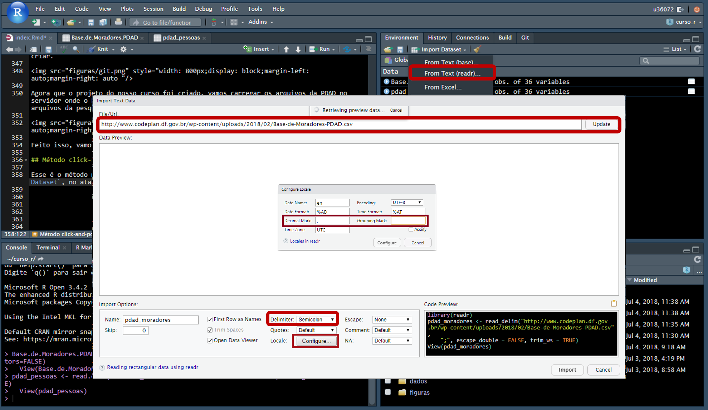

--- 
title: "Curso R"
author: "Thiago Mendes Rosa"
date: "`r Sys.Date()`"
output:
  html_document:
    #df_print: paged
    theme: flatly
    highlighting: tango
    number_sections: yes
    toc: yes
    toc_float: yes
description: Minicurso de R aplicado a manipulação de microdados da Codeplan
#documentclass: book
fontsize: 14pt
#github-repo: curso-r/ragmatic-book
link-citations: yes
#bibliography: book.bib
#site: bookdown::bookdown_site
biblio-style: apalike
---

```{r, echo=F}
# Definir opções dos chunks
knitr::opts_chunk$set(echo = TRUE, warning = FALSE, message = FALSE,
                      results = "hide")


setwd("~/curso_r")
```

# Agenda

Este minicurso de R será focado no `tidyverse` (universo "arrumado"), que conta um um conjunto de pacotes que auxiliam os pesquisadores a manipular suas bases de dados, preparando-as para que as análises sejam realizadas. Preparar a base de dados, geralmente, é a etapa que mais consome tempo do pesquisador. Portanto, ter uma ferramenta que torne essa tarefa mais eficiente é fundamental.

Mais informações sobre o `tidyverse` estão disponíveis livro [R for data science](http://r4ds.had.co.nz/). Esse curso foi baseado no curso [R pragmático](https://curso-r.github.io/ragmatic-book/), que pode ser consultado e realizado sempre que necessário.

**Público-alvo**

- Novos estagiários da Codeplan.
- Pesquisadores da Codeplan.
- Pessoas com desejo de adquirir novos conhecimentos.

**Requisitos básicos:**

- Noções de lógica de programação.
- Noções básicas de estatística.
- Noções básicas de inglês (para facilitar pesquisas e entendimento das funções).

**Conteúdo:**

- Introdução ao R;
- Carga da Pesquisa Distrital por Amostra de Domicílios, de diversas formas;
- Introdução ao `tidyverse`;
- Operador `pipe`, manipulação de textos com o `stringr`e datas `lubridate`;
- Transformação de dados com `dplyr` e `tidyr`, visualização de dados com `ggplot2`;
- Elaboração de relatórios com `knitr` e `rmarkdown`.

# Introdução

## Por que usar o R e não outros softwares?

- O R é um sistema para estatísticva computacional e gráfica;

- Um dos focos do R é análise de dados e a interatividade. Isso faz com que o R seja uma linguagem intuitiva e flexível.

- Código aberto: sem pirataria!

- Constantemente atualizado

- Comunidade ativa e cada vez mais ampla (estatística, economia, pscicologia, biologia etc.)

- O R possui a possibilidade de adotar diversos pacotes. Estes pacotes são coleções de funções e/ou bases de dados desenvolvidos pela comunidade que utiliza a ferramenta. Or pacotes ficam disponíveis no [CRAN](https://cran.r-project.org/), que é o *Comprehensive R Archive Network*, i.e., uma coleção de sites da linguagem R e seus documentos relacionados.

## RStudio

O RStudio é um ambiente integrado de desenvolvimento para a linguagem R. Ele ajuda a organizar os trabalhos desenvolvidos, dividindo os conteúdos em janelas. Ele, por exemplo, tem recursos que facilitam a escrita dos códigos (com atalhos de teclado e o recurso de auto completar). Além disso, possibilita que alguns recursos sejam utilizados via *click and point*. Acesse  [essa página](https://csgillespie.github.io/efficientR/set-up.html#rstudio) para maiores informações.

Um recurso muito importante do RStudio, e amplamente utilizado na Codeplan, é a possibilidade de criar projetos. Nossos projetos são todos com controle de versão, realizados atravez do [github](https://github.com/). Caso você não tenha uma conta, aproveite essa oportunidade para fazê-la.

## Rsutdio Server

A Codeplan conta com o RStudio server, o que significa que você pode acessar e trabalhar de qualquer máquina conectada à rede do GDF diretamente do navegador. Clique [aqui](http://rserver.codeplan.df.gov.br/) para acessar o servidor.

Uma vantagem de utilizar o Rserver é sua alta capacidade de processamente, contando atualmente com 32GB de memória ram e um processador de 32 núcleos.

Além disso, os pacotes instalados para a realização de um projeto ficam disponíveis para todos os demais usuários da empresa, sendo periodicamente atualizados pelo administrador do servidor. Isso facilita a reprodutibilidade dos códigos escritos por outros usuários.

## Banco de dados da Codeplan

A Codeplan conta com um banco de dados com as principais pesquisas da empresa já organizadas e prontas para uso, além de outras fontes de dados secundárias bastante utilizadas em pesquisas (e.g. IBGE). A vantagem de se utilizar um banco de dados centralizado é que todos usem a mesma fonte de informação para a produção de relatórios, garantindo consistência aos dados gerados.

Além disso, as bases utilizadas em um trabalho ficam a disposição dos demais pesquisadores da empresa, evitando o trafego de informações localmente. Quanto mais usuários estiverem utilizando a mesma fonte de dados, mais fácil fica para validar as informações e proceder eventuais correções para todos os usuários da informação.

Atualemente, o banco conta com as seguintes bases de dados:

- Pesquisa Distrital por Amostra de Domicílios;
- Pesquisa Metropolitana por Amostra de Domicílios;
- Pesquisa Nacional por Amostra de Domicílios;
- Relação Anual de Informações Sociais;
- Censo escolar;
- Prova Brasil;
- Enem;
- IPCA;
- Pesquisas 156

As informações podem ser facilmente carregadas pelo R (ou qualquer outro pacote estatístico), por conexão ODBC -- acrônimo para Open Database Connectivity. O Rserver já está configurado para fazer esta conexão, enquanto as máquinas locais podem ser facilmente configuradas seguindo **esses passos (incluir informação)**. As bases são acessadas com o pacote `RODBC`, através de consultas SQL (Structured Query Language), que nada mais é que uma linguagem estruturada para realizar consultas em banco de dados.

## GitHub

O GitHub é uma plataforma online de compartilhamento e armazenamento de códigos. Projetos do GitHub são baseados no `git`, uma ferramenta de versionamento de software.

A codeplan utiliza o GitHub para organizar e versinar seus projetos, de modo a mantê-los organizados e atualizados, sem o risco de perder alguma informação acidentalmente ou por alguma falha técnica. Outra vantagem é a característica colaborativa da plataforma, permitindo o acesso aos códigos de qualquer lugar por outros pesquisadores. Se o repositório for público, qualquer pessoa pode contribuir com os projetos, proporcionando ganhos a todos os futuros usuários.

## RMarkdown

O Markdown é um sistema para tornar a escrita e a leitura de textos mais simples. Ele adiciona as formatações correspondentes do formato em que você deseja apresentar seu texto de maneira simplificada, através de símbolos de teclado.

No R, o RMarkdown, é um tipo de documento especial que contém tanto textos, no formato markdown, quanto códigos em R. Os códigos em R podem ser inseridos diretamente no texto ou separados em estruturas específicas (*chunks*). Os códigos são executados sempre que o documento é processado para algum formato específico, que pode HTML (como esse documento que você está lendo), em PDF (formato `Latex`) ou mesmo microsoft Word. Apresentações de slides também podem ser facilmente realizadas com o Rmarkdow, nos formatos HTML ou Latex.

Alguns relatórios e apresentações da Codeplan são produzidos em Rmardonw. As apresentações da pesquisa [156](https://codeplanprojetos.github.io/156_adasa_2018/) e da PDAD 2018 estão sendo produzidos com esta ferramenta.

Suas principais vantagens são a **velocidade**, **reprodutibilidade** e ***eficiência** na produção destes relatórios. Por exemplo, a produção de relatórios para 31 Regiões Administrativas do DF a partir dos dados da PDAD 2018 fica muito mais rápida e padronizada.

Para detalhes sobre como utilizar o RMarkdown, acesse [esse](http://r4ds.had.co.nz/r-markdown.html) e [esse](http://rmarkdown.rstudio.com/lesson-1.html) sites (em inglês).

# Preliminares

## Estrutura do RStudio Server

O primeiro passo é efetuarmos o login no RStudio server da Codeplan. Para isso, acesse o site do [servidor](http://rserver.codeplan.df.gov.br/).


Entre com suas credenciais e faça o login.

O RStudio server estará dividido em quatro painéis: o superior à esquerda apresenta os scripts abertos para uso; o inferior a esquerda apresenta o console, local em que os comandos e seus resultados são apresentados. Nesse painel há também uma aba para o terminal do Linux; o supeior direito apresenta o ambiente, com os objetos ativos na sessão. Há mais quatro abas, com o histórico dos comandos executados, as conexões, build (para desenvolvimentos) e o Git; por fim, o inferior direito apresenta o diretório de trabalho, com as pastas e arquivos. Há ainda mais quatro abas, que apresentam os plots gerados, os pacotes disponíveis na biblioteca, a janela de ajuda e a janela de visualização (utilizadas por alguns pacotes para mostrar conteúdos da web).


Na parte superior, existe uma barra de tarefas, com a qual você pode criar novos scripts, projetos, abrir arquivos, executar buscas etc. São formas de você executar funções por click-and-point. Por exemplo, você pode alterar a visualização do RStudio server em `Tools` -> `Global Options...` -> `Appereance`.

Por todos os painéis existem atalhos úteis para executar diversas tarefas (abrir um novo script, criar um novo projeto, salvar o projeto salvo, criar uma nova pasta etc.).

## Pacotes
Uma das funções mais básicas é instalar e carregar um pacote. Por exemplo:

```{r, warning=FALSE, message=FALSE}
#install.packages("tidyverse") # Instalar o pacote "tidyverse"
library(tidyverse) # Carregar o pacote "tidyverse"
```

Repare que o caracter $"#"$ é utilizado para escrever comentários na codificação. Documentar bem seu código é fundamental para as pessoas que trabalham com você entendam o que foi realizado. Além disso, é fundamental para que uma tarefa que dependa desse código possa ser executada ou alterada por outro programador. Lembre-se que tudo o que produzimos é público e deve ser o mais acessível possível para qualquer pessoa!

## Operadores básicos

Dentro do R, alguns operadores básicos são constantemente utilizados. Os mais comuns são:

```{r, echo=F,results='asis'}
pander::pander(
data.frame(Operadores=c("+","-","*","/","^ ou **", "%%","%/%"),
           Descrição=c("Adição","Subtração","Multiplicação",
                       "Divisão","Exponenciação","Resto da divisão","Divisão inteira")),
caption="Operadores aritiméticos")
```

```{r, echo=F,results='asis'}
pander::pander(
data.frame(Operadores=c("<","<=",">",">=","==","!=","!X","X|Y","X&Y"),
           Descrição=c("Menor","Menor ou igual","Maior","Maior ou igual",
                       "Exatamente igual a","Não é igual a","Não X",
                       "X ou Y","X e Y")),
caption="Operadores lógicos")
```

```{r, echo=F,results='asis'}
pander::pander(
data.frame(Operadores=c("x <- valor","x <<- valor",
                        "valor -> x","valor ->> x",
                        "x = valor"),
           Descrição=c("Atribuir 'valor' a 'x'","Atribuir 'valor' a 'x'",
                       "Atribuir 'valor' a 'x'","Atribuir 'valor' a 'x'",
                       "Atribuir 'valor' a 'x'")),
caption="Operadores de atribuição de valor")
```

Agora vamos realizar algumas operações básicas com o R.

```{r warning=FALSE, message=FALSE}
1 + 2 # Adição
```

```{r warning=F,message=F}
3 - 1 # Subtração
```

```{r warning=FALSE, message=FALSE}
2 * 2 # Multiplicação
```

```{r warning=FALSE, message=FALSE}
1 / 4 # Divisão
```

O R realiza operações matemáticas básicas diretamente no console, como adição, subtração, multiplicação e divisão. Ele também realiza testes lógicos.

```{r, warning=F,message=F}
2+2==4 # 2 + 2 é igual a 4?
```

```{r, warning=F,message=F}
2+2==5 # 2 + 2 é igual a 5? 
```

```{r, warning=F,message=F}
2+2&1+3==4 # 2 + 2 e 1 + 3 são iguais a 4?
```

```{r, warning=F,message=F}
2+2|1+4==5 # 2 + 2 ou 1 + 4 são iguais a 5?
```

## Utilizar chamada de funções

As funções no R são chamadas seguidas dos símbolos "()". Algumas delas estão sempre disponíveis no R (como as "base functions") e outros apenas disponíveis quando os pacotes são carregados.

```{r, warning=FALSE, message=FALSE}
sum(1,2) # Adição
prod(2,2) # Multiplicação
```

Algumas funções podem ser chamadas diretamente de seus pacotes, sem que seja necessário carregar o respectivo pacote.

```{r, warning=FALSE, message=FALSE,results='hide'}
psych::describe(c(1,2)) # Utilizando a função describe, do pacote "psych", sem carregálo
```

Apesar de ser necessário digitar mais caracteres para obter o resultado, chamar funções desta maneira tem duas vantages. A primeira é que fica claro, em cada passo, qual o pacote está sendo utilizado para executar determinada tarefa. Em segundo lugar, caso exista algum outro pacote com uma função de mesmo nome, não haverá o risco de utilizarmos a função errada para o problema que estamos tratando.

## Criar uma função

Você pode criar suas próprias funções do R. Por exemplo, ao invés de utilizar a função de soma `sum`, nós podemos criar nossa própria função de soma.

```{r, warning=FALSE, message=FALSE, results='hide'}
# Função para somar dois valores
somar <- 
  function(x,y){
  z = x + y
  
  print(z)
  
  }

#Aplicar a função
somar(2,4)
```

# Operador Pipe

Com o R, nós podemos "aninhar" várias funções ao mesmo tempo. Por exemplo, se quiser somar um vetor de números, tirar a raiz quadrada e arrendondar, podemos fazer tudo isso em uma única linha de comando.

```{r}
x <- c(1:10) # Criar o vetor numérico

round(sqrt(sum(x))) # Calcular a raíz quadrada da soma do vetor x
```

Todavia, algumas vezes aninhar várias funções ao mesmo tempo pode deixar o código confuso. Vejamos um exemplo, com uma função para preparação de um bolo.^[Exemplo extraído de: https://curso-r.github.io/ragmatic-book/principios.html#pipe.]

```{r}
# esfrie(asse(coloque(bata(acrescente(recipiente(rep("farinha", 2), "água", "fermento", "leite", "óleo"), "farinha", até = "macio"), duração = "3min"), lugar = "forma", tipo = "grande", untada = T), duração = "50min"), "geladeira", "20min")
```

Dentro de um mesmo código, é possível indentar as linhas, sempre após um novo argumento da função a ser separado por vígula.

```{r}
# esfrie(asse(coloque(bata(acrescente(recipiente(rep("farinha", 2), 
#                                                "água", "fermento", 
#                                                "leite", "óleo"), 
#                                     "farinha", até = "macio"), 
#                          duração = "3min"),
#                     lugar = "forma", tipo = "grande", untada = T), 
#             duração = "50min"), "geladeira", "20min")
```

Mesmo assim, ainda resta alguma dificuldade para realuzar a leitura do código de uma maneira mais clara e fluída. Essa é uma das vatagens de utilizar o operador pipe `%>%`, que é bastante intuitivo. Ele realiza o seguinte comando: "use o resultado do lado esquedo como argumento da função do lado direito". Para utlizá-lo, é necessário carregar algum pacote que leve o operador. Ao carregar o `tidyverse`, por exemplo, você já estará apto a usar o pipe.

Vamos testar o operador pipe para calcular novamente a raiz quadrada da soma de um vetor.

```{r}
x <- c(1:10)

x %>% sum %>% sqrt %>% round
```

Observe que a escrita fica muito mais intuitiva. Para o caso do bolo:

```{r}
# recipiente(rep("farinha", 2), "água", "fermento", "leite", "óleo") %>%
#   acrescente("farinha", até = "macio") %>%
#   bata(duração = "3min") %>%
#   coloque(lugar = "forma", tipo = "grande", untada = T) %>%
#   asse(duração = "50min") %>%
#   esfrie("geladeira", "20min")
```

A utilização do pipe será muito importante para a manipulaçaõ das bases de dados, uma vez que, geralmente, são necessárias várias sequências de funções até que elas fiquem no formato desejado para análise.

## Onde encontrar ajuda

Há várias maneiras de encontrar ajuda sobre um pacote específico. Por exemplo, você pode acessar os detalhes da função `psych::describe` posicionado o cursor próximo a função e pressionar a tecla F11.

Uma outra maneira é colocar um $?$ antes da função para a qual se quer ajuda. Uma terceira opção é utilizar a função `help`.

```{r warning=FALSE, message=FALSE}
?psych::describe
help("describe")
help(describe)
?psych
help("psych")
help(psych)
```

Para uma pesquisa mais ampla, que irá escanear todos os documentos do pacote instalado na sua biblioteca, você pode utiliza ro símbolo $??$ antes da função ou utilizar diretamente a função `help.search`

```{r, warning=FALSE, message=FALSE}
??psych
help.search("psych")
```

Por fim, outra forma de realizar pesquisas, utilizando a internet é com a função `RSiteSearch`.

```{r warning=FALSE, message=FALSE}
RSiteSearch("psych")
RSiteSearch("{linear model}")
```

O site [stackoverflow](https://stackoverflow.com/questions/tagged/r) é outra excelente fonte de informação. É muito possível que a dúvida ou o problema que você está encontrando em alguma programação já foi enfrentado por outro usuário. Assim, basta pesquisar sobre sua dúvida neste site (geralmente, feitas e respondidas em inglês).

Por fim, uma boa e velha máquina de buscas é fundamental. Quase todas as repostas você encontrará lá.

# Carga da PDAD 2015

Vamos iniciar a atividade de utilizar a base de dados carregando a Pesquisa Distrital por Amostra de Domicílios 2015. A PDAD é uma pesquisa amostral conduzida pela Codeplan a cada dois anos, com representatividade para as 31 Regiões Administrativas, tendo por objetivo traçar as principais características dos domicílios e pessoas destas localidades.

Vamos carregar a PDAD 2015 de quatro maneiras diferentes. A PDAD 2015 está disponível, no fomato `.csv` no site da Codeplan, neste [endereço](http://www.codeplan.df.gov.br/pdad-2015/). São quatro arquivos: dois deles contendo os microdados, referentes aos domicílios e aos moradores e seus respectivos dicionários.

As bases de dados com microdados usualmente são separadas em tantos arquivos quanto necessário, seguindo sempre de uma documentação que detalha os aspectos técnicos, fornecendo informações para a manipulação dos dados.

Vamos criar um projeto para fazermos nossas análises. Acesse sua conta no [github](https://github.com/) e crie um novo repositório. Depois disso, vamos criar um novo projeto no RStudio server. Para isso, clique em `File`, `New project`, `Version Control`,`Git`. No campo `Repository URL`, cole a url do projeto que você acabou de criar. 


Agora que o projeto do nosso curso foi criado, vamos carregar os arquivos da PDAD no servidor onde o Rstudio está instalado. Cria uma pasta chamada `dados` e salve os arquivos da pesquisa dentro dela.


Feito isso, vamos agora carregar os dados no R de quatro maneiras diferentes.

## Método click-and-point

Para isso, clique em `Import Dataset`, no atalho do painel `Ambiente`. O RStudio server vem configurado com duas opções para você importar os dados. Vamos ver a primeira delas, `From Text(base)`.


Nesta primeira opção, você seleciona o arquivo `.csv` salvo no passo alterior e o R já apresenta a estrutura dos dados. Marque a opção "yes" em `Heading` e desmarque a opção `String as factors`. Caso deseje, altere o nome do arquivo e clique em importar.

Repare que, no painel console, o código necessário para carregar a base é inserido. Teste novamente, copiando essa linha de comando e rodando no console.

```{r}
pdad_moradores <- read.csv2("~/curso_r/dados/Base-de-Moradores-PDAD.csv", stringsAsFactors=FALSE)
```

Vamos agora testar o segundo método. Novamente, clique em `Import Dataset`, no atalho do painel `Ambiente`, mas agoa na opção `From Text(readr)`. Agora, ao invés de informar o arquivo que você baixou, basta informar o link onde ele está hospedado. No nosso caso, é o mesmo endereço em que baixamos os dados da [PDAD 2015](http://www.codeplan.df.gov.br/pdad-2015/). Vamos testar com a [base de moradores](http://www.codeplan.df.gov.br/wp-content/uploads/2018/02/Base-de-Moradores-PDAD.csv).



Assim que você inserir o link para a pesquisa, clique em `Update` para visualizar uma prévia dos dados. Mude o delimitador dos dados para `Semicolon` e clique em importar. Repare, novamente, que o comando necessário para carregar os dados aparece no console. Desta vez, a função utilizada para ler o conjunto de dados foi `read_delim`. Mais uma vez, copie e rode essa linha de comando diretamente no console.

```{r}
pdad_moradores <- read_delim("http://www.codeplan.df.gov.br/wp-content/uploads/2018/02/Base-de-Moradores-PDAD.csv",";", escape_double = FALSE, trim_ws = TRUE)
```

Você poderia carregar os dados, de ambas as maneiras, diretamente pela linha de comando. Um outro pacote, bastante últil e veloz para o carregamendo de dados é o `data.table`. Vamos treinar o carregamento dos dados pela linha de comando. Para isso, vamos antes limpar o ambiente, excluindo os objetos carregados anteriormente, com a função `rm()`. 

```{r}
rm(pdad_moradores) # Remove apenas o objeto "pdad_moradores"
rm(list=ls()) # Remove todos os objetos do ambiente
```

Repare que você pode excluir todos os objetos do ambiente, listando-os com a função `ls()`. Vamos também definir o diretório padrão em que estamos trabalhando. O RStudio server, por padrão, utilizará a pasta do seu usuário no servidor. Para consultar o diretório ativo no momento, utilize a função `getwd()`.

```{r}
getwd()
```

Vamos alterar para a pasta `curso_r`, criada juntamente com o nosso projeto.

```{r}
setwd("/u02/u36072/curso_r")
setwd("~/curso_r")
```

Repare que existem duas maneiras de definir o diretório padrão. Caso ele seja um subdiretório do qual você está trabalhando atualmente, basta entrar com o caracter `~` antes do caminho desejado. Este recurso é um atalho para o endereço do diretório atualmente ativo no R. Você também pode indicar o caminho completo, conforme no exemplo acima. Repare que o padrão dos caminhos é a barra invertida `/`. Apesar deste ser o padrão Linux, que é o ambiente utilizado no servidor, ele também deve ser seguido nas demais plataformas, como o Windows.

## Método por linha de comando

Agora vamos carregar novamente a base de moradores da PDAD, desta vez apenas utilizando a linha de comando. 

````{r}
# Carregar o pacote
library(data.table)
# Carregar a base de um arquivo local
pdad_moradores <- data.table::fread("dados/Base-de-Moradores-PDAD.csv",
                                    dec = ",",encoding = "Latin-1")
# Carregar a base de um link da internet.
pdad_moradores <- data.table::fread("http://www.codeplan.df.gov.br/wp-content/uploads/2018/02/Base-de-Moradores-PDAD.csv",dec = ",",encoding = "Latin-1")
```

Repare que, com a função `fread()`, nós podemos carregar a base de ambas as maneiras com a mesma função. Repare que a função `fread()` detectou o delimitador automaticamente. Informamos apenas que o separador decimal da nossa base é a vírgula, com a opção `dec=","` e que o enconding do arquivo é `enconding=Latin-1`. Essa última opção é importante quando estamos transitando arquivos salvos em diferentes formatos, principalmente entre Windows e Linux, que possuem formas distintas de tratar caracteres especiais. Agora que você já aprendeu a carregar a base de moradores, pratique carregando também a base de domicílios.

## Carga pelo banco de dados

A última maneira, que deverá ser sempre sua *primeira* opção, é carregar a base diretamente do banco de dados da Codeplan. Para isso, vamos precisar do pacote `RODBC`, que fará a nossa conexão com o banco de dados. Isso é feito através da função `odbcConnect()`.

```{r, results='hide'}
source("/u02/u36072/banco.R")
```


```{r}
# Carregar pacote
library(RODBC)

# Abrir conexão com o banco de dados
db <- RODBC::odbcConnect("db_codeplan", uid=matricula, pwd=senha, 
                         believeNRows=FALSE)
```

Pronto! Já estamos conectados ao banco de dados. Para consultar as tabelas disponíveis, utilizamos a função `sqlTables()`. O argumento desta função é o objeto com a conexão que fizemos para o banco de dados.

```{r}
# Verificar as tabelas disponíveis no banco de dados
tabelas <- RODBC::sqlTables(db)
```

No objeto `tabelas` nós podemos observar todas as tabelas que temos permissão de acesso. para consultar os dados carregados, você pode clicar no objeto carregado ou utilizar a função `View()`. Para consultar a classe do objeto carregado, utilize a função `class()`, enquanto, para ver os nomes, utilize as função `names()`. A função `head()` apresenta as primeiras linhas do data.frame, enquanto a função `tails()` apresenta as últimas. Os tipos das colunas podem ser consultados com a função `glimpse()`, do pacote `dplyr`

```{r}
#View(tabelas) # Visualizar o objeto tabelas
class(tabelas) # Verificar a classe do objeto
names(tabelas) # Verificar o nome das colunas carregadas
head(tabelas) # Verificar as primeiras linhas da tabela
tail(tabelas) # Verificar as últimas linhas da tabela
dplyr::glimpse(tabelas) # Verificar tipo das colunas
```


A coluna `TABLE_CAT` informa o banco de origem, `TABLE_SCHEM` informa o esquema da tabela, `TABLE_NAME` o nome da tabela, `TABLE_TYPE` o tipo e `REMARKS` as observações, se houver.

O objeto do tipo `data.frame`será aquele com o qual mais iremos trabalhar. Esse objeto é como se fosse uma matriz, em que as linhas representam as observações e as colunas as variáveis. Como em uma matriz, você pode acessar as linhas e as colunas com o operador `[,]` logo após o nome do objeto. À esqueda, indica-se a posição da linha, enquanto à direita indica-se a coluna. Você pode utilizar a posição númerica ou o nome da coluna. Repare que a função `names()` indica a posição das colunas. Outra maneira para acessar uma variável específica, utilize o caracter `$` logo após o nome da tabela. Por exemplo, para consultar apenas a coluna com os esquemas, utilize o comando abaixo. 

```{r}
tabelas$TABLE_SCHEM # Consultar apenas a coluna "TABLE_SCHEM"
tabelas[,2] # Outra maneira de consultar a coluna "TABLE_SCHEM"
tabelas[,"TABLE_SCHEM"] # Mais uma maneira de consultar a coluna "TABLE_SCHEM"
tabelas[1:2,1:2] # Selecionar apenas as duas primeiras linhas e colunas
tabelas[1:2,]$TABLE_SCHEM # Selecionar apenas as duas primeiras linhas da coluna "TABLE_SCHEM"
tabelas[c(1,7,10:12),c(1,3)] # Selecionar linhar e colunas distintas
```
 
Para fazer uma tabulação simples, para verificar o número de tabelas em cada esquema, utilize a função `table()`.

```{r}
table(tabelas$TABLE_SCHEM) # Tabular a coluna
table(tabelas[,2]) # Tabular a coluna
table(tabelas[,"TABLE_SCHEM"]) # Tabular a coluna
```

Agora, vamos aprender a filtrar os dados. Como o nosso foco é na PDAD, focar apenas nas tabelas deste esquema. Em outras palavras, queremos olhar apenas as **linhas** do esquema "pdad". Isso é feito da seguinte maneira.

```{r}
tabelas[tabelas$TABLE_SCHEM=="pdad",3]
tabelas[tabelas[,2]=="pdad",]$TABLE_NAME
```

Dentro da posição para indicar a linha a ser selecionada, nós informamos que queremos apenas as linhas em que a coluna `TABLE_SCHEM` é exatamente igual à "pdad". Note que, como se trata de um campo caractér, nós devemos colocar a condição do filtro entre aspas.

Com isso, nós já conseguimos identificar quais são as tabelas que temos interesse em analisar. Vamos refazer todos esses passos, agora de uma maneira muito mais simples e rápida, com o pacote `dplyr`, utilizando os pipes.

```{r}
# Carregar o pacote dplyr
library(dplyr)

# Consultar as tabelas disponíveis
RODBC::sqlTables(db) %>%
  # Filtrar apenas linhas do esquema PDAD
  dplyr::filter(TABLE_SCHEM=="pdad") %>%
  # Selecionar apenas a coluna com as tabelas
  dplyr::select(TABLE_NAME)
```

Com as funções `filter` e `select` nós conseguimos filtrar e selecionar colunas facilmente, de uma maneira rápida e elegante.

Agora que temos o nome das tabelas da pdad, vamos consultar quais são as colunas existentes, por exemplo, naquela referente às pessoas. Para isso, vamos utilizar a função ``

```{r}
colunas <- RODBC::sqlColumns(db,"pdad.pdad_2015_mor")
```

Os nomes das colunas estarão disponíveis na coluna `COLUMN_NAME`. O objeto carregado possui diversas informações, como o tipo e o tamanho da coluna. Como, neste momento, vamos trabalhar apenas com os nomes das colunas, vamos utilizar o que já aprendemos para visualizar somente esta informação.

```{r}
RODBC::sqlColumns(db,"pdad.pdad_2015_mor") %>%
  dplyr::select(COLUMN_NAME)
```

Feito isso, já estamos pronto para carregar a base de moradores da PDAD no R. Para isso, vamos utilizar a função `sqlQuery`. Dentro dessa função, enviar qualquer consulta SQL, da mesma maneira que fazemos em qualquer outro programa de acesso a bancos de dados. A única diferença é que o pacote `RODBC` estará intermediando a comunicação, apresentando os dados quando pertinente. Vamos, então, carregar a base de pessoas.

```{r}
pdad_moradores <- RODBC::sqlQuery(db,"select * from pdad.pdad_2015_mor")
```