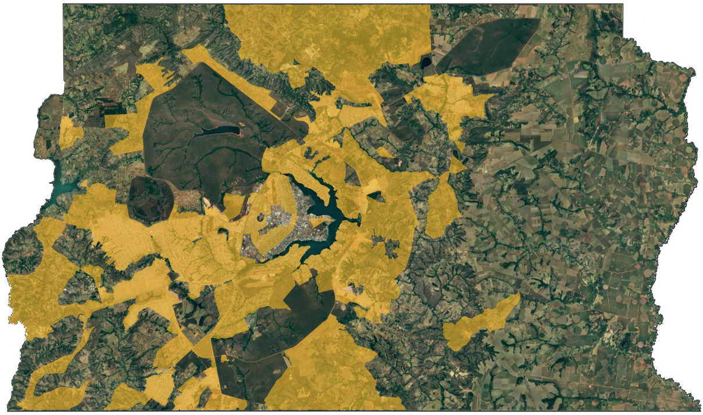

--- 
title: "Curso R"
author: "Thiago Mendes Rosa"
date: "`r Sys.Date()`"
output:
  html_document:
    highlighting: tango
    number_sections: yes
    theme: flatly
    toc: yes
    toc_float: yes
  pdf_document:
    toc: yes
link-citations: yes
fontsize: 18pt
description: Minicurso de R aplicado a manipulação de microdados da Codeplan
---

```{r, echo=F}
library(knitr)
library(stringr)
library(forcats)
# Definir opções dos chunks
knitr::opts_chunk$set(echo = TRUE, warning = FALSE, message = FALSE,
                      results = "hide")
# Definir função para separador de milhar e decimal dos chunks
knit_hooks$set(inline = function(x) {
  prettyNum(x, big.mark=".",decimal.mark = ",")
})
# Outras opções gerais e de pacotes específicos
options(OutDec = ",")
options(scipen=999)
setwd("~/curso_r")
```

# Agenda

Este minicurso de R será focado no `tidyverse` (universo "arrumado"), que conta um um conjunto de pacotes que auxiliam os pesquisadores a manipularem suas bases de dados, preparando-as para que análises possam ser realizadas. Ajustar a base de dados, geralmente, é a etapa que mais consome tempo em uma pesquisa. Portanto, ter uma ferramenta que torne essa tarefa mais eficiente é fundamental.

Informações mais aprofundadas sobre o `tidyverse` estão disponíveis livro [R for data science](http://r4ds.had.co.nz/). 

Esse curso foi baseado nos cursos [R pragmático](https://curso-r.github.io/ragmatic-book/) e [Curso de R](http://material.curso-r.com/rbase/), que podem ser consultados sempre que necessário. O livro [R para cientistas sociais](http://www.uesc.br/editora/livrosdigitais_20140513/r_cientistas.pdf) é uma outra boa fonte de informações.

**Público-alvo**

- Estagiários da Codeplan.
- Pesquisadores da Codeplan.
- Pessoas da Codeplan com desejo de adquirir novos conhecimentos.

**Requisitos básicos:**

- Noções de lógica de programação.
- Noções básicas de estatística.
- Noções básicas de inglês (para facilitar pesquisas e entendimento das funções).

**Conteúdo:**

- Introdução ao R;
- Projetos com controle de versão pelo github;
- Acesso ao banco de dados da Codeplan;
- Carga da Pesquisa Distrital por Amostra de Domicílios 2018;
- Introdução ao `tidyverse`;
- Operador `pipe`, manipulação de textos com o pacote `stringr`e datas com o pacote `lubridate`;
- Transformação de dados com `dplyr` e `tidyr`;
- Visualização de dados com `ggplot2`;
- Elaboração de mapas;
- Utilização do pacote `survey` e `srvyr` para pesquisas amostrais;
- Elaboração de relatórios com o `Rmarkdown`.

# Introdução

Como surgiu o R e quem o utiliza hoje?

[Vídeo introdutório](https://youtu.be/u94oFWZCTCU)

## Por que usar o R e não outros softwares?

- O R é um sistema para estatística computacional e gráfica;

- Um dos focos do R é análise de dados e a interatividade. Isso faz com que o R seja uma linguagem intuitiva e flexível.

- Código **aberto**: **sem pirataria!**

- Constantemente atualizado;

- Comunidade ativa e cada vez mais ampla (estatística, economia, psicologia, biologia etc.);

- O R possui a possibilidade de adotar diversos pacotes. Estes pacotes são coleções de funções e/ou bases de dados desenvolvidos pela comunidade que utiliza a ferramenta. Os pacotes ficam disponíveis no [CRAN](https://cran.r-project.org/) -- *Comprehensive R Archive Network* -- que nada mais é do que uma coleção de sites da linguagem R e seus documentos relacionados.

- Versatilidade para integração com outras linguagens e ferramentas. Já é possível rodar python diretamente no RStudio;

- As versões mais recentes do R podem ser baixadas [neste site](https://www.r-project.org/). Uma versão específica, e também gratuita, aprimorada da Microsoft para certas plataformas está disponível [neste site](https://mran.microsoft.com/download).

## RStudio

O RStudio é um ambiente integrado de desenvolvimento (*integrated development environment* -- IDE) para a linguagem R. Ele ajuda a organizar os trabalhos desenvolvidos, dividindo os conteúdos em janelas. Ele, por exemplo, tem recursos que facilitam a escrita dos códigos (com atalhos de teclado e o recurso de auto completar). Além disso, possibilita que algumas funções sejam utilizadas via *point-and-click*. Acesse  [essa página](https://csgillespie.github.io/efficientR/set-up.html#rstudio) para maiores informações (em inglês).

Para baixar o RStudio, acesse [este site](https://www.rstudio.com/products/rstudio/download/preview/).

Um recurso muito importante do RStudio, amplamente utilizado na Codeplan, é a possibilidade de criar projetos. Nossos projetos são conduzidos com controle de versão, por meio do [Github](https://github.com/).

## Rsutdio Server

A Codeplan conta com o RStudio server, o que significa que você pode acessar e trabalhar de qualquer máquina conectada à rede do GDF diretamente do navegador. Clique [aqui](http://rserver.codeplan.df.gov.br/) para acessar o servidor.

Uma vantagem de utilizar o Rserver é sua alta capacidade de processamento, quando comparado com as máquinas locais, contando atualmente com 32GB de memória RAM e um processador de 32 núcleos.

Além disso, os pacotes instalados para a realização de um projeto ficam disponíveis para os demais usuários da empresa, sendo periodicamente atualizados pelo administrador do servidor. Isso facilita a reprodutibilidade dos códigos escritos por outros usuários, auxiliando também na continuidade de pesquisas e projetos. Sempre que precisar instalar um pacote, comunique o administrador do servidor para que ele também fique disponível para os demais usuários. Caso você necessite um pacote que demande alguma atualização do servidor, contate o administrador do servidor.

## Banco de dados da Codeplan

A Codeplan conta com um banco de dados com as principais pesquisas da empresa, já organizadas e prontas para uso, além de outras fontes de dados secundárias bastante utilizadas em pesquisas (e.g. IBGE). A vantagem de se utilizar um banco de dados centralizado é que todos os pesquisadores usam a mesma fonte de informação para a produção de relatórios, garantindo consistência aos produtos gerados.

Além disso, as bases utilizadas em um trabalho ficam à disposição dos demais pesquisadores da empresa, evitando o trafego de informações localmente. Quanto mais usuários estiverem utilizando a mesma fonte de dados, mais fácil fica para validar as informações e proceder eventuais correções, beneficiando todos os usuários. 

Atualmente, o banco conta com as seguintes bases de dados:

- Pesquisa Distrital por Amostra de Domicílios;
- Pesquisa Metropolitana por Amostra de Domicílios;
- Pesquisa de Emprego e Desemprego;
- Pesquisa Nacional por Amostra de Domicílios;
- Pesquisa Nacional por Amostra de Domicílios Contínua;
- Censo Demográfico;
- Pesquisa de Orçamentos Familiares;
- Cadastro de empresas da Receita Federal;
- Relação Anual de Informações Sociais;
- CAGED;
- Censo escolar;
- Prova Brasil;
- Enem;
- IPCA;
- INPC;
- Pesquisas 156;
- Base de MEIs;
- Cadastros de endereços;
- Finanças públicas anuais.

Algumas bases de dados são de acesso público, enquanto outras são de acesso restrito. Todos os usuários, por padrão, possuem permissão de leitura das bases públicas. Para as bases restritas, é necessário preencher um termo de responsabilidade de uso, informando o projeto, o período de uso e os produtos a serem gerados com as informações. Esse termo deve ser aprovado pelo gestor da informação, antes que o acesso seja liberado pelo administrador do banco de dados. Esse processo visa a resguardar a confidencialidade das informações.

As informações armazenadas no banco de dados podem ser facilmente carregadas pelo R (ou na maioria dos demais pacotes estatístico), por conexão ODBC -- acrônimo para *Open Database Connectivity*. O Rserver já está configurado para fazer esta conexão, enquanto as máquinas locais podem ser facilmente configuradas seguindo [esses passos](https://msdn.microsoft.com/pt-br/library/79hh5st2.aspx?f=255&MSPPError=-2147217396). As bases são acessadas com o pacote `RODBC` ou `DBI`, através de consultas SQL (*Structured Query Language*), que nada mais é que uma linguagem estruturada para realizar consultas em bancos de dados.

## GitHub

O **GitHub** é uma plataforma online de compartilhamento e armazenamento de códigos. Os projetos do GitHub são baseados no `git`, uma ferramenta de versionamento de software.

A Codeplan utiliza o GitHub (ou o GitLab) para gerenciar e versionar seus projetos, de modo a mantê-los organizados e atualizados, sem o risco de perder informações acidentalmente ou por alguma falha técnica. Outra vantagem é a característica colaborativa da plataforma, permitindo o acesso aos códigos, de qualquer lugar via internet, por outros pesquisadores. Se o repositório for público, qualquer pessoa pode contribuir com os projetos, proporcionando ganhos a todos os futuros usuários.

Caso você não tenha conta, aproveite essa oportunidade para criar uma no [Github](https://github.com/). Vale lembrar que todos os pacotes desenvolvidos no R ficam armazenados no GitHub e são de acesso público para qualquer usuário. Assim, você pode consultar a programação de todas as funções utilizadas no R.

## RMarkdown

O **Markdown** é um sistema para tornar a escrita e a leitura de textos mais simples. Ele adiciona as formatações correspondentes a estrutura na qual você deseja apresentar seu texto. Tudo isso é feito de maneira simplificada, através de símbolos de teclado.

No R, o RMarkdown, é um tipo de documento especial que contém tanto textos, no formato markdown, quanto códigos, em R. Os códigos em R podem ser inseridos diretamente no texto ou separados em estruturas específicas (*chunks*). Os códigos são executados sempre que o documento é processado para algum formato específico, que pode ser HTML (como esse documento que você está lendo), em PDF (formato $\LaTeX$) ou mesmo microsoft Word. Apresentações de slides também podem ser facilmente realizadas com o Rmarkdown, nos formatos `HTML` ou PDF ($\LaTeX$).

Alguns relatórios e apresentações da Codeplan são produzidos em RMarkdown. Algumas apresentações da pesquisa [156](https://codeplanprojetos.github.io/156_estacionamentos_rotativos_2018/) e os relatórios da PDAD 2018 foram produzidos com esta ferramenta.

Suas principais vantagens são a **velocidade**, **reprodutibilidade** e **eficiência** na produção destes relatórios. Por exemplo, a produção de relatórios para 31 Regiões Administrativas do DF, a partir dos dados da PDAD 2018, ficou muito mais rápida e padronizada.

Para detalhes sobre como utilizar o RMarkdown, acesse [esse](http://r4ds.had.co.nz/r-markdown.html) e [esse](http://rmarkdown.rstudio.com/lesson-1.html) sites (em inglês).

# Preliminares

## Estrutura do RStudio Server

O primeiro passo é efetuarmos o login no RStudio server da Codeplan. Para isso, acesse o site do [servidor](http://rserver.codeplan.df.gov.br/).


Entre com suas credenciais e faça o login.

O RStudio server estará dividido em quatro painéis: o superior à esquerda apresenta os scripts abertos para uso; o inferior à esquerda apresenta o console, local em que os comandos e seus resultados são apresentados. Nesse painel há também uma aba para o terminal do Linux; o superior direito apresenta o ambiente, com os objetos ativos na sessão. Há mais quatro abas, com o histórico dos comandos executados, as conexões, *build* (para desenvolvimentos) e o Git (se você estiver no ambiente de projetos); por fim, o inferior direito apresenta o diretório de trabalho, com as pastas e arquivos. Há ainda mais quatro abas, que apresentam os *plots* gerados, os pacotes disponíveis na biblioteca, a janela de ajuda e a janela de visualização (utilizadas por alguns pacotes para mostrar conteúdos da web).


Na parte superior, existe uma barra de tarefas, com a qual você pode criar novos scripts, projetos, abrir arquivos, executar buscas etc. São formas de você executar funções por *point-and-click*. Por exemplo, você pode alterar a visualização do RStudio server em `Tools` -> `Global Options...` -> `Appereance`.

Por todos os painéis existem atalhos úteis para executar diversas tarefas (abrir um novo script, criar um novo projeto, salvar o script atual, criar uma nova pasta etc.).

## Pacotes

Uma das funções mais básicas é instalar e carregar um pacote no R. Por exemplo:

```{r, warning=FALSE, message=FALSE}
#install.packages("tidyverse") # Instalar o pacote "tidyverse"
library(tidyverse) # Carregar o pacote "tidyverse"
```

Note que o caractere `#` é utilizado para escrever comentários na codificação. Documentar bem seu código é fundamental para as pessoas que trabalham com você entendam o que foi realizado. Além disso, é fundamental para que uma tarefa que dependa desse código possa ser executada ou alterada por outro pesquisador. Lembre-se que tudo o que produzimos é público e deve ser o mais acessível possível para qualquer pessoa! Para comentar uma série de linhas ao mesmo tempo, utilize o atalho `Ctrl`+`Shift`+`C` após selecioná-las.

Tão importante quanto utilizar um pacote é citar ele no seu trabalho. Para tanto, utilize a função `citation()`.

```{r}
citation("tidyverse")
```
  
## Operadores básicos

Dentro do R, alguns operadores básicos são constantemente utilizados. Os mais comuns são:

```{r, echo=F,results='asis'}
pander::pander(
data.frame(Operadores=c("+","-","*","/","^ ou **", "%%","%/%"),
           Descrição=c("Adição","Subtração","Multiplicação",
                       "Divisão","Exponenciação","Resto da divisão","Divisão inteira")),
caption="Operadores aritiméticos")
```

```{r, echo=F,results='asis'}
pander::pander(
data.frame(Operadores=c("<","<=",">",">=","==","!=","!X","X|Y","X&Y"),
           Descrição=c("Menor","Menor ou igual","Maior","Maior ou igual",
                       "Exatamente igual a","Não é igual a","Não X",
                       "X ou Y","X e Y")),
caption="Operadores lógicos")
```

```{r, echo=F,results='asis'}
pander::pander(
data.frame(Operadores=c("x <- valor","x <<- valor",
                        "valor -> x","valor ->> x",
                        "x = valor"),
           Descrição=c("Atribuir 'valor' a 'x'","Atribuir 'valor' a 'x'",
                       "Atribuir 'valor' a 'x'","Atribuir 'valor' a 'x'",
                       "Atribuir 'valor' a 'x'")),
caption="Operadores de atribuição de valor")
```

Algumas teclas de atalho podem ser bastante úteis na hora de escrever os códigos. Veja algumas das principais:

- **Ctrl+enter**: roda a linha selecionada no script, enviando-a para o console. Um dos atalhos mais utilizado.
- **Ctrl+shift+M**: (%>%) operador *pipe*.
- **Ctrl+1**: altera cursor para o script.
- **Ctrl+2**: altera cursor para o console.
- **Ctrl+Alt+I**: cria um *chunk* no R Markdown.
- **Alt+Shift+K**: janela com todos os atalhos disponíveis.

Agora vamos realizar algumas operações matemáticas básicas com o R. Digite diretamente no console ou abra um script, escreva os códigos e utilize o atalho de teclado para rodar o código (você pode rodar o código com o botão "Run" na parte superior da janela de script).

```{r warning=FALSE, message=FALSE}
1 + 2 # Adição
```

```{r warning=F,message=F}
3 - 1 # Subtração
```

```{r warning=FALSE, message=FALSE}
2 * 2 # Multiplicação
```

```{r warning=FALSE, message=FALSE}
1 / 4 # Divisão
```

O R também realiza testes lógicos. Vamos testar alguns deles.

```{r, warning=F,message=F}
2+2==4 # 2 + 2 é igual a 4?
```

```{r, warning=F,message=F}
2+2==5 # 2 + 2 é igual a 5? 
```

```{r, warning=F,message=F}
2+2&1+3==4 # 2 + 2 e 1 + 3 são iguais a 4?
```

```{r, warning=F,message=F}
2+2|1+4==5 # 2 + 2 ou 1 + 4 são iguais a 5?
```

No último exemplo testamos se alguma das duas expressões era verdadeira. Para testar cada uma separadamente, precisamos de uma função de entrada de vários argumentos simultaneamente. A função utilizada para combinar é a `c()`, na qual seus argumentos são separados por vírgulas. Vamos refazer o último exemplo.

```{r, warning=F,message=F}
c(2+2,1+4)==5 # 2 + 2 é igual a.---* 5? 1 + 4 é igual a 5?
```

Agora, o R testa separadamente os dois casos.

## Utilizar chamada de funções

As funções no R são chamadas seguidas de parenteses `()`. Algumas delas estão sempre disponíveis no R (como as **base functions**), enquanto outras estão apenas quando os pacotes são carregados. Vamos ver as funções de soma `sum()` e de multiplicação `prod()`.

```{r, warning=FALSE, message=FALSE}
sum(1,2) # Adição
prod(2,2) # Multiplicação
```

Algumas funções podem ser chamadas diretamente de seus pacotes, sem que seja necessário carregá-lo. Para isso, escreva o nome do pacote instalado, seguido do símbolo `::`.

```{r, warning=FALSE, message=FALSE,results='hide'}
psych::describe(c(1,2)) # Utilizando a função describe, do pacote "psych", sem carregá-lo
```

Apesar de ser necessário digitar mais caracteres para obter o resultado, chamar funções desta maneira apresenta duas vantagens. A primeira é que fica claro, em cada passo, qual o pacote está sendo utilizado para executar determinada tarefa. Em segundo lugar, caso exista algum outro pacote com uma função de mesmo nome, não haverá o risco de utilizarmos a função errada para o problema que estamos tratando.

## Criar uma função

Você pode criar suas próprias funções do R. Por exemplo, ao invés de utilizar a função de soma `sum`, nós podemos criar nossa própria função para somar dois valores.

```{r, warning=FALSE, message=FALSE, results='hide'}
# Função para somar dois valores
somar <- 
  
  # Abrir argumento para criação de função e informar dentro dos parenteses os parâmetros
  function(x,y){
    
    # Construir a operação de soma
  z = x + y
  
  # Retornar o resultado
  
  return(z)
  
  }
#Aplicar a função
somar(2,4)
```

No caso acima, determinamos que a função deve ser dois argumentos, `x` e `y`, os quais serão somados e atribuídos a variável `z`, que, por sua vez, será apresentada com a função `return()`.

## Tipos de dados

O R cria seus objetos em diversas classes e tipos. Para as classes, elas podem ser: `lógica`, `inteiro`, `numérico`, `complexo` ou `caractere`. Vamos olhar alguns exemplos:

```{r}
x <- 1L # inteiro
class(x)
x <- 1 # numérico
class(x) 
x <- 8i # complexo
class(x)
x <- TRUE # lógico
class(x)
x <- "hello" # character
class(x)
```

Sobre os tipos, que dizem respeito à estrutura de como as informações são organizadas, temos, entre outros: `vetor`, `lista`, `matriz`, `data frame`, `fator` e `tabela`. Vejamos primeiramente o `vetor`, o mais simples deles.

```{r}
x <- c(1,2,3) # Vetor numérico
typeof(x) # Checar o método de armazenagem
class(x) # Checar a classe
length(x) # Checar o tamanho
str(x) # Checar a estrutura
```

Entre as classes de objetos, sempre que você tentar misturar elementos distintos, o R irá forçar a conversão do vetor para uma classe única. Ele segue a seguinte regra:

**DOMINANTE** `character > complex > numeric > integer > logical` **RECESSIVO**

As classes de um vetor poder ser alteradas com as seguintes funções:

```{r}
x <- 1:10
class(x)
as.numeric(x)
as.logical(x)
as.character(x)
```

Caso o R não consiga converter algum elemento entre as classes, ele emitirá um aviso, colocando um valor ausente em seu lugar (`NA`).

Agora vamos ver uma matriz.

```{r}
x <- matrix(ncol = 2,nrow = 2) # Criar uma matriz  2 x 2
dim(x) # Checar as dimensões da matriz
x[,] <- c(1,7,9,6) # Atribuir valores à matriz
x <- 1:3 # Contruir um vetor x
y <- 10:12 # Construir um vetor z
z <- cbind(x,y) # Montar uma matriz a partir destes vetores (por colunas)
z <- rbind(x,y) # Montar uma matriz a partir destes vetores (por linhas)
```

Temos algumas operações úteis para matrizes, como transpor e inverter.

```{r}
m <- matrix(1:4,ncol = 2,nrow = 2) # Construir a matriz m
n <- matrix(5:8,ncol = 2,nrow = 2) # Construir a matriz n
t(m)      # matriz transposta de m
m %*% n   # multiplicação matricial de m por n
solve(m)  # matriz inversa de m
```

A lista é um tipo de objeto que pode armazenar diferentes classes em um mesmo local.

```{r}
lista <- list(1,"galo",2i,2.61,TRUE,matrix(1:4)) # Criar uma lista
lista # Checar a lista criada
lista[[2]] # Acessar o segundo elemento da lista
lista <- list(a=1,b="galo",c=2i,d=2.61,e=TRUE,f=matrix(1:4)) # Criar uma lista, com nomes dos elementos
```

Os fatores são particularmente importantes para a apresentação dos dados e para regressões. Eles servem para tratar vetores categóricos ou enumeráveis. Vamos ver um exemplo, utilizando logo após a função `table()`, para fazer uma tabulação simples dos valores.

```{r}
# Construir um fator, com opção para mander a ordem data
x <- factor(c("sim","sim","sim","não","sim","não"),levels = c("não","sim")) 
table(x) # Tabular os dados
levels(x) # Verificar os níveis dos fatores
``` 

A estrutura dos `data frames`, foco deste curso, será tratada em detalhes mais adiante, quando começarmos a manipular a PDAD 2018.

Para finalizar, temos alguns números especiais no R: `-Inf`, `Inf`, `NA` e `NaN`. Os dois primeiros se referem ao infinito em ambas as direções, enquanto os dois últimos são os valores ausentes. Enquanto o `NaN` se refere a valores "não numéricos", funcionando como nulo, os valores ausentes propriamente ditos são da forma `NA`, podendo assumir diferentes classes. Há ainda o objeto a classe `NULL`, que seria um objeto vazio. Usualmente ele é utilizado em definições de listas com tamanho zero.

```{r}
1/Inf # Divisão de 1 por infinito
-1/0 # Infinito - divisão de 1 por zero (conceito de limite)
1/0-1/0 # Infinito menos infinito - Indefinido (não numérico)
x <- NA # Missing value (valor ausente)
x <- NULL # Vazio
```


## Controles de fluxo

Temos algumas estrutura que testam condições e estabelecem fluxos no R. São exemplos os condicionantes `if`, `else`, `for` e `while`.

Podemos fazer um teste lógico para que o R execute uma soma quando uma condição é atendida. Vejamos uma aplicação do `if`.

```{r}
# Criar um objeto com x com o valor 2
x <- 2
# Realizar uma soma se x é igual 2
if(x==2){
  
  x+2
  
}
# Realizar uma soma se x é igual a 3
if(x==3){
  
  x+2
  
}
```

Agora vamos usar o condicionante `if` juntamente com o condicionante `else`.

```{r}
# Atribuir o valor 8 à x
x <- 8
# Testar se x é positivo ou negativo
if(x < 0) {
  
  "negativo"
  
} else if(x == 0) {
  
 "zero"
  
} else if(x > 0) {
  
  "positivo"
}
```

Note que, sempre que um novo condicionante é adicionado, o RStudio adiciona uma seta para baixo, indicando onde se inicia o novo fluxo.

O operador `for` é utilizado para realizar uma tarefa baseada em uma lista de valores. Vamos somar uma unidade aos valores listados entre 5 e 10. 

```{r}
# Criar uma lista de índices
i <- 1:10
# Somar 1 aos valores de 5 a 10
for(i in c(5:10)){
  
  print(i+1)
  
}
```

Por fim, temos  condicionante `while`. Ele executa a tarefa até que uma certa condição seja satisfeita. Por exemplo, vamos somar duas unidades a x enquanto o resultado é menor ou igual a 10. Esse condicionante pode, ser utilizado, por exemplo, para a maximização de funções.

```{r}
x <- 1
while (x<=10) {
  
 print (x)
 x=x+2
  
}
```

## Operador Pipe

Com o R, nós podemos "aninhar" várias funções ao mesmo tempo. Por exemplo, se alguém quiser somar um vetor de números, tirar a raiz quadrada e arrendondar o resultado, podemos fazer tudo isso em uma única linha de comando.

```{r}
x <- c(1:10) # Criar o vetor numérico
round(sqrt(sum(x))) # Calcular a raíz quadrada da soma do vetor x, arredondando o resultado
```

Todavia, aninhar várias funções ao mesmo tempo, em algumas situações, pode deixar o código confuso. Vejamos um exemplo de função hipotética para preparação de um bolo.^[Exemplo extraído de: https://curso-r.github.io/ragmatic-book/principios.html#pipe.]

```{r}
# esfrie(asse(coloque(bata(acrescente(recipiente(rep("farinha", 2), "água", "fermento", "leite", "óleo"), "farinha", até = "macio"), duração = "3min"), lugar = "forma", tipo = "grande", untada = T), duração = "50min"), "geladeira", "20min")
```

Dentro de um mesmo código, é possível indentar as linhas, sempre que um novo argumento da função precisa ser separado por vírgula.

```{r}
# esfrie(asse(coloque(bata(acrescente(recipiente(rep("farinha", 2), 
#                                                "água", "fermento", 
#                                                "leite", "óleo"), 
#                                     "farinha", até = "macio"), 
#                          duração = "3min"),
#                     lugar = "forma", tipo = "grande", untada = T), 
#             duração = "50min"), "geladeira", "20min")
```

Mesmo assim, ainda resta alguma dificuldade para ler e entender o código de uma maneira mais clara e fluída. O operador pipe `%>%` é utilizado para facilitar a programação e a leitura, deixando o código mais arrumado. Ele realiza o seguinte comando, de maneira bastante intuitiva: **"use o resultado do lado esquerdo como argumento da função do lado direito"**. Para utilizá-lo, é necessário carregar algum pacote que leve o operador. Ao carregar o `tidyverse`, por exemplo, você já estará apto a utilizar o pipe (originalmente disponível com o pacote `magrittr`)

Vamos testar o operador pipe para calcular novamente a raiz quadrada da soma de um vetor.

```{r}
x <- c(1:10)
x %>% sum %>% sqrt %>% round
```

Observe que a escrita fica muito mais intuitiva e elegante. Para o caso do bolo:

```{r}
# recipiente(rep("farinha", 2), "água", "fermento", "leite", "óleo") %>%
#   acrescente("farinha", até = "macio") %>%
#   bata(duração = "3min") %>%
#   coloque(lugar = "forma", tipo = "grande", untada = T) %>%
#   asse(duração = "50min") %>%
#   esfrie("geladeira", "20min")
```

A utilização do pipe será muito importante para a manipulação das bases de dados, uma vez que, geralmente, são necessárias várias sequências de funções até que elas fiquem no formato desejado para análise.

## Onde encontrar ajuda

Há várias maneiras de encontrar ajuda sobre um pacote específico. Por exemplo, você pode acessar os detalhes da função `psych::describe` posicionado o cursor próximo a função e pressionando a tecla `F1`.

Uma outra maneira é colocar uma interrogação $?$ antes da função para a qual se quer ajuda e executá-la. Uma terceira opção é utilizar a função `help`.

```{r warning=FALSE, message=FALSE}
?psych::describe
help("describe")
help(describe)
?psych
help("psych")
help(psych)
```

Para uma pesquisa mais ampla, que irá escanear todos os documentos de pacotes instalados na sua biblioteca, você pode utilizar o símbolo $??$ antes da função ou utilizar diretamente a função `help.search`

```{r, warning=FALSE, message=FALSE}
??psych
help.search("psych")
```

Por fim, outra forma de realizar pesquisas, utilizando a internet é com a função `RSiteSearch`.

```{r warning=FALSE, message=FALSE}
RSiteSearch("psych") # Pesquisar um termo
```

O site [stackoverflow](https://stackoverflow.com/questions/tagged/r) é outra excelente fonte de informação. É muito possível que a dúvida ou o problema que você está encontrando em alguma programação já foi enfrentado por outro usuário. Assim, basta pesquisar sobre sua dúvida neste site (geralmente, feitas e respondidas em inglês).

Por fim, uma boa e velha máquina de buscas é fundamental. Quase todas as repostas você encontrará com sua utilização.


# Carga da PDAD 2018

Vamos iniciar a atividade de manipulação de base de dados carregando a Pesquisa Distrital por Amostra de Domicílios 2018. A PDAD é uma pesquisa amostral conduzida pela Codeplan a cada dois anos, com representatividade para as 31 Regiões Administrativas, tendo por objetivo traçar as principais características dos domicílios e pessoas destas localidades.

Vamos carregar a pesquisa de quatro maneiras diferentes. A PDAD 2018 está disponível, no formato `.csv` no site da Codeplan, neste [endereço](http://www.codeplan.df.gov.br/microdados-pdad-2018/). São cinco arquivos: dois deles contendo os microdados, referentes aos domicílios e aos moradores; dois arquivos de dicionário, um em formato `.xlsX` e outro em `.pdf`; e o questionário. 

As bases de dados com microdados usualmente são separadas em tantos arquivos quanto necessário, seguidos sempre de uma documentação que detalha os aspectos técnicos, fornecendo informações para sua manipulação. Reserve um tempo para ler esses arquivos e se familiarizar com as questões presentes na pesquisa.

Vamos criar um projeto para fazermos nossas análises. Acesse sua conta no [github](https://github.com/) e crie um novo repositório. Depois disso, vamos criar um novo projeto no RStudio server. Para isso, clique em `File` -> `New project` -> `Version Control` ->`Git`. No campo `Repository URL`, cole a url do projeto que você acabou de criar. 


Agora que o projeto do nosso curso foi criado, vamos carregar os arquivos da PDAD no servidor onde o Rstudio está instalado. Crie uma pasta chamada `dados` e salve os arquivos da pesquisa dentro dela.


Feito isso, vamos agora carregar os dados no R de diferentes métodos.

## Método point-and-click

Para isso, clique em `Import Dataset`, no atalho do painel `Ambiente`. O RStudio server vem configurado com duas opções para você importar os dados. Vamos ver a primeira delas: `From Text(base)`.


Nesta primeira opção, você seleciona o arquivo `.csv` salvo no passo anterior e o R já apresenta a estrutura dos dados a ser carregada. Marque a opção "yes" em `Heading` e desmarque a opção `String as factors`. Caso deseje, altere o nome do arquivo e clique em importar.

Note que, no painel console, o código necessário para carregar a base foi inserido automaticamente. Teste novamente, copiando essa linha de comando e rodando no console.

```{r}
pdad_2018_moradores <- read.csv2("dados/pdad_2018_moradores.csv", stringsAsFactors=FALSE)
```

Vamos agora testar o segundo método. Novamente, clique em `Import Dataset`, no atalho do painel `Ambiente`, mas agora na opção `From Text(readr)`. Agora, ao invés de informar o arquivo que você baixou, basta informar o link onde ele está hospedado. No nosso caso, é o mesmo endereço em que baixamos os dados da [PDAD 2018](http://www.codeplan.df.gov.br/pdad-2018/). Vamos testar com a [base de moradores](http://www.codeplan.df.gov.br/wp-content/uploads/2018/02/Base-de-Moradores-PDAD.csv).


Assim que você inserir o link para a pesquisa, clique em `Update` para visualizar uma prévia dos dados. Mude o delimitador dos dados para `Semicolon` e clique em importar. Repare, novamente, que o comando necessário para carregar os dados aparece no console. Desta vez, a função utilizada para ler o conjunto de dados foi `read_delim`. Mais uma vez, copie e rode essa linha de comando diretamente no console, para ver como carregar a base sem o auxílio do painel.

```{r}
pdad_2018_moradores <- read_delim("http://www.codeplan.df.gov.br/wp-content/uploads/2019/06/pdad_2018_moradores.csv", 
    ";", escape_double = FALSE, locale = locale(decimal_mark = ",", 
        grouping_mark = ""), trim_ws = TRUE)
```

Você poderia carregar os dados, de ambas as maneiras, diretamente pela linha de comando, de outras formas. Um outro pacote, bastante útil e veloz para o carregamento de dados, é o `data.table`. Vamos treinar o carregamento dos dados pela linha de comando com ele. Para isso, vamos antes limpar o ambiente, excluindo os objetos carregados anteriormente, com a função `rm()`. 

```{r}
rm(pdad_2018_moradores) # Remove apenas o objeto "pdad_2018_moradores"
rm(list=ls()) # Remove todos os objetos do ambiente
```

Note que você pode excluir todos os objetos do ambiente, listando-os com a função `ls()`. Vamos também definir o diretório padrão em que estamos trabalhando. O RStudio server, por padrão, utilizará a pasta do seu usuário no servidor. Para consultar o diretório ativo no momento, utilize a função `getwd()`.

```{r}
getwd() # Consultar diretório de trabalho ativo
```

Vamos alterar para a pasta `curso_r`, criada juntamente com o nosso projeto.

```{r}
#setwd("/u02/u36072/curso_r") # Alterar o diretório de trabaho
setwd("~/curso_r") # Alterar o diretório de trabaho (maneira alternativa)
```

Repare que existem duas maneiras de definir o diretório padrão. Caso ele seja um subdiretório do qual você já está trabalhando atualmente, basta entrar com o caractere `.` antes do caminho desejado. Este recurso é um atalho para o endereço do diretório atualmente ativo no R. Você também pode indicar o caminho completo, conforme exemplo acima. Atente-se para o fato de que o padrão dos caminhos é a barra invertida `/`. Apesar deste ser o padrão Linux, que é o ambiente utilizado no servidor, ele também deve ser seguido nas demais plataformas, como o Windows. Um atalho para o diretório padrão do seu R é o caractere `~`.

## Método por linha de comando

Agora vamos carregar novamente a base de moradores da PDAD, desta vez apenas utilizando a linha de comando. 

````{r}
# Carregar o pacote
library(data.table)

# Carregar a base de um link da internet.
pdad_2018_moradores2 <- data.table::fread("http://www.codeplan.df.gov.br/wp-content/uploads/2019/06/pdad_2018_moradores.csv",dec = ",",encoding = "Latin-1")

# Carregar a base de um arquivo local
pdad_2018_moradores <- data.table::fread("dados/pdad_2018_moradores.csv",
                                    dec = ",",encoding = "Latin-1")
```

Com a função `fread()` é possível carregar a base de ambas as maneiras vistas anteriormente. Note que a função `fread()` detectou o delimitador automaticamente. Informamos apenas que o separador decimal da nossa base é a vírgula, com a opção `dec=","` e que o enconding do arquivo é `enconding=Latin-1`. Essa última opção é importante quando estamos transitando arquivos salvos em diferentes plataformas, principalmente entre Windows e Linux, que possuem formas distintas de tratar caracteres especiais. Agora que você já aprendeu a carregar a base de moradores, pratique carregando também a base de domicílios.

## Carga pelo banco de dados

A última maneira, que deverá ser sempre sua **primeira opção**, é carregar a base diretamente do banco de dados da Codeplan. Para isso, vamos precisar do pacote `RODBC`, que fará a nossa conexão com o banco de dados. Isso é feito através da função `odbcConnect()`.

O primeiro argumento desta função é o nome do banco de dados, atribuído no momento da configuração da conexão ODBC. No RServer, o nome atribuído foi `db_codeplan`. Este argumento deve ser fornecido entre aspas. Os próximos argumentos são o nome de usuário e senha. Você deve usar as suas credenciais, fornecidas pelo administrador do banco de dados.

```{r}
# Carregar pacote
library(RODBC)
# Abrir conexão com o banco de dados
db <- RODBC::odbcConnect("db_codeplan", uid=Sys.getenv("matricula"), pwd=Sys.getenv("senha"))
```

Pronto! Já estamos conectados ao banco de dados. Para consultar as tabelas disponíveis, utilizamos a função `sqlTables()`. O argumento desta função é o objeto com a conexão que fizemos para o banco de dados.

```{r}
# Verificar as tabelas disponíveis no banco de dados
tabelas <- RODBC::sqlTables(db)
```

No objeto `tabelas`, podemos observar todas as tabelas que temos permissão de acesso. Para consultar as tabelas, você pode clicar no objeto carregado ou utilizar a função `View()`, utilizando o nome do objeto como argumento. Para consultar a classe do objeto carregado, utilize a função `class()`, enquanto, para ver os nomes da colunas, utilize as função `names()`. A função `head()` apresenta as primeiras linhas do data.frame, enquanto a função `tails()` apresenta as últimas. Os tipos das colunas podem ser consultados com a função `str()` ou `glimpse()`, do pacote `dplyr`. Finalmente, podemos consultar a quantidade de linhas e a quantidade de colunas carregadas com as funções `nrow()` e `ncol()`, respectivamente.

```{r}
#View(tabelas) # Visualizar o objeto tabelas
class(tabelas) # Verificar a classe do objeto
names(tabelas) # Verificar o nome das colunas carregadas
head(tabelas) # Verificar as primeiras linhas da tabela
tail(tabelas) # Verificar as últimas linhas da tabela
str(tabelas) # Verificar as classes das colunas
dplyr::glimpse(tabelas) # Outra opção para checar as classes
nrow(tabelas) # Consultar o número de linhas
ncol(tabelas) # Consultar o número de colunas
```

A coluna `TABLE_CAT` informa o banco de origem, `TABLE_SCHEM` informa o esquema da tabela, `TABLE_NAME` o nome da tabela, `TABLE_TYPE` o tipo e `REMARKS` as observações, se houver alguma.
O objeto do tipo `data.frame`, que é o formato do objeto *tabelas*, será o foco da nossa aula. Esse objeto é como se fosse uma matriz, em que as linhas representam as observações e as colunas as variáveis. Como em uma matriz, você pode acessar as linhas e as colunas com o operador `[,]` logo após o nome do objeto. À esquerda, indica-se a posição da linha, enquanto, à direita, indica-se a coluna. Você pode utilizar a posição numérica ou o nome da coluna. Repare que a função `names()` indica, além dos nomes, a posição das colunas. Elas ficam entre colchetes, apresentadas em ordem crescente. Outra maneira para acessar uma variável específica é utilizando o caractere `$` logo após o nome do `data.frame`. Por exemplo, para consultar apenas a coluna com os esquemas, utilize um dos comandos abaixo. 

```{r}
tabelas$TABLE_SCHEM # Consultar apenas a coluna "TABLE_SCHEM"
tabelas[,2] # Outra maneira de consultar a coluna "TABLE_SCHEM"
tabelas[,"TABLE_SCHEM"] # Mais uma maneira de consultar a coluna "TABLE_SCHEM"
tabelas[1:2,1:2] # Selecionar apenas as duas primeiras linhas e colunas
tabelas[1:2,]$TABLE_SCHEM # Selecionar apenas as duas primeiras linhas da coluna "TABLE_SCHEM"
tabelas[c(1,7,10:12),c(1,3)] # Selecionar linhar e colunas distintas
```
 
Para fazer uma tabulação simples, de modo a verificar o número de tabelas em cada esquema, utilize a função `table()`.

```{r}
table(tabelas$TABLE_SCHEM) # Tabular a coluna
table(tabelas[,2]) # Tabular a coluna
table(tabelas[,"TABLE_SCHEM"]) # Tabular a coluna
```

Agora vamos aprender a filtrar os dados. Como o nosso objetivo é a PDAD, focaremos apenas nas tabelas deste esquema. Em outras palavras, queremos olhar apenas as **linhas** do esquema "pdad". Isso pode ser feito da seguinte maneira.

```{r}
tabelas[tabelas$TABLE_SCHEM=="pdad",3]
tabelas[tabelas[,2]=='pdad',]$TABLE_NAME
```

Dentro da tabela, para indicar a linha a ser selecionada, informamos que queremos apenas as linhas em que a coluna `TABLE_SCHEM` é exatamente igual à "pdad". Note que, como se trata de um campo caractere, devemos colocar a condição do filtro entre aspas (duplas ou simples).

Com isso, já conseguimos identificar quais são as tabelas que temos interesse em analisar. Vamos refazer todos esses passos, agora de uma maneira muito mais simples e rápida, com o pacote `dplyr`, utilizando os pipes.

```{r}
# Carregar o pacote dplyr
library(dplyr)
# Consultar as tabelas disponíveis
RODBC::sqlTables(db) %>%
  # Filtrar apenas linhas do esquema PDAD
  dplyr::filter(TABLE_SCHEM=="pdad") %>%
  # Selecionar apenas a coluna com as tabelas
  dplyr::select(TABLE_NAME)
```

Com as funções `filter` e `select`, conseguimos filtrar e selecionar colunas facilmente, de uma maneira rápida e elegante.
Muitas vezes precisamos alterar o nome de uma coluna, seja para tornar seu entendimento mais fácil, seja por questão de conveniência seja por necessidade. Podemos fazer isso de duas maneiras: com a função `colnames()`, do pacote `base`, ou com a função `rename()`, do pacote `dplyr`.

```{r}
# Alterar o nome da coluna "TABLE_SCHEM" para Esquema
colnames(tabelas)[2] <- "Esquema"
names(tabelas)[2] <- "Esquema"
# Verificar o resultado
names(tabelas)
# Alterar o nome com o dplyr
RODBC::sqlTables(db) %>%
  # Filtrar apenas linhas do esquema PDAD
  dplyr::filter(TABLE_SCHEM=="pdad") %>%
  # Alterar os nomes das colunas
  dplyr::rename(Nome=TABLE_NAME,
                Banco=TABLE_CAT,
                Esquema=TABLE_SCHEM,
                Tipo=TABLE_TYPE,
                Observações=REMARKS)
```

Perceba que foi necessário o conhecimento prévio de que o nome "pdad" estava presente na coluna `TABLE_SCHEM`. O pacote `stringr` conta com uma função para identificar certos argumentos no filtro, baseado em caracteres. Vejamos a função `str_detect()`.

```{r}
# Consultar as tabelas disponíveis
RODBC::sqlTables(db) %>%
  # Filtrar apenas linhas do esquema PDAD
  dplyr::filter(stringr::str_detect(TABLE_SCHEM, pattern =  "pdad")) %>%
  # Selecionar apenas a coluna com as tabelas
  dplyr::select(TABLE_NAME)
```

Agora que temos o nome das tabelas da PDAD, vamos consultar quais são as colunas existentes, por exemplo, naquela referente às pessoas, do ano de 2018. Para isso, vamos utilizar a função `sqlColumns`, informando a tabela específica no formato [nome do esquema].[nome da tabela].

```{r}
# Consultar colunas
colunas <- RODBC::sqlColumns(db,"pdad.mor2018")
```

Os nomes das variáveis disponíveis estarão na coluna `COLUMN_NAME`. O objeto carregado possui diversas informações, como o tipo e o tamanho da coluna. Como, neste momento, vamos trabalhar apenas com os nomes das colunas, vamos utilizar o que já aprendemos para visualizar somente esta informação.

```{r}
# Consultar as colunas da tabela pdad_2015_mor
RODBC::sqlColumns(db,"pdad.mor2018") %>%
  # Selecionar a coluna "COLUMN_NAME"
  dplyr::select(COLUMN_NAME)
```

Feito isso, já estamos pronto para carregar a base de moradores da PDAD no R. Para isso, vamos utilizar a função `sqlQuery`. Dentro dessa função, enviamos uma consulta SQL ao banco de dados, da mesma maneira que fazemos em qualquer outro programa de acesso a BD. A única diferença é que o pacote `RODBC` estará intermediando a comunicação, apresentando os dados quando pertinente. Por exemplo, caso tenhamos permissão para tal, podemos criar, excluir ou alterar tabelas do banco de dados diretamente do R.

Vamos, então, carregar a base de pessoas. A estrutura para realizar uma consulta é bastante simples: dizemos a ação que queremos realizar que, no caso da consulta, é feita com a palavra `select`; informamos as variáveis a serem carregadas, separando-as por vírgulas; dizemos de onde queremos obter esses dados, com a palavra `from`; e informamos o local em que a tabela está armazenada no banco de dados, na estrutura "esquema.tabela", no nosso caso, `pdad.mor2018`.

Como consultamos os nomes das tabelas anteriormente, vamos carregar somente as informações sobre a Região Administrativa e o número de moradores no domicílio, para realizarmos um pequeno exercício.

```{r}
# Carregar a base de moradores da PDAD 2015
pdad_2018_moradores <- RODBC::sqlQuery(db,"select A01ra from pdad.mor2018")
```

### ALTERNATIVA: Pacote DBI e interface de conexão pelo RStudio Server

Uma maneira alternativa de conexão ao banco de dados é com os pacotes `DBI` e `odbc`, que possuem integração com o RStudio server. Para algumas finalidades, esse tipo de conexão pode ser mais indicada. Vamos ver como fazer a conexão com esse pacote.

```{r}
# Conexão ao banco de dados com o pacote DBI
db <- DBI::dbConnect(odbc::odbc(), "db_codeplan",uid=Sys.getenv("matricula"),pwd=Sys.getenv("senha"))
```

O primeiro argumento indica o driver necessário para estabelecer a conexão. Os demais argumentos são os mesmo utilizados para a conexão com o pacote `RODBC`. Assim que você fizer a conexão, o pacote já ativa a aba `Connections`, no painel superior direito. 


Por ali, você pode consultar os bancos, esquemas e tabelas disponíveis, bem como as colunas. Para verificar uma prévia com as 1.000 primeiras linhas, basta clicar ícone da tabela desejada. Para consultar as tabelas ou colunas disponíveis (que são retornadas em formato de vetor), utilize as funções abaixo.

```{r}
DBI::dbListTables(db) # Consultar tabelas
DBI::dbListFields(db,"mor2018") # Consultar colunas da tabela mor_2018
```

Para fazer uma consulta, utilize a função 

```{r}
pdad_2018_moradores <- DBI::dbGetQuery(db,"select A01ra from pdad.mor2018")
```

## Continução

Vamos usar o que aprendemos para verificar, de maneira rápida, quantas pessoas foram entrevistadas em cada RA.

```{r}
# Tabular a amostra por RA
table(pdad_2018_moradores$A01ra)
```

Note que os dados são apresentados com suas codificações. Precisaremos do dicionário de variáveis para entendermos a correspondências entre os códigos e as RAs. Antes de começarmos a realizar estes tratamentos, vamos carregar toda a base da PDAD. Para isso, basta utilizar o caractere `*` na consulta SQL no argumento das variáveis desejadas (todas, neste caso).

```{r}
# Carregar a base completa de moradores
pdad_2018_moradores <- DBI::dbGetQuery(db,"select * from pdad.mor2018")
```

Para termos o dicionário de dados da base de moradores prontamente acessível dentro do R, vamos carregado utilizando a função `readxl::read_excel()`.

```{r}
# Listar os arquivos do diretório dados
list.files("dados")
# Carregar as informações do dicionário
dic_moradores <- readxl::read_excel("dados/Dicionário_de_Variáveis_PDAD_2018.xlsx",
                                    skip = 1,
                                    sheet = 2)
```

Agora que temos as descrições das variáveis, disponível na coluna `Descrição da coluna`, vamos adicionar esses rótulos à base da pdad, com ajuda do pacote `Hmisc`. Esse passo, apesar de dispensável, pode nos ajudar no entendimento do significado das variáveis de maneira rápida, evitando consultas ao dicionário.

```{r}
# Carregar o pacote
library(Hmisc)
# Criar um objeto com os rótulos
var.labels <- dic_moradores$`Descrição da coluna` %>%
  # Retirar as linhas ausentes
  na.omit
# Nomear esses rótulos com o nome das variáveis do nosso banco de dados  
names(var.labels) <- names(pdad_2018_moradores)
# Adicionar os rótulos ao nosso banco de dados
pdad_2018_moradores <- Hmisc::upData(pdad_2018_moradores, labels = var.labels)
# Verificar o resultado
Hmisc::describe(pdad_2018_moradores)
```

Vamos agora ver como criar uma nova variável, no formato fator, atribuindo *label* (rótulo) aos valores. Faremos isso com as Regiões Administrativas de residência dos respondentes. Isso pode ser feito, dentro do pacote `dplyr`, com as funções `mutate` ou `transmute`. A primeira cria uma nova variável no banco de dados, mantendo todas as demais, enquanto a segunda mantém somente as variáveis que estão sendo criadas dentro da função.

```{r}
# Construir uma variável em formato de fator
RA <- pdad_2018_moradores %>%
  dplyr::transmute(RA=factor(A01ra,
                            levels=1:31,
                            labels=c('Brasília/Plano Piloto',      
                                     'Gama',
                                     'Taguatinga',
                                     'Brazlândia',
                                     'Sobradinho',
                                     'Planaltina',
                                     'Paranoá',
                                     'Núcleo Bandeirante',
                                     'Ceilândia',
                                     'Guará',
                                     'Cruzeiro',
                                     'Samambaia',
                                     'Santa Maria',
                                     'São Sebastião',
                                     'Recanto das Emas',
                                     'Lago Sul',
                                     'Riacho Fundo',
                                     'Lago Norte',
                                     'Candangolândia',
                                     'Águas Claras',
                                     'Riacho Fundo II',
                                     'Sudoeste/Octogonal',
                                     'Varjão',
                                     'Park Way',
                                     'SCIA-Estrutural',
                                     'Sobradinho II',
                                     'Jardim Botânico',
                                     'Itapoã',
                                     'SIA',
                                     'Vicente Pires',
                                     'Fercal')))
# Tabular os resultados
table(RA$RA)
```

A função fator possui três argumentos principais: o vetor a ser "fatorizado", os níveis existentes, i.e., o conjunto de valores únicos existente no vetor, e os rótulos que cada um dos níveis deve receber.
Poderíamos ter feito isso utilizando diretamente o dicionário de variáveis, ajustando as informações pelo R.

```{r}
# Filtrar somente as informações da coluna RA
ra <- data.frame(rotulo=dic_moradores[2:32,]$Valor,
                 RA=dic_moradores[2:32,]$`Descrição do valor`)

# Recodificar os nomes
ra_codificada <- pdad_2018_moradores %>%
  dplyr::transmute(ra=factor(A01ra,
                             levels = ra$rotulo,
                             labels = ra$RA))

# Tabular os resultados
table(ra_codificada$ra)
```

Apesar de parecer mais complexo, isso evita que tenhamos de copiar, colar ou escrever manualmente o nome de todas as 31 Regiões Administrativas. Se o número de categorias fosse mais elevado, certamente esses passos seriam fundamentais para dar agilidade à tarefa a ser realizada.
Agora que já conseguimos identificar qual foi a amostra em cada uma das RAs, vamos fazer uma gráfico simples, para verificarmos onde obtivemos as maiores amostras. Para isso, vamos usar a o pacote `ggplot`.

O `ggplot` trabalha com data.frames, e não somente com vetores individuais, como é o caso da função `plot`, disponível no pacote `graphics` do R. Uma vantagem do `ggplot` é que você pode adicionar camadas a um gráfico existente de maneira simples e rápida, com o operador `+`. A função `aes()` é utilizada para especificar quais serão os eixos do gráfico, usualmente x e y. Para um tutorial mais completo, acesse [esse site](http://r-statistics.co/Complete-Ggplot2-Tutorial-Part1-With-R-Code.html).

```{r}
RA %>%
  # Criar a área de plotagem, com o eixo X
ggplot(aes(x=RA)) +
  # Inserir a geometrica do tipo "Barra", com a opção de contagem (gerada automaticamente no eixo y)
  geom_bar(stat = "count") +
  # Inverter os eixos
  coord_flip()
``` 

Agora vamos organizar essas informações de uma outra maneira, resumindo o total da amostra por Região Administrativa, refazendo o gráfico, para colocá-lo em ordem decrescente de localidade amostrada. Para isso, vamos utilizar o pacote `forcats`.

```{r}
# Contar quantas pessoas foram amostradas em cada RA
RA %>%
  # Contar quantas observações temos em cada RA
  dplyr::count(RA) %>%
  # Plotar o gráfico, ajustando as categorias de acordo com o total amostrado
  ggplot(aes(x=forcats::fct_reorder(RA,n),y=n)) +
  # Desenhar a geometria de barras
  geom_bar(stat = "identity") +
  # Inverter os eixos
  coord_flip() +
  # Rotular os eixos
  labs(y="Amostra",
       x="Região Administrativa")
```

Agora, a apresentação da informação ficou um pouco mais clara. Com o pacote `ggplot`, é possível alterar praticamente todos os aspectos de um gráfico. Existem alguns pacotes que carregam temas pré-configurados para serem utilizados com o `ggplot`. Vamos testar o pacote `ggthemr`. Basta rodar a função de mesmo nome e todos os gráficos subsequentes serão gerados com o novo tema.

```{r}
ggthemr::ggthemr()
```

Rode novamente o gráfico anterior e veja o resultado.

Posteriormente vamos aprender a realizar outras configurações nos gráficos gerados com o `ggplot`.

Agora que já aprendemos a carregar e manipular as bases de dados, tente carregar a base de domicílios, diretamente do banco de dados.

```{r, include=FALSE}
# Carregar a base completa de domicílios
pdad_2018_domicilios <- DBI::dbGetQuery(db,"select * from pdad.dom2018")
```

```{r}
# Carregar as informações do dicionário
dic_domiclios <- readxl::read_excel("dados/Dicionário_de_Variáveis_PDAD_2018.xlsx",
                                    skip = 1, sheet = 1)

# Criar um objeto com os rótulos
var.labels <- dic_domiclios$`Descrição da coluna` %>%
  na.omit
# Nomear esses rótulos com o nome das variáveis do nosso banco de dados  
names(var.labels) <- names(pdad_2018_domicilios)
# Adicionar os rótulos ao nosso banco de dados
pdad_2018_domicilios <- Hmisc::upData(pdad_2018_domicilios, labels = var.labels)
# Verificar o resultado
Hmisc::describe(pdad_2018_domicilios)
```

## Aprofundando no tratamento de strings

Manipular string pode ser muito importante em uma pesquisa. Vamos ver como podemos detectar algumas expressões com o pacote `stringr`.

Abaixo você encontra alguns exemplos de operadores ao utilizar strings:

- **'can'**: # reconhece tudo que tenha "can", mas não ignora maiúsculas
- **'CAN'**: # reconhece tudo que tenha "CAN", mas não ignora minúsculas
- **'can$'**: # reconhece apenas o que termina exatamente em "can"
- **'^can'**: # reconhece apenas o que começa exatamente com "can"
- **'c ?an'**: # reconhece tudo que tenha "can", com ou sem espaço entre o "c" e o "a"

```{r, include=F}
s <- c('can', 'bacana', 'encanta', 'encanado', 'CANA', 
            'levou o cano')
expressoes <- list(
  'can', # reconhece tudo que tenha "can", mas não ignora case
  'CAN', # reconhece tudo que tenha "CAN", mas não ignora case
  'can$', # reconhece apenas o que termina exatamente em "can"
  '^can', # reconhece apenas o que começa exatamente com "can"
  'c ?an' # reconhece tudo que tenha "can", com ou sem espaço entre o "c" e o "a"
)
```

Veja como funcionam os testes lógicos.

```{r, results='asis', echo=FALSE}
list(strings = s, expressoes = expressoes) %>%
  cross_df() %>%
  distinct() %>%
  mutate(detect = str_detect(s, expressoes)) %>%
  spread(expressoes, detect) %>%
  pander::pander(caption = "Teste lógicos de strings")
```

Para se verificar quantas vezes um caractere se repete, dado um determinado padrão, utilizamos os símbolos `+`, `*` e `{x,y}`.

- `ey+` significa `e` e depois `y` "**uma vez** ou mais". Por exemplo, reconhece `hey`, `heyy`, `a eyyy`, mas não reconhece `e`, `y` nem `yy`.
- `ey*` significa "**nenhuma vez** ou mais". Por exemplo, reconhece `hey`, `heyy`, `a eyyy` e `e`, mas não reconhece `y` nem `yy`.
- `ey{3}` significa "exatamente três vezes". Por exemplo, reconhece `eyyy` e `eyyyy`, mas não reconhece `eyy`.
- `ey{1,3}` significa "entre uma e três vezes".

Para aplicar um quantificador a um conjunto de caracteres, usamos os parênteses. Por exemplo, `(ey )+` reconhece `ey ey `.

Colocando caracteres dentro de `[]`, reconhecemos quaisquer caracteres desse conjunto. Por exemplo:

- `[Cc]urso` para reconhecer "curso" em maiúsculo ou minúsculo.
- `[0-9]` para reconhecer somente números. Para letras: `[a-z]`, `[A-Z]`, `[a-zA-Z]`
- O símbolo `^` dentro do colchete indica negação. Por exemplo, `[^0-9]` significa todos os caracteres, exceto números.
- O símbolo `.` fora do colchete indica "qualquer caractere". Dentro do colchete é apenas um caractere
- Com `[[:space:]]` reconhecemos espaços, com `[[:blank:]]` reconhecemos espaços em branco e tabulações, com `[[:lower:]]` reconhecemos minúsculas, com `[[:upper:]]` reconhecemos minúsculas e com `[[:punct:]]+` reconhecemos pontuações.

## Trabalhando com datas

Vez ou outra nos deparamos com bases de dados que contêm variáveis do tipo data. Dentro da família `tidyverse`, temos o pacote `lubridate`, que facilita muito a manipulação deste tipo de dado. Na PDAD 2018, temos a variável `datavisita`, que traz o dia em que as informações foram coletadas no domicílio. Vamos utilizar essa variável para manipular datas.

Vamos verificar como estão preenchidas as primeiras linhas dessa coluna, com auxílio da função `head()`.

```{r}
# Verificar as primeiras informações da coluna datavisita
head(pdad_2018_domicilios$datavisita)
```

Repare a data está no formato "MM/DD/YYYY".

Vamos analisar agora qual a classe dessa coluna.

```{r}
# Verificar a classe da coluna datavisita
class(pdad_2018_domicilios$datavisita)
```

Vemos que ela é uma coluna rotulada da classe *"character"*. Precisamos alterar o formato dela para fazermos cálculos de tempo. Faremos isso e calcularemos a quantidade de domicílios coletados em cada mês.

```{r}
# Carregar pacote lubridate
library(lubridate)

# Utilizar a base de domicílios
pdad_2018_domicilios %>%
  # Selecionar a data da pesquisa
  dplyr::select(datavisita) %>%
  # Transformar o campo de data (em caracter) em data (formato data)
  dplyr::mutate(datavisita=lubridate::mdy(datavisita),
                # Extrair o valor do mês
                MES=lubridate::month(datavisita,label=T)) %>%
  # Agrupar por mÊs e contar a quantidade de casos por mÊs
  dplyr::count(MES) 
```

Assim, temos a informação de que a coleta teve início em março e foi finalizada em outubro. Também verificamos que o mês com a maior quantidade de domicílios coletados foi agosto. Vamos verificar essas informações por Região Administrativa.

Antes, vamos criar uma variável `RA` com os *labels* das RAs, de modo a facilitar a visualização.


```{r}
# Criar uma variável com o nome das RAs na base de domicílios
pdad_2018_domicilios <- pdad_2018_domicilios %>%
  dplyr::mutate(RA=factor(A01ra,
                            levels=1:31,
                            labels=c('Plano Piloto',      
                                     'Gama',
                                     'Taguatinga',
                                     'Brazlândia',
                                     'Sobradinho',
                                     'Planaltina',
                                     'Paranoá',
                                     'Núcleo Bandeirante',
                                     'Ceilândia',
                                     'Guará',
                                     'Cruzeiro',
                                     'Samambaia',
                                     'Santa Maria',
                                     'São Sebastião',
                                     'Recanto das Emas',
                                     'Lago Sul',
                                     'Riacho Fundo',
                                     'Lago Norte',
                                     'Candangolândia',
                                     'Águas Claras',
                                     'Riacho Fundo II',
                                     'Sudoeste/Octogonal',
                                     'Varjão',
                                     'Park Way',
                                     'SCIA-Estrutural',
                                     'Sobradinho II',
                                     'Jardim Botânico',
                                     'Itapoã',
                                     'SIA',
                                     'Vicente Pires',
                                     'Fercal')))
```

```{r}
coleta <-
# Utilizar a base de domicílios
pdad_2018_domicilios %>%
  # Selecionar a data da pesquisa
  dplyr::select(RA,datavisita) %>%
 # Transformar o campo de data (em caracter) em data (formato data)
  dplyr::mutate(datavisita=lubridate::mdy(datavisita),
                # Extrair o valor do mês
                MES=lubridate::month(datavisita,label=T)) %>%
  # Agrupar e contar por RA e por  Mês
  dplyr::count(RA,MES)

# Visualizar resultado
#View(coleta)
```

## Gravar uma tabela no formato ".csv"

Agora que geramos a tabela com as informações de coleta, vamos salvar os resultados em um arquivo `.csv`. Para isso, vamos utilizar a função `write.table()`, do pacote `utils`. Com a função, informe o objeto que você quer utilizar para gerar o arquivo no primeiro argumento e o nome do arquivo a ser gerado no segundo argumento. O arquivo será salvo no seu diretório de trabalho, por padrão. Caso você queria salvá-lo em outro local, basta informar o caminho desejado antes do nome do arquivo (e.g. `bases/`, para salvar em um subdiretório chamado bases).

Assim como as colunas possuem nomes, as linhas também podem ser nomeadas no R. Quando não damos um nome específico para as linhas, elas são, por padrão, nomeadas com números inteiros sequenciais, de 1 até o número de linhas da tabela. Consulte essa informação com a função `row.names()`.

Como não queremos que essas informações apareçam na nossa tabela, utilizamos o argumento `row.names = F` no momento de escrevermos a tabela. Além disso, o arquivo será gerado, por padrão, delimitado por espaços. Vamos alterar o delimitador para ponto e vírgula `;`. Poderíamos escolher qualquer outro delimitador desejado.

```{r }
write.table(coleta,"dados/coleta.csv",
            row.names = F, sep = ";")
```

Vamos verificar o resultado localmente. Procure no diretório o arquivo que acabou de ser criado e abra-o. Assim, você pode compartilhar esse resultado com outros pesquisadores em um formato legível em outros softwares, como o Microsoft Excel.

## Operações com datas

Vamos agora aprender a fazer operações com datas. Vamos calcula o intervalo existente entre a data de referência da pesquisa e a data da coleta.

```{r}
# Criar um objeto com a data de referência da pesquisa
ref <- lubridate::dmy("15-07-2018")

# Armazenar o resultado em um objeto
referencias <- 
# Utilizar a base de domicílios
pdad_2018_domicilios %>%
  # Selecionar a data da pesquisa
  dplyr::select(datavisita) %>%
  # Transformar o campo de data (em caracter) em data (formato data)
  dplyr::mutate(datavisita=lubridate::mdy(datavisita),
                # Calcular a diferença entre as datas, em meses
                dif_data_mes=interval(ref,datavisita) %/% months(1),
                # Calcular a diferença entre as datas, em dias
                dif_data_dia=interval(ref,datavisita) %/% days(1))
```

Vamos aproveitar para fazer um gráfico de densidade com essa informação.

```{r}
# Utilizar o objeto de referências
referencias %>%
  # Criar um plot com a diferença de dias no eixo x
  ggplot(aes(x=dif_data_dia)) +
  # Fazer o gráfico de densidade
  geom_density() +
  # Adicionar uma linha vermelha vertical no ponto zero
  geom_vline(aes(xintercept= 0), color="red")+
  # Nomear os eixos
  labs(y="Densidade",
       x="Diferença de dias da pesquisa")
```

Assim, percebemos que houve um pico de coletas logo após a data de referência da pesquisa, que coincide com o mês de Agosto.

## Criando mapas

Com o R, é possível fazermos mapas com relativa facilidade. Para tanto, precisaremos de informações geográficas dos mapas que queremos desenhar. Como estamos utilizando a PDAD 2018, iremos fazer um mapa utilizando as poligonais da pesquisa. Vamos fazer conexão com o banco de dados do núcleo de geografia e pegar as informações necessárias.

```{r, eval=FALSE}
library(RPostgreSQL)
library(postGIStools)
library(ggrepel)
library(sf)
library(rgdal)

db_geo <- DBI::dbConnect(PostgreSQL(),dbname = "nucleo_geo", 
                      user = Sys.getenv("user_geo"),
                      host=Sys.getenv("host_geo"),
                      password = Sys.getenv("senha_geo"))

RA <- postGIStools::get_postgis_query(db_geo, "SELECT * FROM pdad.tb_ra_pdad_2018 ",
                        geom_name = "geom")

pontos <- fortify(RA) %>%
  dplyr::group_by(id) %>%
  dplyr::summarise(lat=mean(lat),
                   long=mean(long)) %>%
  dplyr::mutate(id=as.integer(id))

RA <- sf::st_as_sf(RA)

pdad_mor<- DBI::dbGetQuery(db,"select A01ra, FATOR_PROJ from pdad.mor2018") %>%
  dplyr::group_by(A01ra) %>%
  dplyr::summarise(n=sum(FATOR_PROJ)) 

map<-
RA %>%
  dplyr::left_join(pdad_mor,by=c("ra_num"="A01ra")) %>%
  dplyr::left_join(pontos) %>%
  dplyr::mutate(nome2=factor(ra_num,
                            levels=sort(RA$ra_num),
                            labels=c('Plano Piloto',      
                                     'Gama',
                                     'Taguatinga',
                                     'Brazlândia',
                                     'Sobradinho',
                                     'Planaltina',
                                     'Paranoá',
                                     'Núcleo Bandeirante',
                                     'Ceilândia',
                                     'Guará',
                                     'Cruzeiro',
                                     'Samambaia',
                                     'Santa Maria',
                                     'São Sebastião',
                                     'Recanto das Emas',
                                     'Lago Sul',
                                     'Riacho Fundo',
                                     'Lago Norte',
                                     'Candangolândia',
                                     'Águas Claras',
                                     'Riacho Fundo II',
                                     'Sudoeste/Octogonal',
                                     'Varjão',
                                     'Park Way',
                                     'SCIA-Estrutural',
                                     'Sobradinho II',
                                     'Jardim Botânico',
                                     'Itapoã',
                                     'SIA',
                                     'Vicente Pires',
                                     'Fercal'))) %>%
  ggplot()+
  geom_sf(aes(fill = n)) +
  # muda escala de cores
  scale_fill_distiller(palette="Blues",
                       name="População",
                       labels= scales::unit_format(unit = "Mil", scale = 1e-3),
                       direction = 1) +
  # tira sistema cartesiano
  theme(panel.grid = element_line(colour = "transparent"),
        panel.background = element_blank(),
        axis.text = element_blank(),
        axis.ticks = element_blank(),
        legend.title = element_text(size = 14),
        legend.text = element_text(size = 12)) +
  #geom_text(aes(long, lat, label = nome), colour = "white")+
  geom_label_repel(aes(long, lat, label = nome2),size=5, fontface="bold", family="Arial",
                   label.padding=unit(0.10,"line")) +
  labs(x="",y="") 

ggsave(map,filename = "figuras/mapa_pop.png",
       bg = "transparent",
       width = 30, 
       height = 18, 
       units = "cm")

```


## Atualização de valores monetários

Recorrentemente, precisamos atualizar valores monetários. Para isso, vamos utilizar o pacote `sidrar` para coletar os dados de inflação do [Sistema IBGE de Recuperação Automática - SIDRA](https://sidra.ibge.gov.br/home/pms/brasil). Para fazer isso, vamos montar a tabela desejada no Sidra para os dados do IPCA, disponível [nesse link](https://sidra.ibge.gov.br/tabela/1419). Após selecionar os valores, clique no ícone para compartilhar a tabela e copie o link da api, a partir do valor `/t`.


Após baixar os dados, vamos manipular os dados para criar inflatores para a a atualização dos valores monetários.

```{r}
# Carregar pacote sidrar
library(sidrar)

# Carregar a inflação mensal do DF em um objeto
inflacao <- sidrar::get_sidra(api = '/t/1419/n6/5300108/v/63/p/all/c315/7169/d/v63%202')

# Guardar os inflatores em um objeto
inflacao_df <- inflacao %>%
  # Filtrar para o mês de início da PDAD
  dplyr::filter(`Mês (Código)`>=201803) %>%
  # Organizar dados em ordem cronológica decrescente
  dplyr::arrange(desc(`Mês (Código)`)) %>%
  # Calular o inflator, acumulando os índices mensais
  dplyr::mutate(inflator=cumprod(Valor/100+1)) %>%
  # Selecionar a referência e o inflator calculado
  dplyr::select(`Mês (Código)`,inflator) %>%
  # Criar uma variável para o mes e para o ano do inflator,
  # necessária para cruzar com as informações da PDAD,
  # mantendo a variável de inflator no objeto
  dplyr::transmute(mes=as.numeric(substr(`Mês (Código)`,5,6)),
                   ano=as.numeric(substr(`Mês (Código)`,1,4)),
                   inflator=inflator)
```

Agora, temos um inflator para atualizar os valores monetários da PDAD 2018 para o mês mais recente (maio de 2019). Iremos utilizar essa informação mais tarde, para construirmos a renda em valores atualizados.

Vamos aproveitar a base do IPCA para aprendermos uma manipulação muito importante de bases de dados. Para fazer gráficos, o formato `long` é muito útil, enquanto o formato `wide` apresenta a tabela no formato de colunas. Vamos treinar estes conceitos carregando a inflação, dos últimos 12 meses, do DF, do Brasil, de São Paulo e do Rio de Janeiro.

```{r}
# Carregar informações da inflação para as localidades desejadas
inflacao <- sidrar::get_sidra(api = '/t/1419/n1/all/n7/3301,3501/n6/5300108/v/63/p/all/c315/7169/d/v63%202')

# Gravar a inflação transformada em um objeto  
inflacao_wide <- inflacao %>%
  # Selecionar as variáveis de interesse
  dplyr::select(`Mês (Código)`,`Brasil, Região Metropolitana e Município`,Valor) %>%
  # Renomear as variáveis selecionadas anteriormente
  dplyr::rename_all(list(~c("referencia","Local","Valor"))) %>%
  # Mudar dados para o formato wide.
  tidyr::spread(Local,Valor)

```

Esse formato, em que temos cada coluna um caso, é o chamado formato `wide`, cuja função `spread` "espalha" os dados no banco. Vamos, agora, voltar os dados para o formato `long`, em que cada linha é um caso.

```{r}
# Criar um objeto com os dados no formato long
inflacao_long <- inflacao_wide %>%
  # Passar as colunas de cada localidade para o formato long, criando
  # as variáveis "Local" e "Valor" para receberem os dados de inflação
  tidyr::gather("Local","Valor",-1)
```

A função `gather()` "junta" os valores para colocar cada caso em uma linha. Vamos agora fazer um gráfico de linhas com essas informações, plotando a inflação mensal dos últimos 12 meses para essas localidades.

```{r}
inflacao_long %>%
  # Ajustar a variável de referência para o formato data,
  # utilizando as informações de mês e ano, acrescentando
  # o dia primeiro, apenas como referência
  dplyr::mutate(referencia=lubridate::dmy(paste("01",
                                                stringr::str_sub(referencia,5,6),
                                                stringr::str_sub(referencia,1,4)))) %>%
  # Filtrar para o último ano (de maio a maio)
  dplyr::filter(referencia>=lubridate::dmy("01-05-2018")) %>%
  # Plotar o gráfico, com a referência no eixo x,
  # a inflação no eixo y e a localidade colorindo as linhas
  ggplot(aes(x=referencia,y=Valor,colour=Local))+
  # Construir as linhas, variando o tipo de linha conforme o local
  geom_line(aes(linetype = Local))+
  # Adicionar os pontos
  geom_point()+
  # Ajustar os rótulos dos meses do eixo x, apresentando-os
  # a cada dois meses
  scale_x_date(date_breaks = "2 month")+
  # Ajustar a legenda das cores, atribuindo cores específicas para as linhas
  scale_colour_manual(labels=c("Brasil","Distrito Federal",
                               "Rio de Janeiro","São Paulo"),
                      values=c("cadetblue4","coral4",
                               "darkgoldenrod","chartreuse4"))+
  # Ajustar a legenda das linhas, combinando com a legenda anterior
  scale_linetype_manual(labels=c("Brasil","Distrito Federal",
                                 "Rio de Janeiro","São Paulo"),
                        values=c(1:4))+
  # Ajustar o rótulo dos eixos
  labs(y="Inflação mensal",
       x="Período")+
  # Alterar a posição da legenda
  theme(legend.position = "bottom")
```

## Criação da variável "renda domiciliar per capita"

Uma variável bastante utilizada nas análises é a renda domiciliar. Vamos construir essa variável, utilizando a seguinte metodologia: toda vez que um morador se recusar ou não souber informar algum rendimento, ele será desconsiderado do cálculo e a renda de todo o domicílio ficará com valor ausente. Além disso, vamos retirar do cômputo os empregados domésticos moradores do domicílio e seus parentes, além dos pensionistas.

```{r}
# Armazenar informação em um objeto
renda_domiciliar <- pdad_2018_moradores %>%
  # Vamos mudar para ausente os valores das variáveis G16,G19,G201 até G204
  # com códigos 77777 ou 88888.
  # Vamos também mudar para 0 quando os valores que não se aplicarem
  # ou não forem observados rendimentos
  dplyr::mutate_at(vars(G16,G19,G201:G204), # Variáveis a serem alteradas
                   # Função a ser aplicada
                   list(M=~case_when(. %in% c(77777,88888)~NA_real_,
                                    . %in% c(66666,99999)~0,
                                    TRUE~as.numeric(.)))) %>%
  # Selecionar apenas as variáveis de interesse
  dplyr::select(A01nFicha,E02,G16,G19,G201:G204,G16_M:G204_M) %>%
  # Somar as variáveis modificadas para construir a renda individual
  dplyr::mutate(renda_individual=rowSums(.[,c("G16_M","G19_M",
                                              "G201_M","G202_M",
                                              "G203_M","G204_M")],na.rm = F)) %>%
  # Desconsiderar os empregados domesticos moradores e seus parentes
  dplyr::filter(!E02 %in% c(16,17,18)) %>%
  # Agrupar por domicílio
  dplyr::group_by(A01nFicha) %>%
  # Somar os valores por domicílios
  dplyr::summarise(renda_dom=sum(renda_individual, na.rm = F),
                   # Construir o número de pessoas no domicílio, por esse critério de rendiment0
                   pessoas=n(),
                   # Calcular a renda domiciliar per capita
                   renda_dom_pc=renda_dom/pessoas)
```

No código acima, o aspecto mais importante é a opção `na.rm=F`, na qual informamos que os valores ausentes **NÃO** devem ser desconsiderados no cálculo. Verifique o valor amostral médio para a renda criada com a função `mean`, agora considerando apenas os casos válidos.

```{r}
mean(renda_domiciliar$renda_dom, na.rm=T)
```

O valor amostral é de R\$ `r round(mean(renda_domiciliar$renda_dom, na.rm=T))` (ainda não considera a expansão, que será vista no próxima seção).

# Manipulação da PDAD 2018 com expansão dos resultados

Conforme dito anteriormente, a PDAD 2018 é uma pesquisa amostral, desenhada para fornecer a caracterização socioeconômica e demográfica das 31 Regiões Administrativas, sendo ainda mais específicas para algumas delas (como Águas Claras, Ceilândia, Plano Piloto e São Sebastião), totalizando 38 localidades. Assim, são passos necessários para essa tarefa: definir os limites territoriais; definir a área de interesse dentro desses territórios; ter uma listagem dos domicílios existentes nessas localidades (obtida a partir dos cadastros da CEB, CAESB e listagens próprias).

A delimitação das Regiões Administrativas considerada pela PDAD 2018 pode ser observada na imagem abaixo:


E a área de cobertura considera foi a seguinte:



A área acima corresponde às áreas urbanas e às áreas rurais com características urbanas, abrangendo a moradia de mais de 97% da população do DF.

Dentro da área de cobertura, foram selecionados quase 30 mil domicílios. A imagem abaixo ilustra o conceito de amostragem aplicado à PDAD (imagem extraída do site  [mathcaptain.com](http://www.mathcaptain.com/statistics/stratified-sampling.html)).   


Sendo assim, as estimativas fornecidas pela pesquisa estão sujeitas a um erro amostral, o que torna necessária a consideração de seu desenho amostral para seu cálculo. É com essas informações que construímos intervalos de confiança para as estimativas. De maneira simples, queremos fornecer, com algum grau de confiança, qual o verdadeiro valor populacional dada a amostra coletada.

A população considerada para a PDAD 2018 parte das estimativas populacionais para o DF, publicadas pelo Instituto Brasileiro de Geografia e Estatística (IBGE), em setembro de 2018. Essa população foi alocada nas RAs pela equipe da Dipos/Codeplan e ajustada para a área de alcance da PDAD 2018. A diferença entre as projeções populacionais, disponíveis [neste link](http://www.codeplan.df.gov.br/wp-content/uploads/2018/02/Proje%C3%A7%C3%B5es-Populacionais-Estruturas-Et%C3%A1rias-por-RA-2010-2020.xlsx), e os resultados da PDAD se devem às diferenças entre a área de alcance da PDAD, a população de interesse e as delimitações consideradas.^[Conforme apontado anteriormente, a PDAD investiga domicílios particulares em áreas urbanas e áreas rurais com características urbanas. Assim sendo, todos os domicílios coletivos e aqueles situados em áreas rurais são desconsiderados na pesquisa. Além disso, existem algumas diferenças entre as delimitações das RAS consideradas nas projeções e na PDAD.]

Nessa oficina iremos aprender a declarar o plano amostral da PDAD 2018 no R, utilizando o pacote `survey`. Vamos utilizar também o pacote `srvyr`, que roda o pacote `survey` sob a lógica do pacote `dplyr`, para calcular as estimativas.

## Declarar o plano amostral da PDAD 2018

Antes de declararmos o plano amostral da PDAD 2018, vamos trabalhar com a união das bases de moradores e domicílios. Muitas vezes precisamos cruzar as características de moradia com as pessoais. Por exemplo, se quisermos saber os anos de estudo médio dos responsáveis por domicílios sem esgotamento sanitário adequado, precisamos utilizar as duas bases de dados simultaneamente.

Para realizar este trabalho, vamos utilizar a função `left_join()` do pacote `dplyr`. A junção de bases pode ser feita sob várias perspectivas. Veja a figura abaixo (extraída [desse site](https://twitter.com/yutannihilation/status/551572539697143808)).


Conforme apresentado no diagrama de *Venn*, temos junções à esquerda, à direita, intersecções e complementares de conjuntos. De maneira simples, a nossa intenção é relacionar conjuntos baseado em uma característica comum entre eles -- a chave (ou chaves) de ligação. No caso da PDAD, o código que identifica cada domicílio é dado pela coluna `A01nFicha`. Essa é uma chave única na base de domicílios, sendo repetida conforme o número de moradores na base de pessoas.

```{r}
# Consultar o índice das colunas de mesmo nome entre as bases
x <-
which((names(pdad_2018_domicilios) %in% names(pdad_2018_moradores)))

# Verificar quais são as colunas
names(pdad_2018_domicilios)[x]

# Fazer o join das bases
pdad <- pdad_2018_moradores %>%
  # Entrar com a função para left join
  dplyr::left_join(
    # Informar a base que iremos unir, filtrando para colunas repetidas
    pdad_2018_domicilios %>%
      dplyr::select(-c(A01ra,FATOR_PROJ)))
```

Consulte o número de linhas e colunas da base criada. Repare que o número de linhas permaneceu o mesmo da base posicionada à esquerda, i.e., base de moradores. Como não havia nenhuma repetição na base de domicílios, o resultado já era esperado. Experimente rodar o código novamente, agora substituindo a função `left_join` por `right_join` e perceba que o resultado é exatamente o mesmo. Esse é um cuidado que se deve ter quando o desejo é ligar duas bases. Caso as chaves de ligação tivessem múltiplos casos, a função iria realizar as combinações pertinentes, o que, geralmente, causa um grande aumento no tamanho da base.

Note que a função retornou um aviso no console, com a seguinte mensagem: `Joining, by = "A01nFicha"`. Por padrão, a função de `left_join()` usa como argumento as colunas de mesmo nome. Caso as chaves de ligação tenham nomes distintos em cada base, podemos informar na função da seguinte maneira.

```{r}
# Fazer o join das bases
pdad <- pdad_2018_moradores %>%
  # Entrar com a função para left join
  dplyr::left_join(
    # Informar a base que iremos unir, filtrando para colunas repetidas
    pdad_2018_domicilios %>%
      # Filtrar as colunas repetidas
      dplyr::select(-c(A01ra,FATOR_PROJ)),
by=c("A01nFicha"="A01nFicha"))
```

O resultado é exatamente o mesmo, mas o aviso de junção é inibido, uma vez que informamos a condição desejada. Se houvesse mais de uma condição, basta adicioná-las à direita (e.g. `by=c("A01nficha"="A01nficha","A01ra"="A01ra")`).

Agora que aprendemos a fazer a junção das bases de dados, vamos trazer as informações de inflação e renda domiciliar, construídas anteriormente e aproveitar para atualizar os valores monetários.

```{r}
pdad <- pdad %>%
  dplyr::mutate(datavisita=lubridate::mdy(datavisita),
                # Extrair o valor do mês
                mes=lubridate::month(datavisita,label=F),
                # Extratir o valor do ano
                ano=lubridate::year(datavisita)) %>%
  # Trazer as informações de renda
  dplyr::left_join(renda_domiciliar) %>%
  # Trazer as infomações de inflação
  dplyr::left_join(inflacao_df) %>%
  # Criar as variáveis monetárias em termos reais
  dplyr::mutate(renda_dom_real=renda_dom*inflator,
                renda_dom_pc_real=renda_dom_pc*inflator)

```


Vamos agora declarar o plano amostral da PDAD 2018. Para isso, vamos precisar de algumas informações básicas: 

+ A probabilidade de um domicílio ter sido sorteado em um determinado estrato: `PESO_PRE`;
+ O estrato utilizado para pós-estratificação: `POS_ESTRATO`;
+ A população total de cada pós-estrato: `POP_AJUSTADA_PROJ`;
+ O código único de identificação da unidade de amostragem: `A01nFicha`.

A PDAD 2018 foi pós-estratificada de modo a refletir os totais populacionais projetados para os recortes territoriais considerados na pesquisa, por sexo e faixas etárias (quinquenais até 84 anos e 85 ou mais).

O primeiro passo é criarmos o desenho inicial da pesquisa.

```{r}
# Carregar os pacotes necessários
library(survey)
library(srvyr)

# Declarar o desenho incial
sample.pdad <- 
  survey::svydesign(id = ~A01nFicha, # Identificador único da unidade amostrada
                    strata = ~A01setor, # Identificação do estrato
                    weights = ~PESO_PRE, # Probabilidade da unidade ser sorteada
                    nest=TRUE, # Parâmetro de tratamento para dos IDs dos estratos
                    data=pdad # Declarar a base a ser utilizada
                    )

# Criar um objeto para pós estrato
post.pop <- pdad %>%
  dplyr::group_by(POS_ESTRATO) %>% # Agrupar por pos-estrato
  dplyr::summarise(Freq=max(POP_AJUSTADA_PROJ)) # Capturar o total da população

# Declarar o objeto de pós-estrato
# Estamos dizendo nesse passo qual é a população alvo para cada
# pós-estrato considerado
sample.pdad <- survey::postStratify(sample.pdad,~POS_ESTRATO,post.pop)

# Criar objeto para calcular os erros por bootstrap (Rao and Wu’s(n − 1) bootstrap)
# J. N. K. Rao and C. F. J. Wu - Journal of the American Statistical Association
# Vol. 83, No. 401 (Mar., 1988), pp. 231-241
amostra <- survey::as.svrepdesign(sample.pdad, type = "subbootstrap")

# Ajustar estratos com apenas uma UPA (adjust=centered)
options( survey.lonely.psu = "adjust")

# Ajustar objeto de amostra, para uso com o pacote srvyr
amostra <- srvyr::as_survey(amostra)
```

Pronto! Já temos o objeto com as informações da PDAD que iremos trabalhar no restante desta oficina. Vamos testar estimando o total de pessoas com 18 anos ou mais de idade no Distrito Federal. O nosso objeto base agora será o `amostra`, com o qual utilizaremos o pacote `srvyr`. Com a parâmetro `vartype='ci'`, obtemos as estimativas dos intervalos de confiança. 

```{r}
# População DF com mais de 18 anos
pop18 <- 
amostra %>%
  # Filtrar somente a população com 18 anos ou mais de idade
  srvyr::filter(idade_calculada>=18) %>%
  # Criar uma variável auxiliar para contagem
  srvyr::mutate(count=1) %>%
  # Calcular o total da população, com seu intervalo de confiança
  srvyr::summarise(n=survey_total(count, vartype = "ci"))
```

Verificamos que existiam entre `r pop18[1,2]` e  `r pop18[1,3]` pessoas com mais de 18 anos no DF em 2018, sendo o valor médio de `r pop18[1,1]` pessoas. Caso o desejo fosse estimar esse mesmo total por sexo, isso poderia ser feito com a função `group_by()`. Vamos aproveitar e calcular o percentual de cada grupo no total.

```{r}
amostra %>%
  # Filtrar somente a população com 18 anos ou mais de idade, retirando os códigos de não informação
  srvyr::filter(idade_calculada>=18) %>%
  # Ajustar a variável de sexo
  srvyr::mutate(E03=factor(case_when(E03==1~"Masculino",
                              TRUE~"Feminino"))) %>%
  # Informar o grupo que queremos a informação
  srvyr::group_by(E03) %>%
  # Calcular o total e o Percentual da população, com seu intervalo de confiança
  srvyr::summarise(n=survey_total(vartype = "ci"),
                   # Calcular o percentual da população
                   pct=survey_mean(vartype = "ci"))
```

Note que, desta vez, não foi preciso criar um contador. Quando utilizamos a função de agrupamento seguida da função de sumarização, os totais e percentuais são calculados sem a necessidade de informar o argumento.

Vamos calcular a renda domiciliar nominal e real para  Distrito Federal, agora considerando a expansão do resultado:

```{r}
amostra %>%
  # Filtrar somente para informações do chefe, cujo peso é utilizado para 
  # expandir os resultados de domicílio
  srvyr::filter(E02==1)%>%
  # Calcular a renda domiciliar real média do DF
  srvyr::summarise(renda_dom_real=survey_mean(renda_dom_real,na.rm=T,vartype="ci"),
                   renda_dom=survey_mean(renda_dom,na.rm=T,vartype="ci"))
```

```{r, include=F}
rnd<-
amostra %>%
  # Filtrar somente para informações do chefe, cujo peso é utilizado para 
  # expandir os resultados de domicílio
  srvyr::filter(E02==1)%>%
  # Calcular a renda domiciliar real média do DF
  srvyr::summarise(renda_dom_real=survey_mean(renda_dom_real,na.rm=T,vartype="ci"),
                   renda_dom=survey_mean(renda_dom,na.rm=T,vartype="ci")) %>%
  round()
```


Por essa metodologia, a renda domiciliar nominal estimada foi de R\$ `r rnd[[1,"renda_dom"]]`, com intervalo de R\$ `r rnd[[1,"renda_dom_low"]]` e R\$ `r rnd[[1,"renda_dom_upp"]]`. Em termos reais (Maio/2019), o valor estimado é de R\$ `r rnd[[1,"renda_dom_real"]]`, com intervalo de R\$ `r rnd[[1,"renda_dom_real_low"]]` a R\$ `r rnd[[1,"renda_dom_real_upp"]]`.

## Outras manipulações recorrentes

Vamos agora elencar algumas variáveis para construirmos um pequeno relatório. Vamos construir gráficos e tabelas para: população, por faixa etária e sexo; distribuição do rendimento do trabalho (nominal), por faixas; e tipo de esgotamento sanitário do domicílio. E montar um mini relatório com essas informações.

As informações serão criadas com a função `mutate()`, as faixas de idade e de rendimento serão criadas com auxílio da função `cut()`. Ao final, utilizaremos a função `mutate_if()` para transformar as variáveis do tipo *caracter* em fator e, por fim, utilizaremos a função `select()` para selecionar as variáveis desejadas. Para criar as faixas de rendimento, consideraremos o número de salários mínimos, vigente em 2018.

```{r}
# Criar um objeto com o salário mínimo em 2018
sm <- 954

# Criar um objeto com as variáveis de interesse
vars_relatorio <- amostra %>%
  # Criar variável de sexo
  srvyr::mutate(sexo=case_when(E03==1~"Masculino",
                               E03==2~"Feminino"),
                # Criar variável de esgotamento sanitário
                esgotamento_caesb=case_when(B151==1~"Com Rede Geral (Caesb)",
                                            TRUE~"Sem Rede Geral (Caesb)"),
                # Criar variável de faixas de idade
                idade_faixas=cut(idade_calculada,
                                 breaks = c(-Inf,seq(4,84,by=5),Inf),
                                 labels = c("0 a 4 anos","5 a 9 anos",
                                            "10 a 14 anos","15 a 19 anos",
                                            "20 a 24 anos","25 a 29 anos",
                                            "30 a 34 anos","35 a 39 anos",
                                            "40 a 44 anos","45 a 49 anos",
                                            "50 a 54 anos","55 a 59 anos",
                                            "60 a 64 anos","65 a 69 anos",
                                            "70 a 74 anos","75 a 79 anos",
                                            "80 a 84 anos","Mais de 85 anos"),
                                 ordered_result = T),
                # Criar variável de faixas de salário do trabalho principal
                faixas_salario=cut(case_when(G16 %in% c(77777,88888,99999)~NA_real_,
                                         TRUE~as.numeric(G16)),
                                   breaks = c(-Inf,sm,2*sm,4*sm,10*sm,20*sm,Inf),
                                   labels = c("Até 1 salário","Mais de 1 até 2 salários",
                                              "Mais de 2 até 4 salários",
                                              "Mais de 4 até 10 salários",
                                              "Mais de 10 até 20 salários",
                                              "Mais de 20 salários")),
                # Criar variável para as RAs
                RA=factor(A01ra,
                            levels=1:31,
                            labels=c('Plano Piloto',      
                                     'Gama',
                                     'Taguatinga',
                                     'Brazlândia',
                                     'Sobradinho',
                                     'Planaltina',
                                     'Paranoá',
                                     'Núcleo Bandeirante',
                                     'Ceilândia',
                                     'Guará',
                                     'Cruzeiro',
                                     'Samambaia',
                                     'Santa Maria',
                                     'São Sebastião',
                                     'Recanto das Emas',
                                     'Lago Sul',
                                     'Riacho Fundo',
                                     'Lago Norte',
                                     'Candangolândia',
                                     'Águas Claras',
                                     'Riacho Fundo II',
                                     'Sudoeste/Octogonal',
                                     'Varjão',
                                     'Park Way',
                                     'SCIA-Estrutural',
                                     'Sobradinho II',
                                     'Jardim Botânico',
                                     'Itapoã',
                                     'SIA',
                                     'Vicente Pires',
                                     'Fercal'))) %>%
  # Transformar em fator variáveis do tipo character
  srvyr::mutate_if(is.character,list(~factor(.))) %>%
  # Selecionar as variáveis criadas e algumas variáveis auxiliares
  srvyr::select(RA,E02,idade_calculada,G05,sexo,esgotamento_caesb,idade_faixas,faixas_salario)
```

Criado esse objeto auxiliar com as variáveis desejadas, vamos calcular os totais para cada um dos grupos, juntamente com seus intervalos de confiança. Para isso, vamos utilizar as funções `group_by()`, para conseguirmos agrupar os dados pelas categorias desejadas e a função `summarise()`, que calculará os totais ou proporções para cada grupo. Os intervalos de confiança são calculados com a função `vartype="ci"`. 

```{r}
# Construir um objeto com as idades calculadas, por faixas de idade e sexo
# para montarmos a pirâmide etária
piramide <-
vars_relatorio %>%
  # Agrupar por faixas de idade e sexo
  srvyr::group_by(idade_faixas,sexo) %>%
  # Calcular os totais
  srvyr::summarise(n=survey_total(na.rm = T, vartype = "ci"))

# Fazer o gráfico com a pirâmide
piramide_grafico <-
piramide %>%
  # Construir um plot com as idades no eixo x, as quantidades no eixo y,
  #  preenchimento com a variável sexo, e os intervalos de confiança
  # inferiores e superiores
  ggplot(aes(x=idade_faixas,y=n, fill=sexo, ymin=n_low,ymax=n_upp))+
  # Fazer o gráfico de barras para o sexo Feminino
  geom_bar(data = dplyr::filter(piramide, sexo == "Feminino"),
           stat = "identity") +
  # Fazer o gráfico de barras para o sexo Masculino
   geom_bar(data = dplyr::filter(piramide, sexo == "Masculino"),
           stat = "identity",
           position = "identity",
           # Negativar os valores para espelhar no eixo
           mapping = aes(y = -n))+
  # Plotar os erros para o sexo Masculino, negativando os valores para espelhar o eixo
  geom_errorbar(data = dplyr::filter(piramide, sexo == "Masculino"),
                mapping = aes(ymin = -n_low,ymax=-n_upp),
                  width=0,
                color="black")+
  # Plotar os erros para o sexo Feminino
    geom_errorbar(data = dplyr::filter(piramide, sexo == "Feminino"),
                  width=0,
                color="black")+
  # Inverter os eixos, fazendo com que o gráfico de colunas verticais fique
  # horizontal
  coord_flip() + 
  # Ajustar as configurações de escala
  scale_y_continuous(labels = function(x) format(abs(x), 
                                                 big.mark = ".",
                                                 scientific = FALSE,
                                                 decimal.mark=",")) +
  # Suprimir os nomes dos eixos
  labs(x="",y="") +
  # Suprimir o nome da legenda
  scale_fill_discrete(name = "")

# Plotar gráfico
piramide_grafico
```

Para montar a pirâmide, usamos duas vezes a função `geom_bar()`, uma para desenhar a distribuição etária feminina e outra a masculina. Como o formato desejado é a pirâmide, escolhemos uma das categorias e negativamos seus valores, para que ela seja apresentada na direção oposta da abscissa. O mesmo procedimento deve ser adotado para as informações dos erros amostrais, desenhados com a função `geom_errorbar()`. Para que as informações sejam apresentadas em barras horizontais, ao invés de verticais, usamos a função `coord_flip()`, que inverte as coordenadas do gráfico. Por fim, realizamos alguns ajustes de apresentação das informações, retirando os nomes dos eixos com a função `labs()`, retirando o nome da legenda com a função `scale_fill_discrete()` e alterando a formatação numérica dos *labels* com a função `scale_y_continuos()`. Note que, para isso, criamos uma função com uma série de argumentos de formação: valor absoluto `abs()`, alteramos a forma de exibição do separador decimal e acrescentamos um separador de milhar por ponto.

Para construir o gráfico com os salários, os passos são análogos aos realizados para construção do gráfico anterior. A única diferença é que agora utilizamos a função `theme()` para retirar a legenda da apresentação dos dados.

```{r}
# Construir um objeto com as informações de salário
salario <- vars_relatorio %>%
  # Agrupar por faixas de salário
  srvyr::group_by(faixas_salario) %>%
  # Calcular os totais para cada grupo de salário
  srvyr::summarise(n=survey_total(na.rm=T,vartype = "ci"))

# Construir um objeto com o gráfico
salario_grafico <-
salario %>%
  # Plotar os eixos x e y
  ggplot(aes(x=faixas_salario, y=n))+
  # Construir o gráfico de barras
  geom_bar(stat = "identity") +
  # Construir as barras de erro
  geom_errorbar(aes(ymin=n_low,ymax=n_upp,size=4, width=0), color="darkred")+
  # Inverter os eixos
  coord_flip()+
  # Suprimir o nome dos eixos
  labs(x="",y="")+
  # Retirar o título da legenda
  theme(legend.position="none")+
  # Ajustar as formatações de escala
  scale_y_continuous(labels = function(x) format(abs(x), 
                                                 big.mark = ".",
                                                 scientific = FALSE,
                                                 decimal.mark=","))

# Plotar gráfico
salario_grafico
```


Caso o desejo fosse saber a situação de salários por RA, poderíamos fazer isso facilmente com a função `facet_wrap()`. Vamos ver como funciona, agora calculando o percentual de pessoas em cada faixa de rendimento, para as 31 RAs.

```{r, fig.height=12, fig.width=8}
# Carregar o pacote Scales
library(scales)

# Construir o objeto com os valores
salario2 <- vars_relatorio %>%
  # Agrupar por RA e faixas de salário
  srvyr::group_by(RA,faixas_salario) %>%
  # Calcular as proporções por faixa de salário
  srvyr::summarise(n=survey_mean(na.rm=T,vartype = "ci"))

# Construir o gráfico
salario2 %>%
  # Plotar os eixos x e y
  ggplot(aes(x=faixas_salario, y=n))+
  # Construir o gráfico de barras
  geom_bar(stat = "identity") +
  # Construir o gráfico com os erros
  geom_errorbar(aes(ymin=n_low,ymax=n_upp,size=4, width=0,group=RA), color="darkred")+
  # Inverter os eixos
  coord_flip()+
  # Suprimir o nome dos eixos
  labs(x="",y="")+
  # Suprimir o nome da legenda
  theme(legend.position="none")+
  # Ajustar as formatações de escala
  scale_y_continuous(labels = scales::percent)+
  # Plotar o gráfico para cada uma das RAs, divididas em 4 colunas
  facet_wrap(.~RA, ncol=4)
```


Para o último gráfico, como estamos realizando uma estatística para o domicílio, precisamos filtrar para selecionarmos apenas a informação do chefe (cujo peso é utilizado para expandir os resultados domiciliares). Fazemos isso com auxílio da função `filter()`. Como maneira de facilitar a leitura dos dados, adicionamos os valores exatos de cada coluna com a função `geom_text()`.

```{r}
# Construir o objeto com o esgotamento sanitário
esgotamento <- vars_relatorio %>%
  # Filtrar para as informações somente do responsável (1 obs. por domicílio)
  srvyr::filter(E02==1) %>%
  # Agrupar por situação de esgotamento sanitário
  srvyr::group_by(esgotamento_caesb) %>%
  # Calcular a proporção de cada grupo
  srvyr::summarise(n=survey_mean(na.rm = T,vartype = "ci"))

# Construir o objeto com o gráfico
esgotamento_grafico <-
esgotamento %>%
  # Plotar os eixos x e y, reordenando os fatores, do maior para o menor resultado
  ggplot(aes(x=fct_reorder(esgotamento_caesb,-n),y=n,ymin=n_low,ymax=n_upp))+
  # Construir o gráfico de barras
  geom_bar(stat = "identity")+
  # Construir os erros
  geom_errorbar(size=4, width=0,
                color="black")+
  # Ajustar os nomes dos eixos
  labs(x="",y="% Domicílios")+
  # Retirar o nome da legenda
  theme(legend.position="none")+
  # Ajustar a formatação dos rótulos
  scale_y_continuous(labels = scales::percent)+
  # Inserir informações dos resultados no gráfico
  geom_text(aes(label = paste0(round(100*n,0),"%")),
                size=4, fontface = "bold", 
                vjust = -0.25,hjust=1.25)

# Plotar grafico
esgotamento_grafico
``` 

Vamos ver como fazer um gráfico de setores, com as mesmas informações anteriores. Note que, para fazer esse tipo de gráfico, perderemos as informações dos intervalos de confiança. Para que o gráfico fique mais elegante, criamos um tema retirando todos os elementos básicos, atribuindo-o a um objeto chamado `tema_branco`. Para esse tipo de gráfico, precisamos da função `coord_polar()`, para colocar o gráfico em coordenada polar. Com isso, o posicionamento dos rótulos ficam um pouco mais complexos, sendo necessário criar uma variável com a posição do *label*.

```{r}
# Carregar o pacote ggrepel
library(ggrepel)

# Construir o objeto com as informações de esgotamento sanitário
esgotamento2 <- vars_relatorio %>%
  # Filtar para o responsável
  srvyr::filter(E02==1) %>%
  # Agrupar por tipo de esgotamento
  srvyr::group_by(esgotamento_caesb) %>%
  # Calcular as proporções
  srvyr::summarise(n=survey_mean(na.rm = T,vartype = "ci")) %>%
  # Deixar as informações em ordem decrescente
  dplyr::arrange(-n) %>%
  # Construir uma variável auxiliar, com a posição do label
  dplyr::mutate(pos=cumsum(n)-n/8)

# Criar o tema branco, eliminando todos os elementos gráficos padrões
tema_branco <- theme_minimal()+
  theme(
    # Retirar título do eixo x
    axis.title.x = element_blank(),
    # Retirar título do eixo y
    axis.title.y = element_blank(),
    # Retirar as bordas no painel
    panel.border = element_blank(),
    # Retirar elementos textuais do eixo y
    axis.text.y = element_blank(),
    # Retirar demais elementos textuais dos eixos
    axis.text = element_blank(),
    # Retirar as linhas de grade
    panel.grid=element_blank(),
    # Retirar os ticks
    axis.ticks = element_blank())

# Construir o gráfico de pizza
esgotamento2 %>%
  # Plotar o gráfico, com as quantidades no eixo y, o preenchimento com as categorias,
  # reordenando as quantudades, e o valor 1 para travar o eixo x
  ggplot(aes(x=1,y=n,fill=fct_reorder(esgotamento_caesb,n)))+
  # Construir as "barras"
  geom_bar(stat="identity")+
  # Transformar em coordenada polar o eixo y, com início em 0
  coord_polar("y", start=0)+
  # Retirar os nomes dos eixos
  labs(x="",y="") +
  # Adicionar o tema branco
  tema_branco+
  # Retirar o nome da legenda
  scale_fill_discrete(name="")+
  # Adicionar o label com os valores, usando a função repel para evitar
  # sobreposições
  geom_text_repel(aes(label = percent(n), y=pos), size=5, color="white",
                  fontface="bold")
```

Alternativamente ao gráfico de setores, podemos fazer um gráfico de coluna agrupada, que fornece o mesmo tipo de informação para este caso.

```{r}
# Construir o objeto com as informações de esgotamento sanitário
vars_relatorio %>%
  # Filtar para o responsável
  srvyr::filter(E02==1) %>%
  # Agrupar por tipo de esgotamento
  srvyr::group_by(esgotamento_caesb) %>%
  # Calcular as proporções
  srvyr::summarise(n=survey_mean(na.rm = T,vartype = "ci")) %>%
  # Gerar uma área de plotage,
  ggplot()+
  # Gerar a geometria da barra
  geom_bar(aes(x=1,y=n,fill=esgotamento_caesb),stat = "identity",alpha=0.5) +
  # Adicionar os percentuais ao gráfico, na forma de texto
  geom_text(aes(x=1, label = paste0(format(abs(round(n*100)), 
                                                 big.mark = ".",
                                                 scientific = FALSE,
                                                 decimal.mark=","),"%"),
                    y= n,
                group = esgotamento_caesb),
            size=4, 
            fontface = "bold",
            color = "black",
            position = position_stack(vjust = .5)) +
  # Retirar o nome da legenda
  scale_fill_discrete(name="")+
  # Ajustar o label da escala y
  scale_y_continuous(labels = scales::percent)+
  # Retirar o rótulo dos eixos
  labs(x="",y="")+
  # Retirar as informações do eixo x
  theme(axis.line.x = element_blank(),
        axis.ticks.x = element_blank(),
        axis.text.x=element_blank())
```

# Criando relatórios com o Rmarkdown

Agora que fizemos todos esses objetos contendo nossos gráficos, vamos criar um pequeno relatório com essas informações. Para isso, vamos precisar salvar nossos objetos, para que não seja necessário criarmos todos eles novamente dentro do documento. Basicamente, podemos salvar os objetos do R em alguns formatos, como o `rda` e o `rds`, ou em formatos utilizados por outros softwares estatísticos, com o pacote `foreign`. Uma maneira rápida de salvar todos os seus objetos disponíveis no ambiente em um único arquivo é utilizando a função `save.image()`. Utilize a opção `compress = T` para reduzir o tamanho do arquivo a ser criado.

```{r}
# Salvar um arquivo com todos os objetos
save.image("dados/objetos.rda", compress = T)
# Remover todos os objetos do ambiente
# rm(list = ls())
# Carregar os objetos salvos
load("dados/objetos.rda")
```

Muitas vezes não precisamos salvar todo o nosso diretório e queremos apenas salvar um objeto específico, como um determinado banco de dados ou apenas os objetos que iremos utilizar no nosso relatório. Para isso, utilizamos a função `saveRDS()`. Vamos salvar os três gráficos que criamos anteriormente, neste formato.

```{r}
# Salvar os objetos no formato RDS
saveRDS(piramide,"dados/piramide.rds")
saveRDS(esgotamento,"dados/esgotamento.rds")
saveRDS(salario,"dados/salario.rds")
```

Feito isso, agora vamos criar nosso relatório. Para isso, abra um novo arquivo R markdown, clicando no atalho para novo arquivo -> `R Markdown`. Selecione a opção PDF, escolha um nome para o arquivo e clique em ok.


Os arquivos gerados no R em pdf são baseados na linguagem $\LaTeX$. Assim, é possível adicionar os pacotes e definições utilizados no $\LaTeX$ diretamente no R. Os relatório básicos já estão pré-configurados no R, sem que sejam necessários maiores ajustes.

Assim que criamos um novo arquivo, um modelo de relatório é automaticamente gerado. A estrutura básica é composta por um preâmbulo, no qual inserimos algumas informações sobre a estrutura e a configuração do markdown. Este preâmbulo fica encapsulado entre três traços `---`, nos quais indicamos uma série de formatações, inclusive o tipo do *output* que será gerado, que é o PDF no nosso caso. Podemos gerar ainda documentos em word ou html. Este curso, por exemplo, foi escrito em um arquivo `markdown`, tendo como *output* o formato `HTML`.

Os códigos de R podem ser inseridos juntamente com os textos, dentro de acentos graves ` `` `, com a primeira letra sendo o `r`. Podemos criar também os **chunks**, que são estruturas separadas para inserções no texto, como tabelas e figuras. Os **chunks** são encapsulados por uma sequência de três acentos graves`  ``` `, sendo a parte superior composta ainda de parâmetros inseridos entre chaves `{r}`, iniciando com a letra r.

```{r}
# `r rnow(pdad_2018_moradores)` Isto é um código r dentro de um texto markdown

# Abaixo temos um exemplo de chunk

#```{r}
# table(pdad_2018_moradores$A01ra)
#```

```

Os títulos das seções são criados com o símbolo `#`. Caso queiramos criar subseções, vamos adicionando sequências do mesmo símbolo.

Após ser escrito o relatório, precisamos compilar o documento, que é realizado com o auxílio dos pacotes `knit` e `pandoc`. O primeiro deles cria um arquivo com os elementos textuais e do R, no formato `.md`, que posteriormente é convertido para o formato desejado com o segundo pacote.


Rode o arquivo de exemplo, clicando no botão `knit`, para verificar o resultado. O RStudio pedirá para você indicar o nome e o local do arquivo a ser criado. Toda vez que você "tricotar" o documento, o R salva e executa todos os passos elencados anteriormente automaticamente. 


Vamos agora criar o nosso relatório. Para isso, vamos utilizar apenas dois pacotes do $\LaTeX$, o `babel`, para conseguirmos produzir o relatório em português, e o pacote `inputenc`, que cuidará do encoding dos caracteres. Fazemos isso adicionando no preâmbulo do documento a linha `header-includes:`, indicando os pacotes do $\LaTeX$ a serem utilizados. Qualquer outro pacote pode ser inserido neste espaço. Para rodar o relatório em PDF, você precisará ter alguma distribuição do `TeX/LaTeX`. Uma opção é o [MiKTeK](https://miktex.org/download). Durante a instalação, marque a opção *"Install missing packages on-the-fly"* como *"yes"*.

Comumente, utilizamos o primeiro *chunk* para inserir as configurações e opções a serem utilizadas no decorrer do documento. Note que utilizamos a opção `include=FALSE` para que este *chunk* não seja incluído no documento. Nele, carregamos os pacotes necessários, ajustamos as configurações padrão dos demais *chunks*, carregamos a base e ajustamos uma configuração do pacote `xtable`, que será utilizado para gerar nossas tabelas no formato $\LaTeX$. 

No meio do documento, podemos utilizar qualquer comando $\LaTeX$, da mesma maneira que faríamos, caso estivéssemos trabalhando com a ferramenta. Alguns atalhos facilitam uma série de formatações, como palavras em itálico, escritas entre asteriscos `*palavra*` e negrito, escritas entre duplos asteriscos `**palavra**`. Notas de rodapé são facilmente inseridas entre colchetes, precedido de um acento circunflexo `^[nota de rodapé]`. 

Para inserirmos uma figura criada com o pacote `ggplot`, devemos "abrir" um *chunk* e chamar o objeto dentro dele. Para inserir o título da figura e seu respectivo *label*, utilizamos a opção `fig.cap="Título"`, no início do *chunk*. O *label* deve ser adicionado por dentro do título, com o comando `\\label{}`, este último derivado do $\LaTeX$. Repare que, neste caso, foi necessário inserir uma segunda barra invertida, de modo que o R entenda que estamos querendo utilizar um comando do $\LaTeX$ dentro do *chunk*. Para fazer referência ao elemento, utilize o comando `\ref{}` dentro do texto.

Para as tabelas, utilizamos o pacote `xtable`. Diferentemente das figuras, este pacote já esta preparado para receber as informações de título e *label* da tabela em parâmetros específicos, convertendo o resultado para a linguagem $\LaTeX$. Para algumas formatações adicionais, como separador de milhar, posicionamento da tabela e marcador decimal, precisamos da função `print()`.

```{r}
# ---
# title: "PDAD 2018"
# author: "Thiago Mendes Rosa"
# date: "`r Sys.Date()`"
# output: pdf_document
# header-includes:
# - \usepackage[brazilian]{babel}
# - \usepackage[utf8]{inputenc}
# - \usepackage{float}
# ---
# 
# 
# ```{r setup, include=FALSE}
# library(xtable)
# library(forcats)
# library(scales)
# knitr::opts_chunk$set(echo = F,fig.pos = 'H',warning=F)
# # Carregar objetos
# load("bases/objetos.rda")
# options(xtable.comment = FALSE)
# 
# # Definir função para separador de milhar e decimal dos chunks
# knitr::knit_hooks$set(inline = function(x) {
#   prettyNum(x, big.mark=".",decimal.mark = ",")
# })
# 
# ```
# 
# # PDAD 2018
# 
# A PDAD 2018 visitou **`r nrow(pdad_2018_domicilios)`** domicílios e coletou informações de `r nrow(pdad_2018_moradores)` moradores.
# 
# ## Estrutura etária
# 
# A estrutura etária dos moradores do Distrito Federal é apresentada na Figura \ref{fig:piramide}.
# 
# ```{r piramide, fig.cap="Pirâmide etária \\label{fig:piramide}",out.extra=''}
# piramide_grafico
# ```
# 
# Os valores específicos podem ser verificados na tabela \ref{tab:piramide}.
# 
# ```{r piramide.tab, results='asis'}
# print(
# xtable::xtable(piramide,
#                label="tab:piramide",
#                caption="Pirâmide etária"),
# include.rownames=F,
#               format.args=list(big.mark = ".",
#                                decimal.mark = ","),
# table.placement="!hb")
# ```
# 
# \clearpage
# 
# ## Salários
# No que diz respeito aos salários, sua distribuição por faixas de salário mínimo^[O salário considerado foi de R$ 954,00] é apresentada na Figura \ref{fig:salarios}.
# 
# ```{r salarios, fig.cap="Salarios por faixa de SM \\label{fig:salarios}",out.extra=''}
# salario_grafico
# ```
# 
# Os dados podem ser consultados na Tabela \ref{tab:salarios}.
# 
# ```{r salarios.tab, results='asis'}
# print(
# xtable::xtable(salario,
#                label="tab:salarios",
#                caption="Salarios por faixa de SM"),
# include.rownames=F,
# format.args=list(big.mark = ".",
#                  decimal.mark = ","),
# table.placement="!hb")
# ```
# 
# \clearpage
# \pagebreak
# 
# 
# ## Esgotamento
# 
# Por fim, o esgotamento sanitário é apresentado na Figura \ref{fig:esgotamento}
# 
# ```{r esgotamento, fig.cap="Esgotamento sanitário \\label{fig:esgotamento}",out.extra=''}
# esgotamento_grafico
# ```
# 
# Os números podem ser consultados na Tabela \ref{tab:esgotamento}.
# 
# ```{r esgotamento.tab, results='asis'}
# print(
# xtable::xtable(esgotamento,
#                label="tab:esgotamento",
#                caption="Esgotamento sanitário"),
# include.rownames=F,
# format.args=list(big.mark = ".",
#                  decimal.mark = ","),
# table.placement="!hb")
# ```
```

O relatório criado em PDF pode ser facilmente gerado em outros formatos. Experimento clicar no botão knit, na seta para baixo, selecionando a opção `Knit to Word`. O relatório também pode ser gerado no formato `HTML`, todavia as tabelas necessitam de alguns ajustes neste caso. Devemos alterar o tipo da tabela para `"html"`, com o argumento `type`, dentro do print. Alternativamente, podemos utilizar as funções `knitr::kable()` ou `pander::pander()`.

# Encerramento

Essa foi a oficina da PDAD 2018 aplicada ao R. O R é uma ferramenta muito ampla, que permite diversas outras aplicações, principalmente na área estatística. Aqui foi apresentada uma modesta parcela das funcionalidades que esta ferramenta pode oferecer. Ainda há muito mais a ser explorado. Utilizar o R constantemente fará com que você acumule habilidades e avance cada vez mais na utilização desta ferramenta.

Abaixo você tem uma lista de aplicações analíticas sendo realizadas atualmente com o auxílio do R, segundo o blog [revolution analytics](http://blog.revolutionanalytics.com/2012/07/a-big-list-of-the-things-r-can-do.html)

Expanda seus conhecimentos e compartilhe!

Análises

- Matemática básica
- Estatística básica
- Distribuições de probabilidade
- *Análise de Big Data*
- *Machine Learning*
- Otimização e programação matemática
- Processamento de sinais
- Simulações e Geração de números aleatórios
- Modelagem estatística
- Teste estatísticos


Visualização e gráficos

- Gráficos estáticos
- Gráficos dinâmicos
- Mapas
- Dispositivos e formatos

Aplicações em R e Extensões ***

- Aplicações
- Mineração de dados
- Metodologia estatística 

Qualquer dúvida, mande um e-mail para [thiago.rosa@codeplan.df.gov.br](thiago.rosa@codeplan.df.gov.br).


